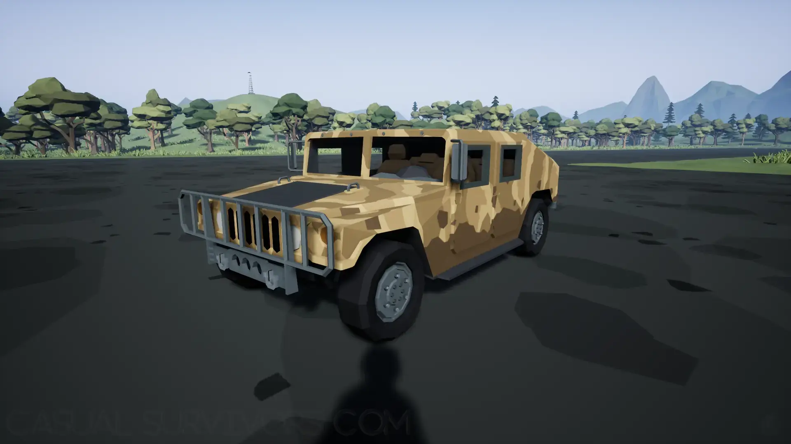
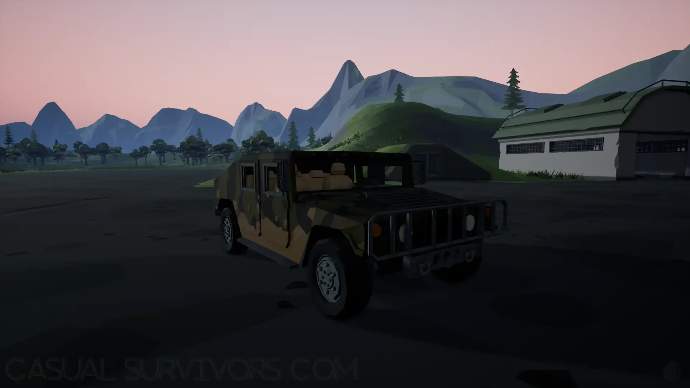
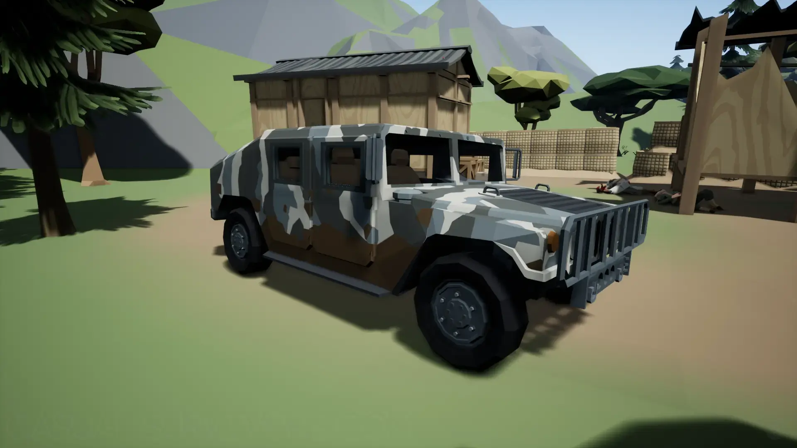
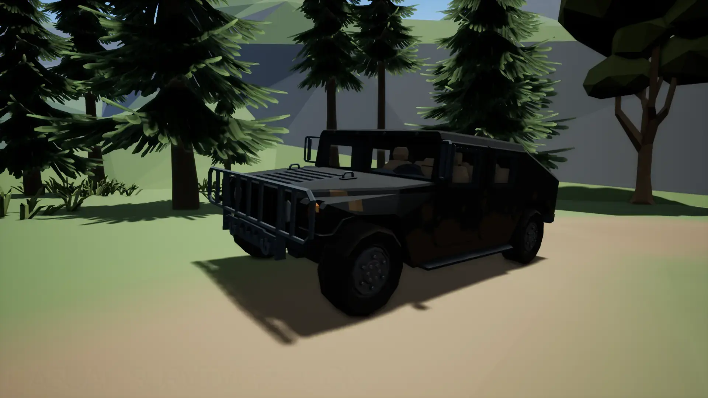


A showcase of the Deadpoly Hummers and what they look like in-game.


## Deadpoly Hummers
There are a few different kinds of hummers in Deadpoly. We want to showcase them, so you know what to look for and to help you decide which one you like the most!

## Hummer Locations
The Hummers can only be found in designated locations as shown in the [Vehicle Locations](/deadpoly/guides/vehicle-locations/) guide. Most of the are found in the military base hangers, however, there is a single spawn location in the western area. Besides the map locations, you can find them where other players may have left them around in the world, however, that is only if you are playing multiplayer of course. 

## Tan Camo Hummer

## Green Camo Hummer

## Grey Camo Hummer

## Black Hummer

