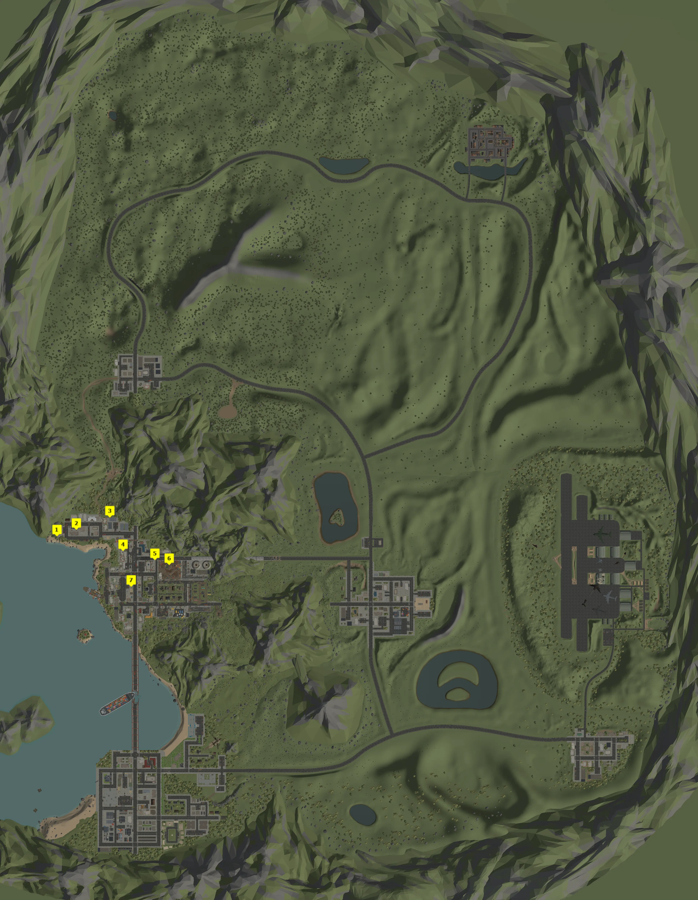
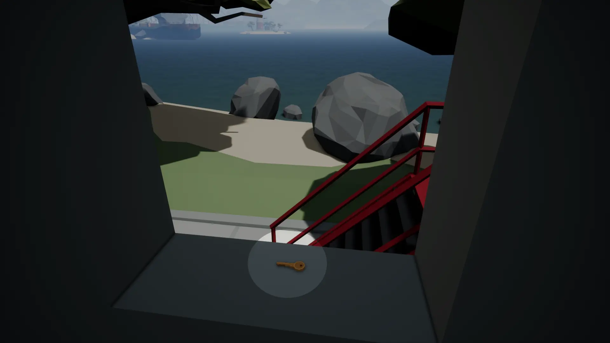
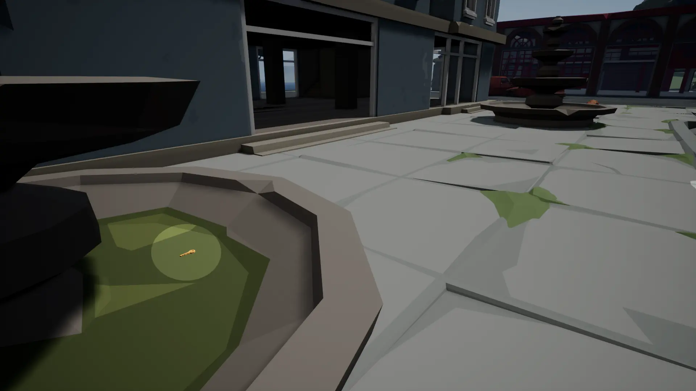
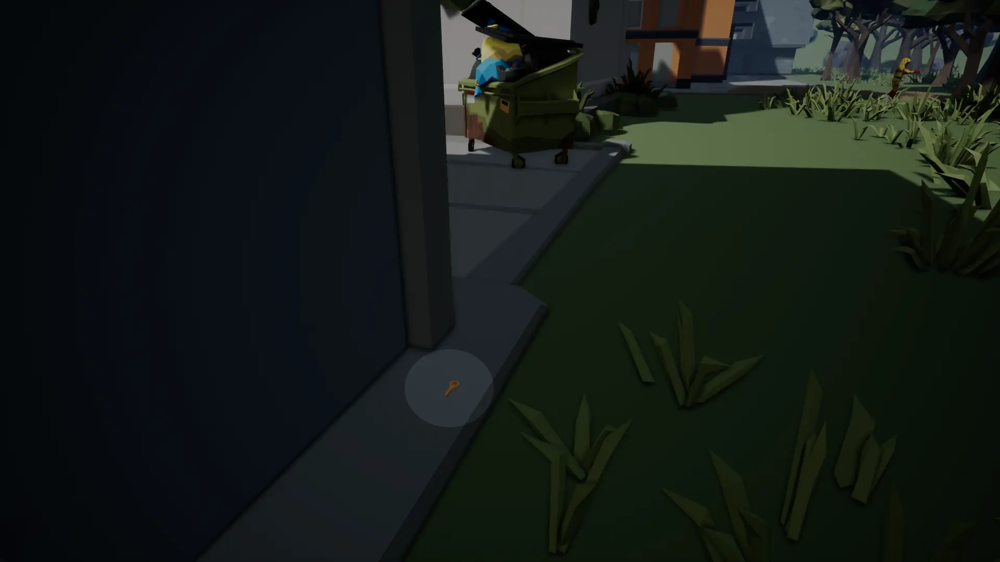
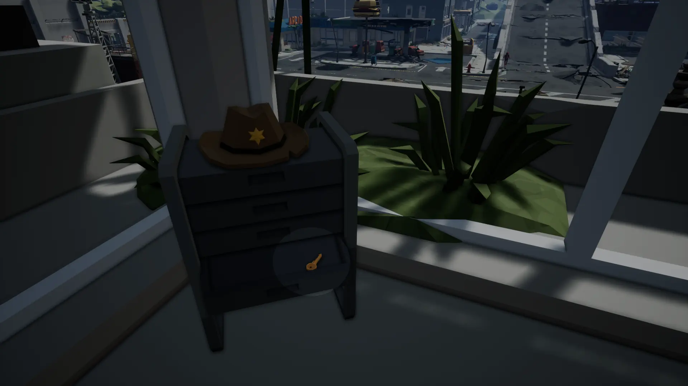
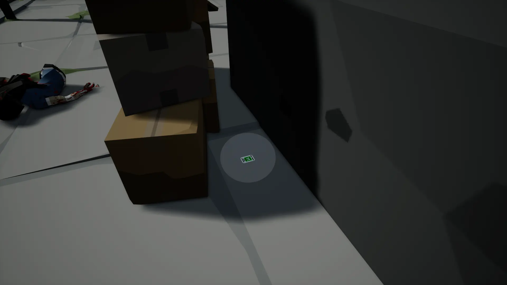
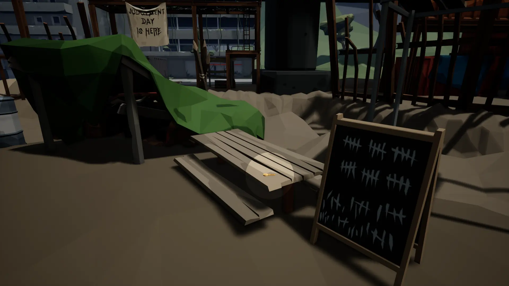
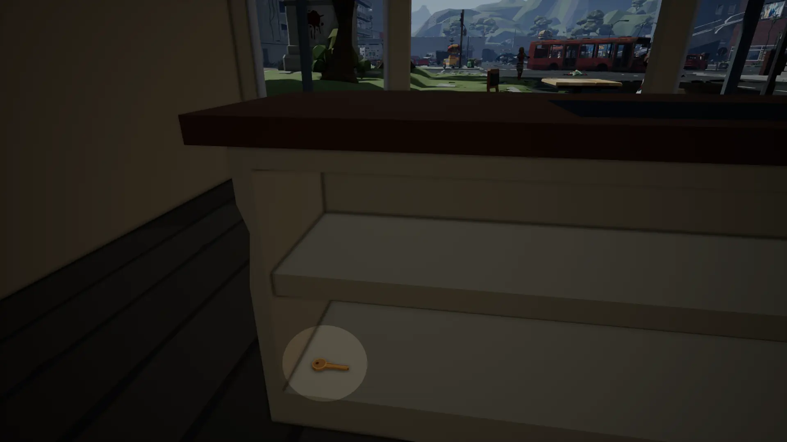


An in-depth map for Deadpoly showing you everything you need to know to find the stuff you seek in-game.


## Deadpoly Key Locations
Below you can find all the static Key Card locations for the Flower Shop, Bunker 11, and Bunker 24. There are however, some important things to mention about these spots. While you can find the respective keys at these spots, they are not always there. Each location has a chance to spawn one of the keys upon a server restart or the item respawn timer.

Every key has a chance to be randomly spawned throughout the game, so it's possible to find a key just about anywhere loot can be found. 

## Location 1

## Location 2

## Location 3

## Location 4

## Location 5

## Location 6

## Location 7

