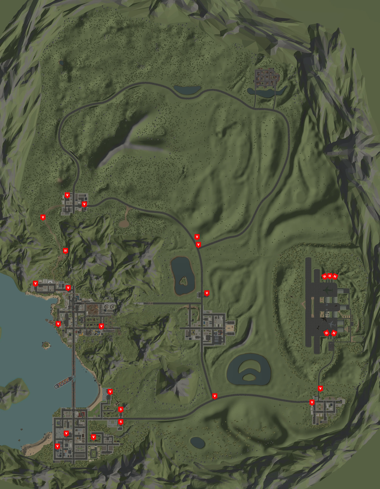
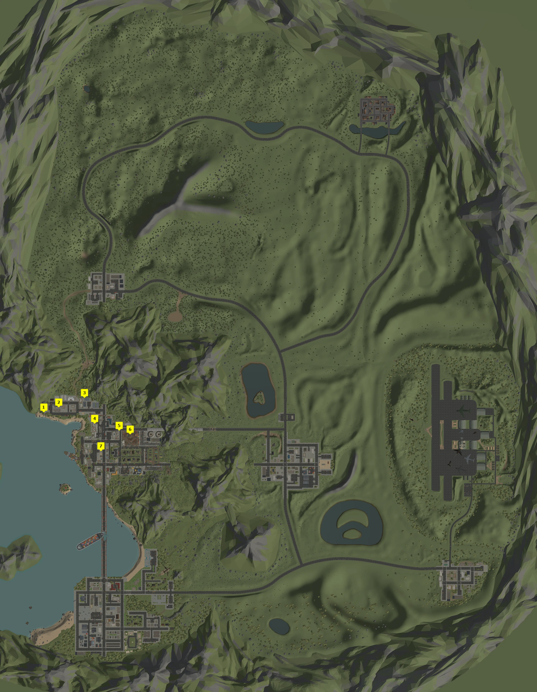


An in-depth map for Deadpoly showing you everything you need to know to find the stuff you seek in-game.


## Deadpoly Map Locations
There are many interesting locations for Deadpoly. Because of this, we've broken them down into different categories to help sort the data for you. Take a look at the sections below for what you want!

We will continue to update these sections as we add more to the Deadpoly Map. 

## Vehicles - Deadpoly Map Locations
Looking for a certain vehicle or where to find them? We have that just for you in the Vehicles Locations guide. Additionally, the map is posted below for quick reference for you. If you need more information than the map, however, please do check out the guide!

## Key Cards - Deadpoly Map Locations
Are you seeking a certain Key Card or Key to a specific flower shop? We have all the known static locations mapped out just for you! Take a look at the Key Locations guide to see exactly where they all are. Otherwise, your quick cheat sheet for them is below!

## Vendors (Coming Soon)
Looking for a certain NPC Vendor to push your goods? All the information you need can be found in our Vendors Location guide. Alternatively, you may just use the map posted below to find them! 

## Places of Interest (Coming Soon)
Major landmarks or "POI" that will help you navigate the local lands...

