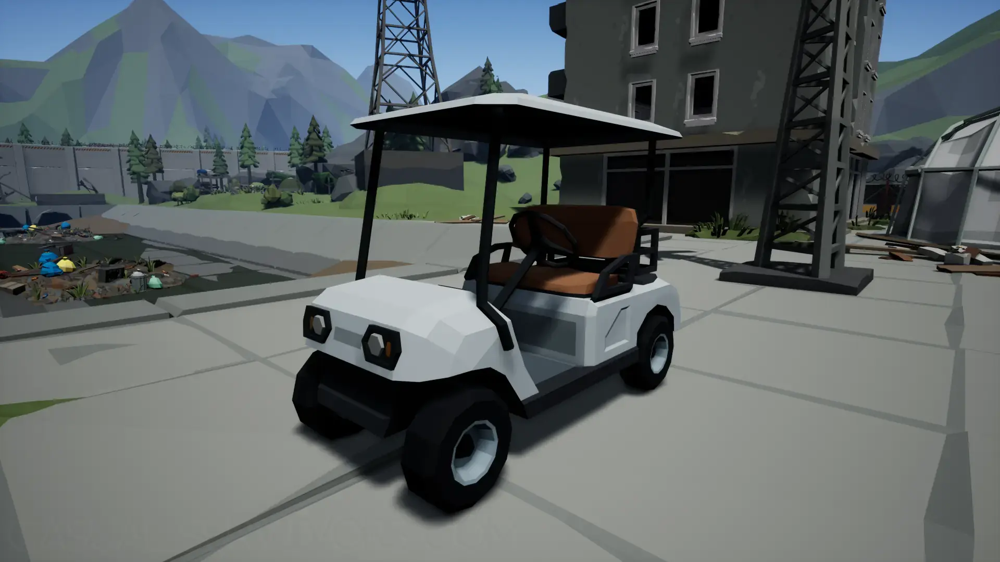
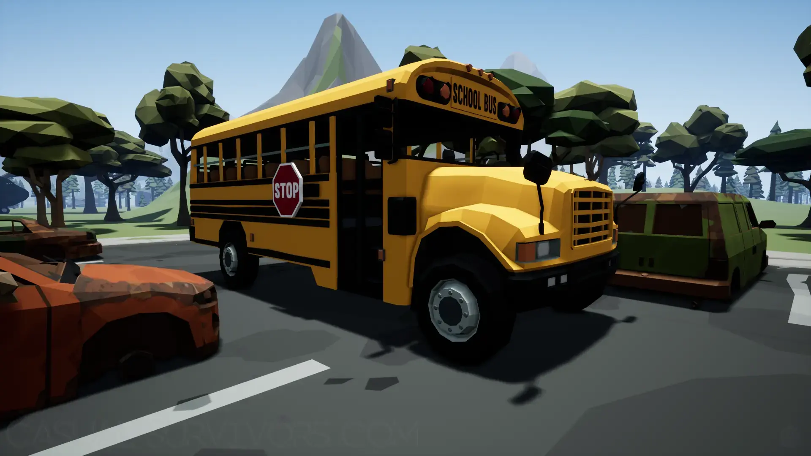
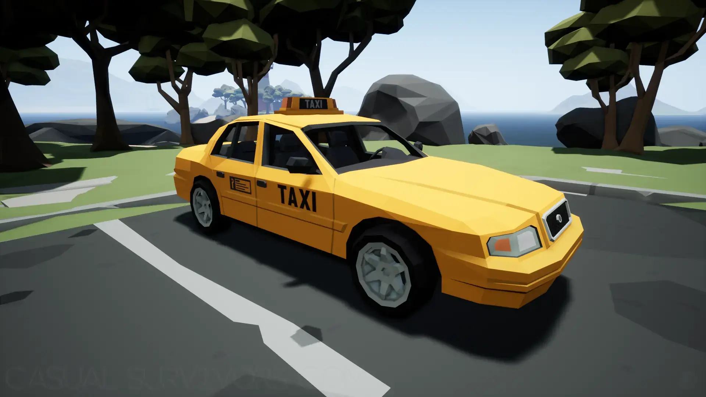


A showcase of the Deadpoly Special Vehicles and what they look like in-game.


## Deadpoly Special
There are a few different kinds of Special Vehicles in Deadpoly. We want to showcase them, so you know what to look for and to help you decide which one you like the most!

## Special Vehicles Locations
There are a few things of note for the Special Vehicles in Deadpoly. First-most, the School Bus only spawns in the parking area for the school. Check out the [Vehicle Locations](/deadpoly/guides/vehicle-locations/) guide for the exact locations marked with the S. Additionally, the remaining special vehicles are random spawn in the normal vehicle spawned locations. So, best of luck in the RNG when attempting to find them. Besides the map locations, you can find them where other players may have left them around in the world, however, that is only if you are playing multiplayer of course. 

## Golf Cart

## School bus

## Buggy

## Taxi ('Yellow' Sedan)

