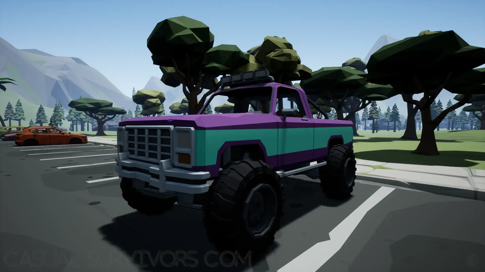
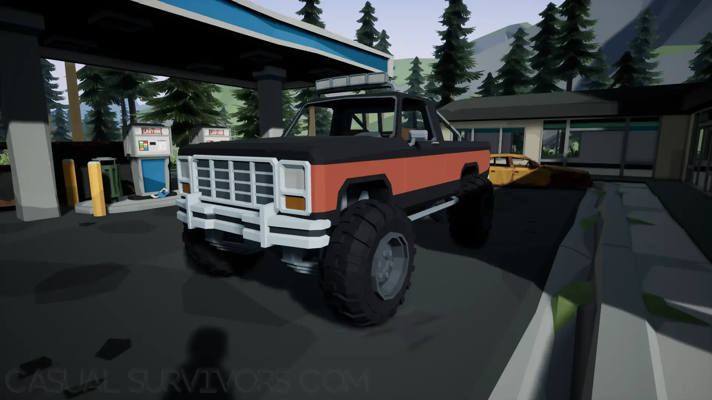
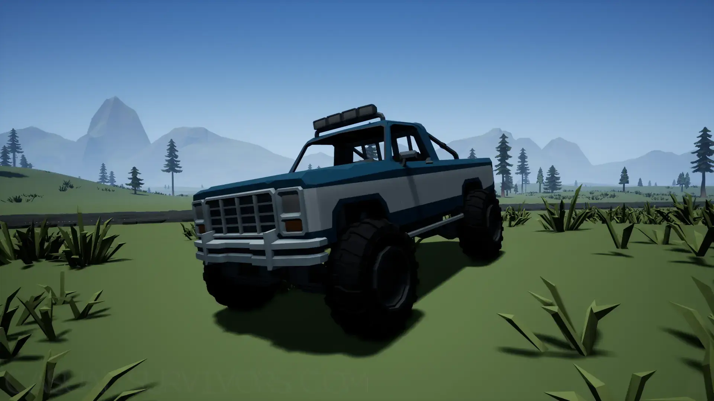
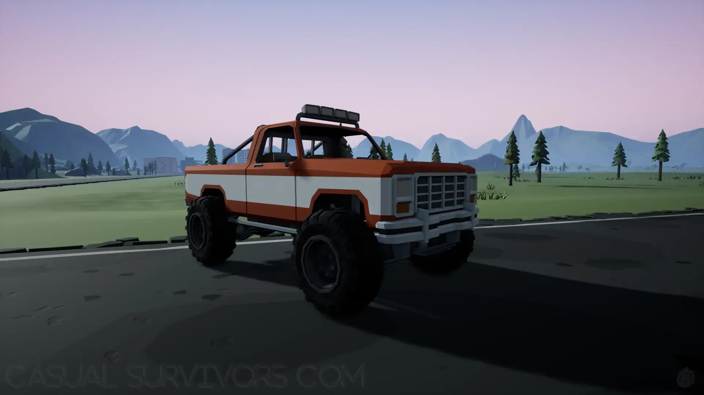
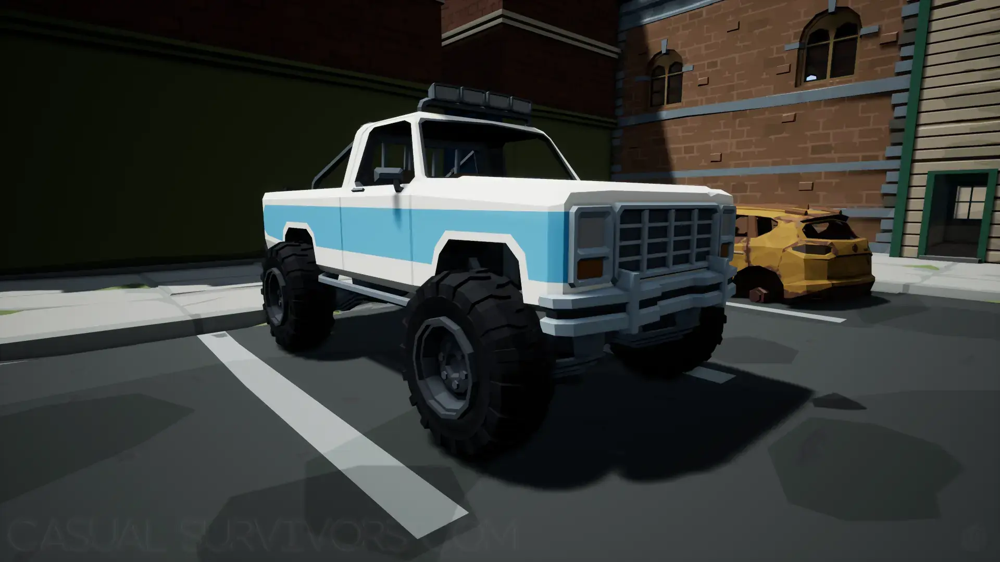


A showcase of the Deadpoly Trucks and what they look like in-game.


## Deadpoly Trucks
There are a few different kinds of Trucks in Deadpoly. We want to showcase them, so you know what to look for and to help you decide which one you like the most!

## Truck Locations
The Trucks can be found in any of the normal Vehicle spawning locations shown in our [Vehicle Locations](/deadpoly/guides/vehicle-locations/) guide. Head over there and take a look at the map to figure out where you can find one naturally in the game. Besides the map locations, you can find them where other players may have left them around in the world, however, that is only if you are playing multiplayer of course. 

## Purple & Teal-Stripe Truck

## Black & Orange-Striped Truck

## Blue & White-Striped Truck

## Red & White-Striped Truck

## White & Blue-Striped Truck

