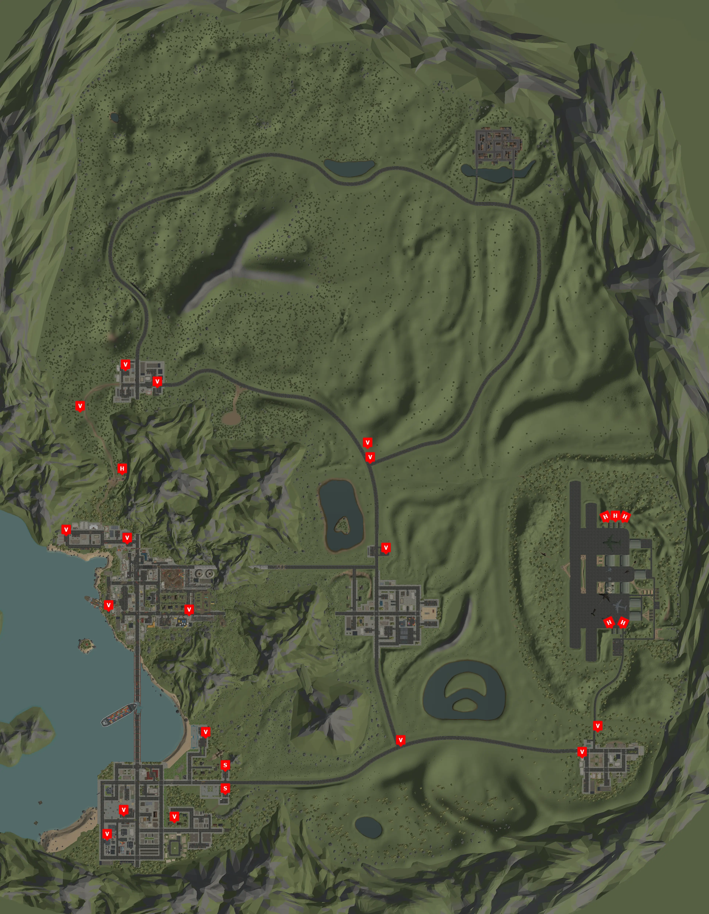


All the known locations for the vehicles in Deadpoly. Including all the special vehicles like the Buggy and School Bus.


## Deadpoly Vehicles
Deadpoly consists of the following vehicle types; [Bug](/deadpoly/guides/bug/), [Farm Truck](/deadpoly/guides/farm-truck/), [Hummer](/deadpoly/guides/hummer/), [Jeep](/deadpoly/guides/jeep/), [Sedan](/deadpoly/guides/sedan/), [Truck](/deadpoly/guides/truck/), and [Specials](/deadpoly/guides/special-vehicles/). Of the Special variety, you can find the School Bus, Buggy and Taxi as part of that collection.

## Deadpoly Vehicle Controls
These are the common and default controls for vehicles in Deadpoly;
 - F: Interact - How you enter the vehicle as the driver or passager.
 - R: Starts the Engine
 - E: Emergency (Hazard) Lights
 - W: Gas (Forward)
 - S: Breaks (Backwards)
 - A: Left Turn
 - D: Right Turn

## Deadpoly Vehicle Locations
Below is a map of all the known locations that we've mapped out.
 - V: Vehicle location
 - H: Hummer location
 - S: School Bus location

Right-Click the image and select 'Open in a new Tab' and you will be able to zoom further on the image if you are unable to make out the letters on the map.

### Hummer, School Bus, and Default Spawning
The Hummer and School Bus have a limited spawning location. They are shown on the map as H for Hummer and S for School Bus. Every other vehicle will spawn in the other default locations marked with a V on the map.

## Other Deadpoly Maps
Make sure to check out our [Map Locations](/deadpoly/guides/map-locations/) guide for more information on other spots of interest in [Deadpoly](https://store.steampowered.com/app/1621070/DeadPoly/).
