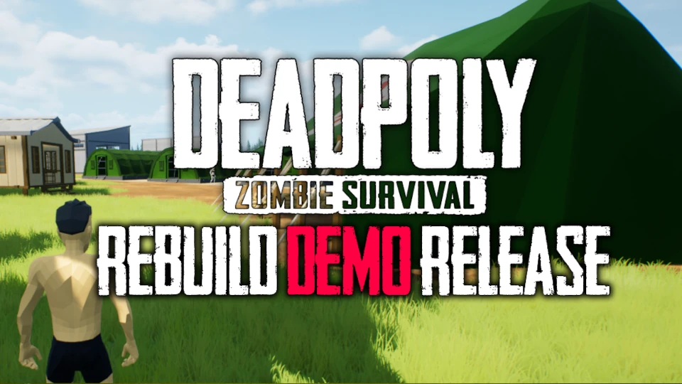


The Deadpoly Rebuild Demo can be downloaded for those who own a copy of Deadpoly. Head over to the beta sections in Steam and select the Rebuild option to download the Demo.


## Deadpoly Rebuild Demo
The first playable demo from the Deadpoly Demo is out now! If you own a copy of Deadpoly currently and would like to test out the demo, today is your lucky day! Head to your Steam library and right-click Deadpoly in your game library. Select the bottom option "Properties..." and a new steam window will appear. In this window, you want to select the "Betas" tab on the left-hand side to change views. On the Betas screen, there is a 'Beta Participation' option with a dropdown box. Click on the box for a section of options. You want to select the "rebuild - epic intensifies" option for the Demo. Once selected, Steam will start to download the Demo for Deadpoly.

## Download Warning
Before you download the Demo, it is strongly encouraged to back up your Deadpoly Legacy saves if you are planning to still play the Legacy version of Deadpoly. If you are not concerned about the Legacy Version, then you can ignore this warning!

Your saved files can be located in the %appdata%\Local\Deadpoly folder. 

## Demo Version
As a friendly reminder, this is a **DEMO** meaning this is not intended for you to play on it long term. It is intended to be a preview of things to come. Even the creator, Kamron, has stated; 
> "The demo is not optimized basically at all, and is basically unplayable on machines without a graphics card. Optimization will continue to happen throughout the development process."

## Reporting Issues & Feedback
If you find something that is wrong, please report it on the [Deadpoly Discord](https://discord.gg/deadpoly)! Kamron is monitoring Discord for community feedback and activity for Deadpoly.

Feedback can also be provided on the Deadpoly Discord. Kamron is very open about the ideas and stuff that will or will not work with the game or the vision he has in mind for the game. Worse case they will tell you not, however best case it can be added into the game!

## Content Source
If you want to look at the source of all this information, please check out Kamron's [original post](https://store.steampowered.com/news/app/1621070/view/3665419040590400215) on the matter. We always encourage the community to check out the original content if anything is unclear or if you just want to see the source for yourself!

Any information that can't be found in the link above will come from the official [Deadpoly Discord](https://discord.gg/deadpoly), so I encourage you to join that as well for more information about Deadpoly. 

That's all for this Deadpoly Rebuild Update! We will make sure to keep you informed on the progress of the update as much as possible. Stay tuned for more Deadpoly News. 
