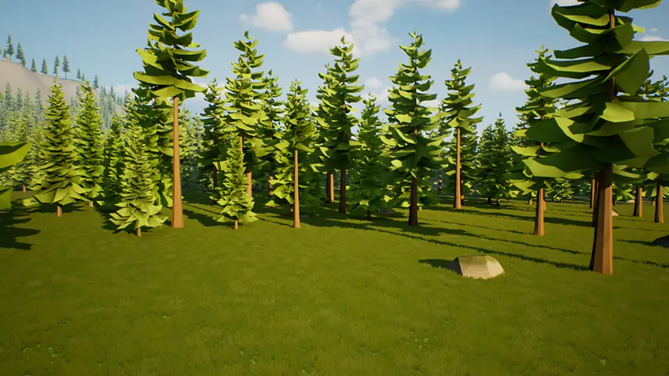
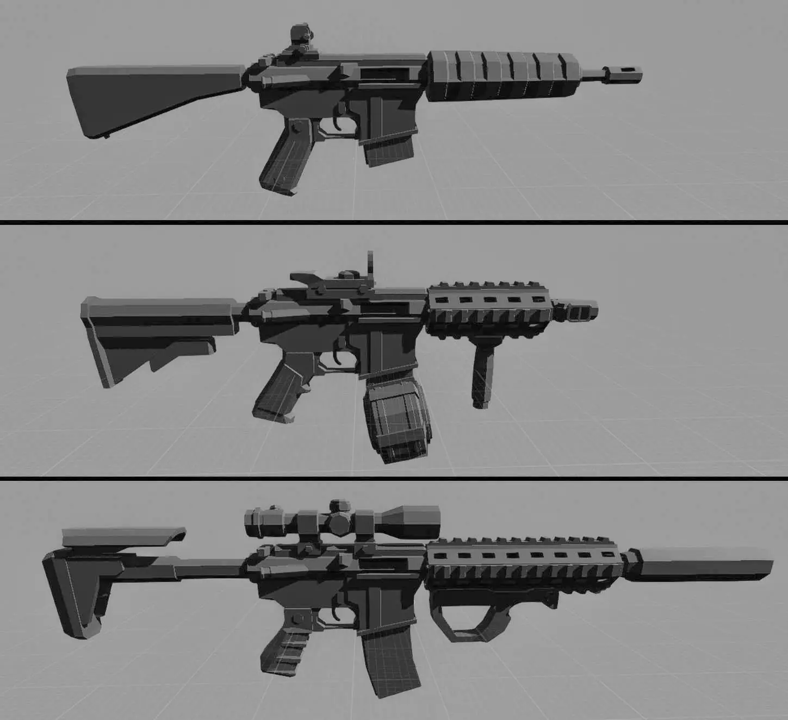
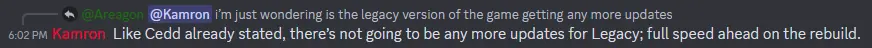


Deadpoly is being rebuilt from the ground up using the Unreal 5 Engine. This April update is showing off some of the progress made thus far. 


## April Deadpoly Rebuild Update
Today's sneak peek at the Unreal 5 Engine rebuild will be a short one sadly, but something is better than nothing! Here is a look at the new trees running in the new system;

The new map size will be about 6km x 6km in size and will be a lot bigger than what the current game has! It will be amazing, however, I am a bit concerned that we might have a hard time finding other players on such a big map... Guess time will tell.

## Gun Attachments
Gun attachments are a feature that will be part of the rebuilt Deadpoly game. Some progress on this feature has been made, take a look at a screenshot of an assault rifle with different mods on it;

## Deadpoly Game Studio
Kamron has been working in the background creating a gaming studio to hire people to help him develop and maintain the game going forward. The name of the said studio is still unknown at this time, but he has hinted at things finally starting to take shape! We look forward to hearing more about this studio in the coming months.

## No more Legacy Content Updates
There have been many questions from the community wondering if the legacy version of Deadpoly will be getting updated anymore or not. Kamron has done a few bug fixes here and there on the current version, which will be the legacy version, but has clearly stated to the community that no more content updates will happen. 

## The Rebuild Announcement
The official announcement when Kamron stated that he will be rebuilding the game was in the [Community Update #3](https://store.steampowered.com/news/app/1621070/view/3705938838428060529) patch notes. Follow that link for more information about what was promised and why Kamron decided to rebuild the game.

## Content Source
If you want to look at the source of all this information, please check out Kamron's [original post](https://store.steampowered.com/news/app/1621070/view/3681170860467962673) on the matter. We always encourage the community to check out the original content if anything is unclear or if you just want to see the source for yourself!

That's all for this April Deadpoly Rebuild Update! We will make sure to keep you informed on the progress of the update as much as possible. Stay tuned for more Deadpoly News. 
