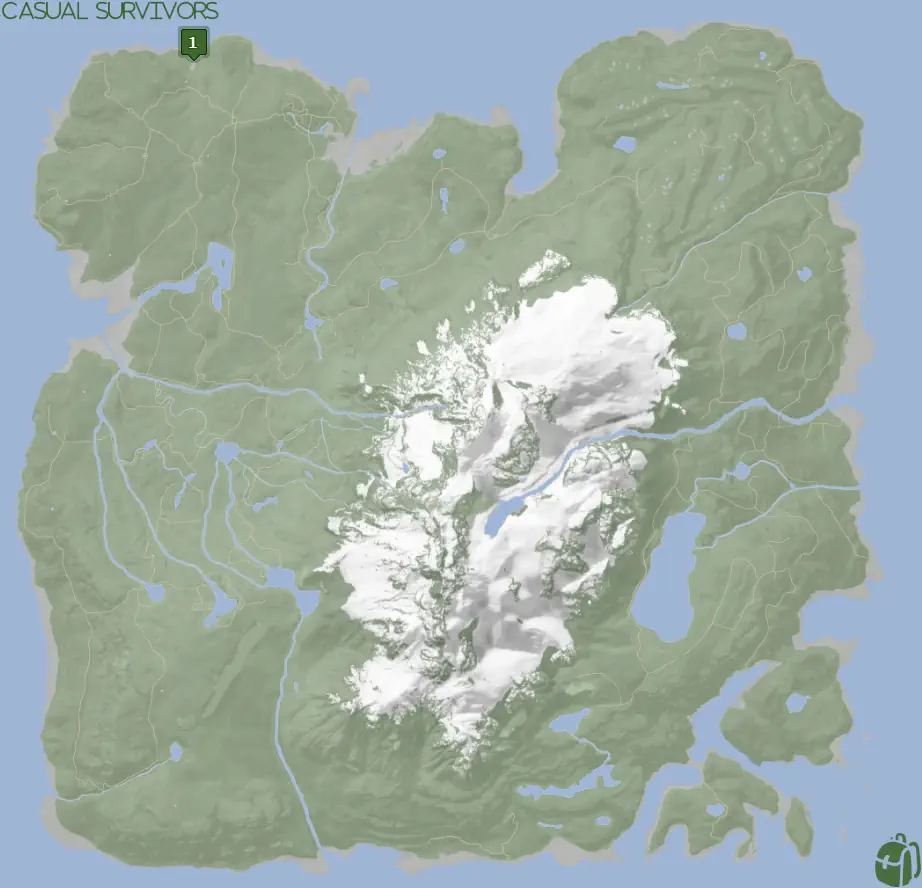
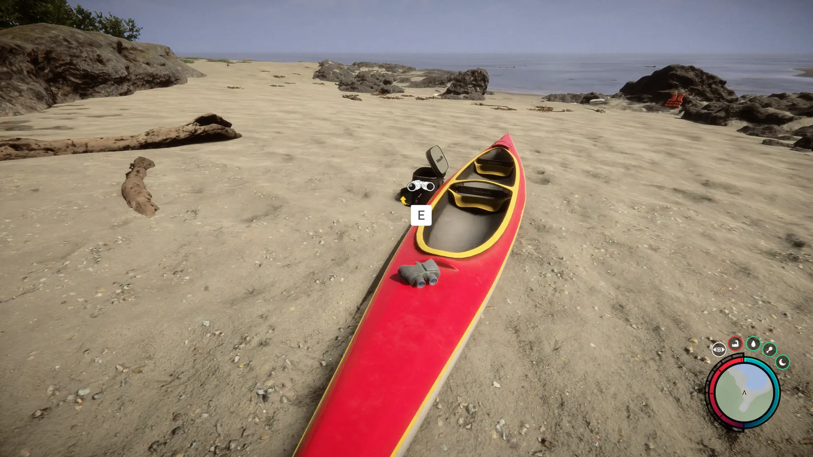


Where to find the Binoculars and the requirements to obtain it in the Sons of the Forest.


## Binoculars in Sons of the Forest
The Binocular is a tool you can use to look off in the distance. Simply hold the left click while you have them equipped to look through them. Sadly this does require both hands meaning you can't hold anything else to do this. 

The Binoculars has no durability, doesn't require additional items, and can't be crafted into something else, so this is the final form.

## Requirements to Obtain
**None** - Some items require the player to solve a puzzle or use other collected items to obtain. For example, you may need to dig into the ground to find an item, so in situations like that, you will need a  Shovel. 

## Binoculars Map
Below is a world map with all the known locations for the Binoculars.

## Binoculars Location #1
The green marker labeled 1 on the map is the location of the Binoculars. Head towards the shoreline and look for 2 beached red canoes. The one closest to the ocean has both the Binoculars and the [Camouflage Suit](/sons-of-the-forest/guides/camouflage-suit/).

### Other Items Nearby
There are no other items in the direct area of the Binoculars, however, there are a few other items close to you. Here are a few other items in a short walking distance from you; [Shotgun Rail](/sons-of-the-forest/guides/shotgun-rail/), [Glider](/sons-of-the-forest/guides/glider/), [Camouflage Suit](/sons-of-the-forest/guides/camouflage-suit/), and Shotgun (Coming Soon).

## More Possible Locations
Currently, there is only 1 known location for the Binoculars. More locations may come in future updates, but at this time players can only obtain it at the location above.
We will make sure to update our map with any new spots when Sons of the Forest gets any new updates for the Stun Baton.

## Achievements 
The Binoculars is not required for any achievements in the game at this time. We will update this section if that ever changes in the future. 

## Obtain Once
The Binoculars can only be obtained once. If the item had other spawn locations (Which may happen in the future), they would despawn preventing you from picking up multiple versions of the item. This is how Sons of the Forest enables the players to have multiple options when looting major items. 

## Conclusion
There are no requirements for the Binoculars and there is only 1 known location to obtain it. So, if you want to collect all the items in Sons of the Forest, make sure you head to the marked spot and collect your used Binoculars!

Additionally; we would like to know if you enjoyed our guide. Let us know what you think and provide any feedback you may feel would improve the quality of the guide. To do so, join us on [Discord](https://discord.gg/ZXp93XsKnN) and let us know! We would love to hear from you! 
