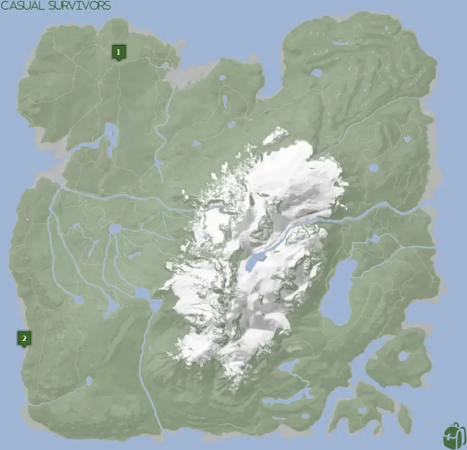


Where to find the Blazer and the requirements to obtain it in the Sons of the Forest.


## Blazer in Sons of the Forest
The Blazer is cloth gear that provides better warmth and comfort levels than the standard Tactical Jacket you start with. The Blazer does have a lower water rating than the Tactical Jacket. 

The Blazer is a weaker version of the [Tuxedo](/sons-of-the-forest/guides/tuxedo), so it's suggested to use the Tuxedo over the Blazer unless you are roleplaying of course!

The Blazer has no durability, doesn't require additional items, and can't be crafted into something else, so this is the final form.

## Requirements to Obtain
**None** - Some items require the player to solve a puzzle or use other collected items to obtain. For example, you may need to dig into the ground to find an item, so in situations like that, you will need a  Shovel. 

## Blazer Map
Below is a world map with all the known locations for the Blazer.

## Blazer Location #1
The green marker labeled 1 on the map is the location of the graveyard where you can find the Blazer. Search around the coffins and you will find the Blazer in one of them. 

### Other Items Nearby
There are no other items in the direct area of the Blazer, however, there are a few other items close to you. Here are a few other items in a short walking distance from you; [Shotgun Rail](/sons-of-the-forest/guides/shotgun-rail/), [Glider](/sons-of-the-forest/guides/glider/), Binoculars (Coming Soon), Shotgun (Coming Soon), and Virginia Outfits (Coming Soon).

## Blazer Location #2
The green marker labeled 2 on the map is the location of some beached boats where you can find a Blazer. Search the southernmost boat on the shore and you will find the Blazer in the back area.

### Other Items Nearby
**NONE!** This spot is far away from other items, so it is suggested that you use Location 1 to pick up the Blazer. 

## More Possible Locations
Currently, there are only 2 known locations for the Blazer. More locations may come in future updates, but at this time players can only obtain it at the locations above.
We will make sure to update our map with any new spots when Sons of the Forest gets any new updates for the Stun Baton.

## Achievements 
The Blazer is an item required for the FASHIONISTA achievement. To earn this achievement, you need to gather all the possible clothing items. 

## Obtain Once
The Blazer can only be obtained once. If the item had other spawn locations (Which may happen in the future), they would despawn preventing you from picking up multiple versions of the item. This is how Sons of the Forest enables the players to have multiple options when looting major items. 

## Conclusion
There are no requirements for the Blazer and there is only 1 known location to obtain it. So, if you want to collect all the items in Sons of the Forest, make sure you head to the marked spot and collect your used Blazer!

Additionally; we would like to know if you enjoyed our guide. Let us know what you think and provide any feedback you may feel would improve the quality of the guide. To do so, join us on [Discord](https://discord.gg/ZXp93XsKnN) and let us know! We would love to hear from you! 
