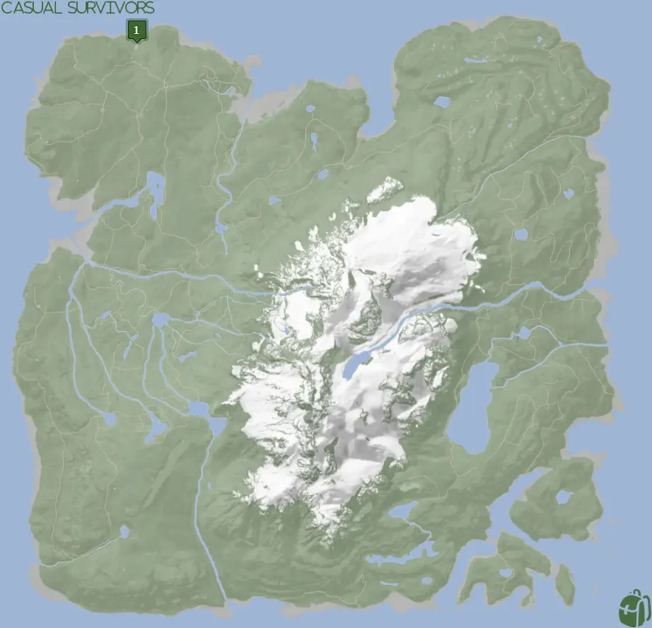
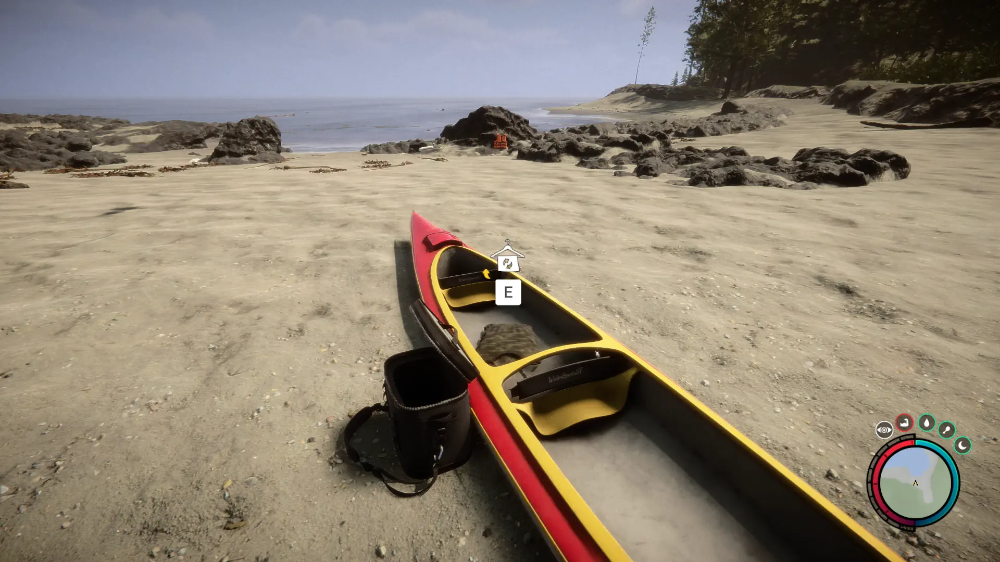


Where to find the Camouflage Suit and the requirements to obtain it in the Sons of the Forest.


## Camouflage Suit in Sons of the Forest
The Camouflage Suit is cloth gear that you can give to Virginia for a cosmetic override. 

The Camouflage Suit has no durability, doesn't require additional items, and can't be crafted into something else, so this is the final form.

Additionally, the Camouflage Suit doesn't appear in your inventory after being collected. The only way to confirm if you have it is to interact with Virginia and attempt to change her clothes. 

## Requirements to Obtain
**None** - Some items require the player to solve a puzzle or use other collected items to obtain. For example, you may need to dig into the ground to find an item, so in situations like that, you will need a  Shovel. 

## Camouflage Suit Map
Below is a world map with all the known locations for the Camouflage Suit.

## Camouflage Suit Location #1
The green marker labeled 1 on the map is the location of the Camouflage Suit. Head towards the shoreline and look for 2 beached red canoes. The one closest to the ocean has both the Camouflage Suit and the [Binoculars](/sons-of-the-forest/guides/binoculars/).

### Other Items Nearby
There are no other items in the direct area of the Camouflage Suit, however, there are a few other items close to you. Here are a few other items in a short walking distance from you; [Shotgun Rail](/sons-of-the-forest/guides/shotgun-rail/), [Glider](/sons-of-the-forest/guides/glider/), [Binoculars](/sons-of-the-forest/guides/binoculars/), and Shotgun (Coming Soon).

## More Possible Locations
Currently, there is only 1 known location for the Camouflage Suit. More locations may come in future updates, but at this time players can only obtain it at the location above.
We will make sure to update our map with any new spots when Sons of the Forest gets any new updates for the Stun Baton.

## Achievements 
The Camouflage Suit is an item required for the FASHIONISTA achievement. To earn this achievement, you need to gather all the possible clothing items. Check this Article's Series for the other locations of the clothes. 

## Obtain Once
The Camouflage Suit can only be obtained once. If the item had other spawn locations (Which may happen in the future), they would despawn preventing you from picking up multiple versions of the item. This is how Sons of the Forest enables the players to have multiple options when looting major items. 

## Conclusion
There are no requirements for the Camouflage Suit and there is only 1 known location to obtain it. So, if you want to collect all the items in Sons of the Forest, make sure you head to the marked spot and collect your used Camouflage Suit!

Additionally; we would like to know if you enjoyed our guide. Let us know what you think and provide any feedback you may feel would improve the quality of the guide. To do so, join us on [Discord](https://discord.gg/ZXp93XsKnN) and let us know! We would love to hear from you! 
