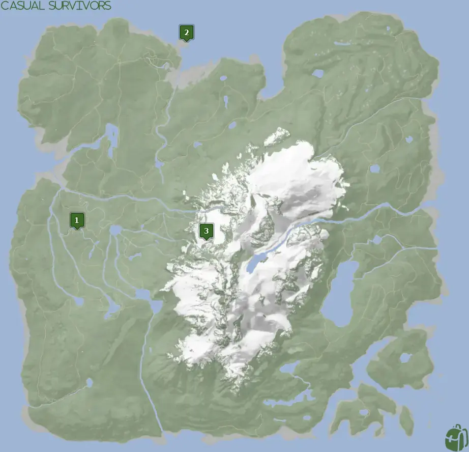
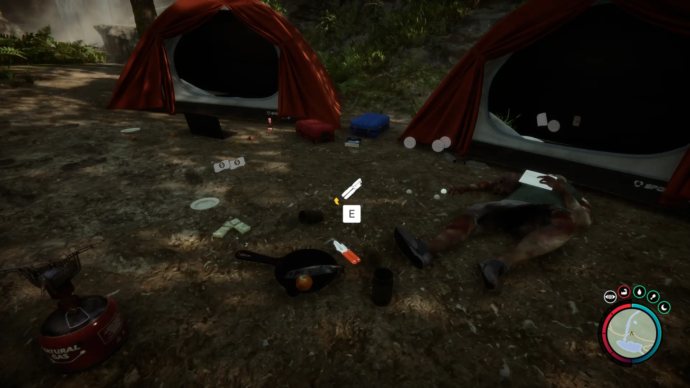


Where to find the Can Opener and the requirements to obtain it in the Sons of the Forest.


## Can Opener in Sons of the Forest
The Can Opener is the tool used to open cans and to provide you with food! 

## Requirements to Obtain
**None** - Some items require the player to solve a puzzle or use other collected items to obtain. For example, you may need to dig into the ground to find an item, so in situations like that, you will need a shovel. 

The Can Opener can be obtained at any point of the game, you just need to walk up to it and pick it up!

## Can Opener Map
Below is a world map with all the known locations for the Can Opener.

## Can Opener Location 1
Head to the location 1 icon on the map for the Can Opener. You are looking for a small human camp with 2 orange tents next to a small waterfall. In the middle of the camp, they were preparing some food with their Can Opener, that's where you will find it.

## More Possible Locations
Currently, there is only 1 known location for the Can Opener. More locations may come in future updates, but at this time players can only obtain it at the location above.
We will make sure to update our map with any new spots when Sons of the Forest gets any new updates for the Can Opener.

## Obtain Once
The Can Opener can only be obtained once. If the item had other spawn locations (Which may happen in the future), they would despawn preventing you from picking up multiple versions of the item. This is how Sons of the Forest enables the players to have multiple options when looting major items. 

## Conclusion
There are no requirements for the Can Opener and there is only 1 known location to obtain it. So, if you want to collect all the items in Sons of the Forest, make sure you head to the marked spot and collect your Can Opener!

Additionally; we would like to know if you enjoyed our guide. Let us know what you think and provide any feedback you may feel would improve the quality of the guide. To do so, join us on [Discord](https://discord.gg/ZXp93XsKnN) and let us know! We would love to hear from you! 