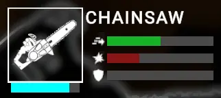
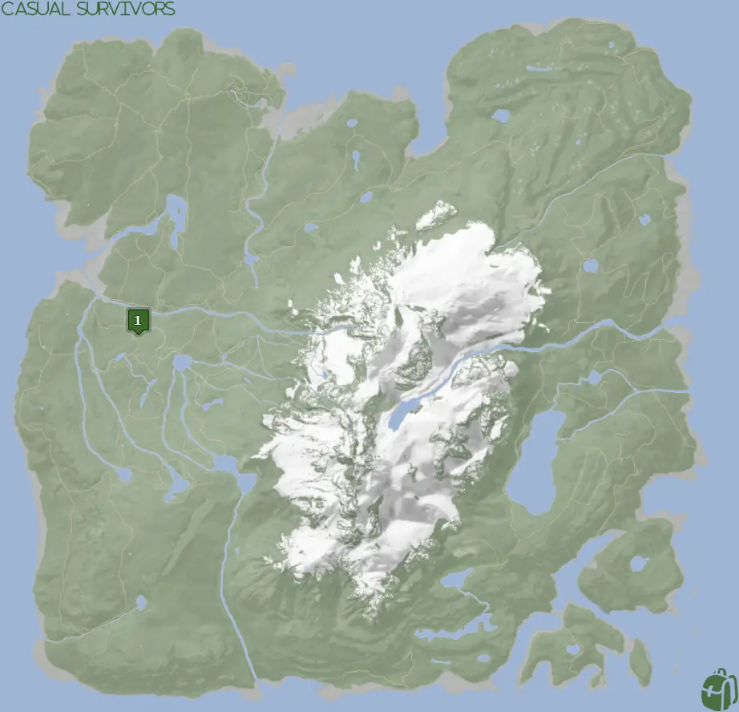
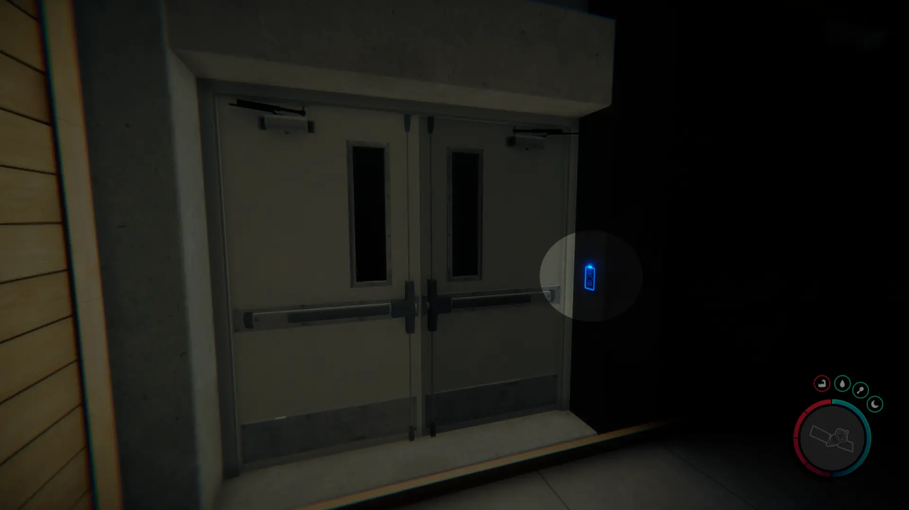
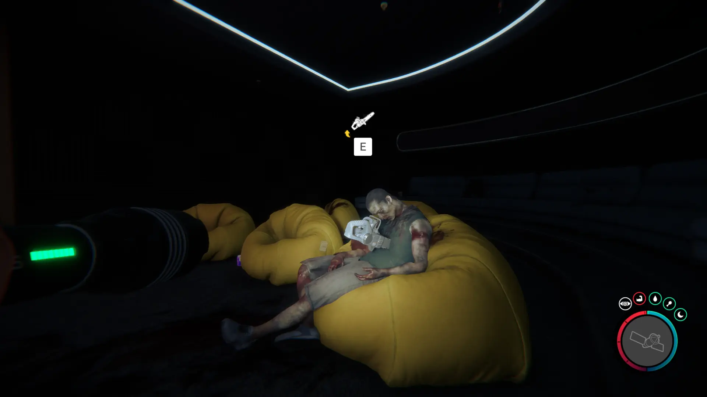


Where to find the Chainsaw and the requirements to obtain it in the Sons of the Forest.


## Chainsaw in Sons of the Forest
The Chainsaw is a right-handed tool/weapon that can be used with your [Flashlight](/sons-of-the-forest/guides/flashlight/). The Chainsaw is battery-operated just like the Flashlight and will run out of power with continual use. 

To check the battery levels of the Chainsaw, hover the mouse over it while in the inventory. The light blue bar under the item's icon is your indicator of how much power you have left (See the image below).

## Requirements to Obtain
**Guest Keycard, Maintenance Keycard, Gun Rope, Rebreather, & Shovel** - Some items require the player to solve a puzzle or use other collected items to obtain. For example, you may need to dig into the ground to find an item, so in situations like that, you will need a Shovel. 

The [Gun Rope](/sons-of-the-forest/guides/rope-gun/) and [Rebreather](/sons-of-the-forest/guides/rebreather/) are requirements for the [Shovel](/sons-of-the-forest/guides/shovel/), which is what you need to access the Bunker of Maintenance Shaft A where you can obtain the [Maintenance Keycard](/sons-of-the-forest/guides/maintenance-keycard/). The Maintenance Keycard is then used to collect the [Guest Keycard](/sons-of-the-forest/guides/guest-keycard/) in the same building where you obtain the Chainsaw, so it's perfectly normal to enter the cave without the Guest Keycard. 

## Chainsaw Map
Below is a world map with all the known locations for the Chainsaw.

## Chainsaw Location 1
Head to the green location 1 marked on the map and look for a pulsing green icon on your map in the game. The location is marked in the game with the pulsing green circle, so head toward that when you see it in the area.

Once in the area, you are searching the cave entrance or the abandoned golf cart.

Inside the cave, head further until you need to use your keycard.

Progress past the Gym and up to a second floor. On the second floor keep progressing until you reach the club area. Loot the [Guest Keycard](/sons-of-the-forest/guides/guest-keycard/) and then leave the club area, but stay on the second floor. There is another door you need to open up using your Guest Keycard just outside of the club area. 

Head down to the newly accessible area and hug the left wall until you reach the entertainment room with the Chainsaw inside the dead body on the yellow bean bag.

## More Possible Locations
Currently, there is only 1 known location for the Chainsaw. More locations may come in future updates, but at this time players can only obtain it at the location above.
We will make sure to update our map with any new spots when Sons of the Forest gets any new updates for the Chainsaw.

## Obtain Once
The Chainsaw can only be obtained once. If the item had other spawn locations (Which may happen in the future), they would despawn preventing you from picking up multiple versions of the item. This is how Sons of the Forest enables the players to have multiple options when looting major items. 

## Conclusion
There are no requirements for the Chainsaw and there is only 1 known location to obtain it. So, if you want to collect all the items in Sons of the Forest, make sure you head to the marked spot and collect your Chainsaw!

Additionally; we would like to know if you enjoyed our guide. Let us know what you think and provide any feedback you may feel would improve the quality of the guide. To do so, join us on [Discord](https://discord.gg/ZXp93XsKnN) and let us know! We would love to hear from you! 