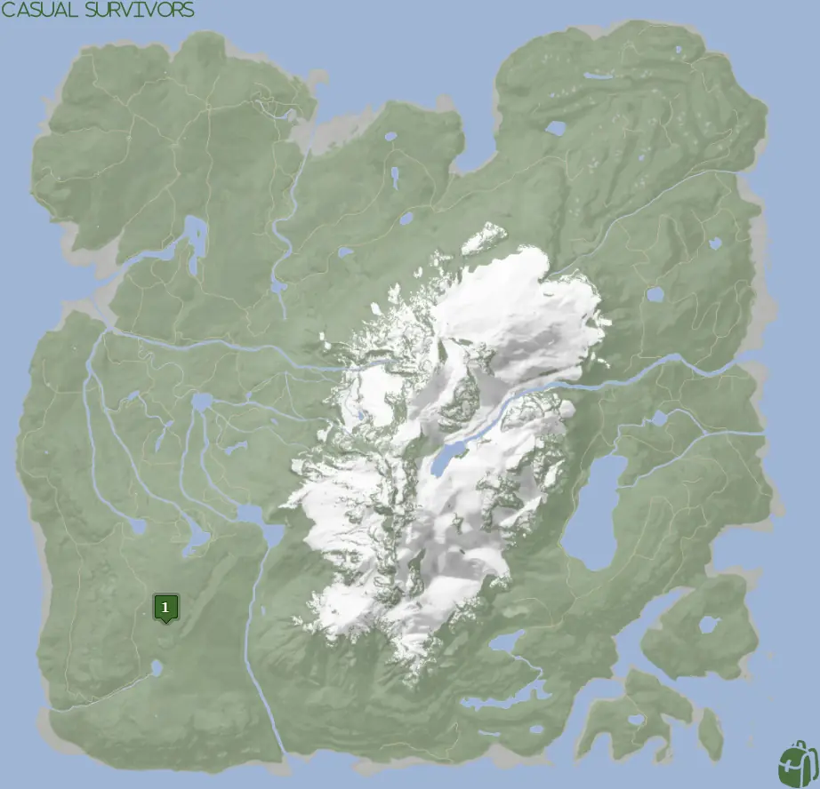


Where to find the Compound Bow and the requirements to obtain it in the Sons of the Forest.


## Compound Bow in Sons of the Forest
The Compound Bow is a two-handed ranged weapon for shooting arrows. It can be held in your right hand with a light source, however, when you pull the cord, the light source is put away. 

## Requirements to Obtain
**Gun Rope, Rebreather, & Shovel** - Some items require the player to solve a puzzle or use other collected items to obtain. For example, you may need to dig into the ground to find an item, so in situations like that, you will need a  Shovel. 

The [Gun Rope](/sons-of-the-forest/guides/rope-gun/) and [Rebreather](/sons-of-the-forest/guides/rebreather/) are requirements for the [Shovel](/sons-of-the-forest/guides/shovel/), which is what you need to access the Bunker of Maintenance Shaft B.

## Compound Bow Map
Below is a world map with all the known locations for the Compound Bow.

## Compound Bow Location 1
Head to the green location 1 marked on the map and look for a pulsing green icon on your map in the game. The location is marked in the game with the pulsing green circle, so head toward that when you see it in the area. Be mindful of the cannibal camp nearby.

Once in the area, you are searching for a clear spot of dirt to dig up. The shovel icon will appear when you are close enough to the dig location.

The Compound Bow in is the bathroom section of the living quarters, next to the dead body over the bathtub. 

### Other Items Nearby
The [Silencer](/sons-of-the-forest/guides/silencer/) is the only item in the immediate area of the Compound Bow. Aside from that, a short run to the northeast can yield you the [Leather Jacket](/sons-of-the-forest/guides/leather-jacket/).

## More Possible Locations
Currently, there is only 1 known location for the Compound Bow. More locations may come in future updates, but at this time players can only obtain it at the location above.
We will make sure to update our map with any new spots when Sons of the Forest gets any new updates for the Compound Bow.

## Obtain Once
The Compound Bow can only be obtained once. If the item had other spawn locations (Which may happen in the future), they would despawn preventing you from picking up multiple versions of the item. This is how Sons of the Forest enables the players to have multiple options when looting major items. 

## Conclusion
There are no requirements for the Compound Bow and there is only 1 known location to obtain it. So, if you want to collect all the items in Sons of the Forest, make sure you head to the marked spot and collect your Compound Bow!

Additionally; we would like to know if you enjoyed our guide. Let us know what you think and provide any feedback you may feel would improve the quality of the guide. To do so, join us on [Discord](https://discord.gg/ZXp93XsKnN) and let us know! We would love to hear from you! 