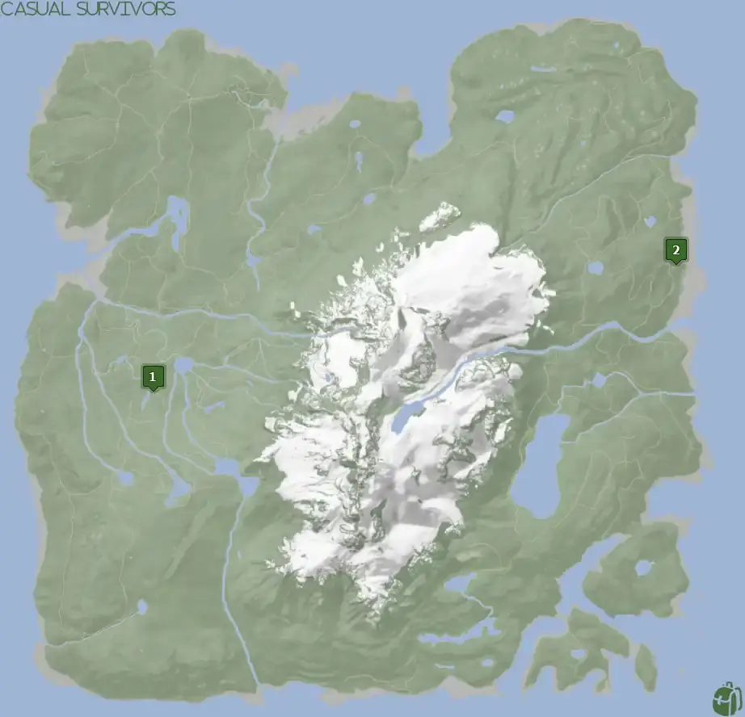


Where to find the Cross and the requirements to obtain it in the Sons of the Forest.


## Cross in Sons of the Forest
The Cross is a weapon used for demons! It's an AoE attack that will affect demons while you are holding it out in your right hand.

The Cross has no durability, doesn't require additional items, and can't be crafted into something else, so this is the final form.

## Requirements to Obtain
**Cave and Varies** - Some items require the player to solve a puzzle or use other collected items to obtain. For example, you may need to dig into the ground to find an item, so in situations like that, you will need a shovel. 

Depending on which Cross location you head towards will depend on what you need. Cross Location 1 will be the easiest to obtain.

## Cross Map
Below is a world map with all the known locations for the Cross.

## Cross Location 1
The green marker labeled 1 on the map is the location of the cave you need to enter to obtain the Cross. Once inside, if you hug the right wall you will eventually reach your destination. It's not that far into the cave and you should find it rather fast. 

### Tips for Finding Cross
The cave is between 2 lakes and near the [Stun Baton](/sons-of-the-forest/guides/stun-baton/). Head towards the Location 1 marker and after some time, a cave icon will appear on your map. Follow that icon to the cave entrance for the Cross.

### Requirements for Location 1
**Cave** - You have to enter a cave with the chance of combat. It's possible to avoid combat and obtain the Cross, however, that depends on your stealth skills. 

### More Items Nearby
The [Rope Gun](/sons-of-the-forest/guides/rope-gun/) is further into the cave, however, you will need to fight to reach it. 

## Cross Location 2
The green marker labeled 2 on the map is the location of the final bunker. You have to unlock the doors to gain entry. Once inside, head towards the lounge area shown below to find the Cross.

### Requirements to Location 2
**Locked Door, Guest Keycard, Maintenance Keycard, Gun Rope, Rebreather, & Shovel** - Location 4 requires the [Gun Rope](/sons-of-the-forest/guides/rope-gun/), [Rebreather](/sons-of-the-forest/guides/rebreather/), [Shovel](/sons-of-the-forest/guides/shovel/), [Maintenance Keycard](/sons-of-the-forest/guides/maintenance-keycard/), and the [Guest Keycard](/sons-of-the-forest/guides/guest-keycard/) to access the bunker. On top of all of these items, you need to unlock the doors while at the Residential Bunker to unlock the final Bunker.

## More Possible Locations
Currently, there are only 2 known locations for the Cross. More locations may come in future updates, but at this time players can only obtain it at the location above.
We will make sure to update our map with any new spots when Sons of the Forest gets any new updates for the Cross.

## Obtain Once
The Cross can only be obtained once. If the item had other spawn locations (Which may happen in the future), they would despawn preventing you from picking up multiple versions of the item. This is how Sons of the Forest enables the players to have multiple options when looting major items. 

## Conclusion
There are no requirements for the Cross at Location 1 and is the easiest to obtain, while Location 2 is towards the end of the game. If you want to collect all the items in Sons of the Forest, make sure you head to one of the marked spots and collect your Cross!

Additionally; we would like to know if you enjoyed our guide. Let us know what you think and provide any feedback you may feel would improve the quality of the guide. To do so, join us on [Discord](https://discord.gg/ZXp93XsKnN) and let us know! We would love to hear from you! 