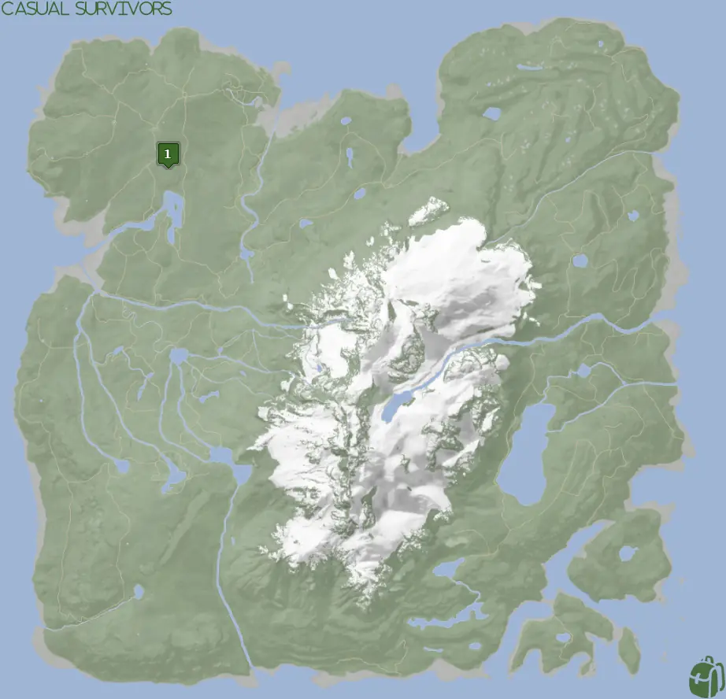
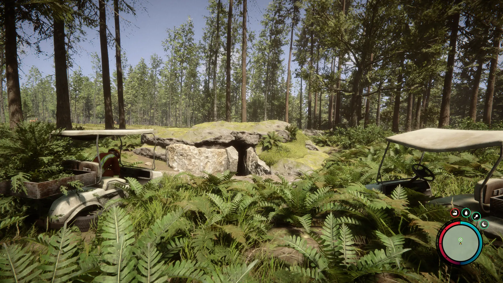
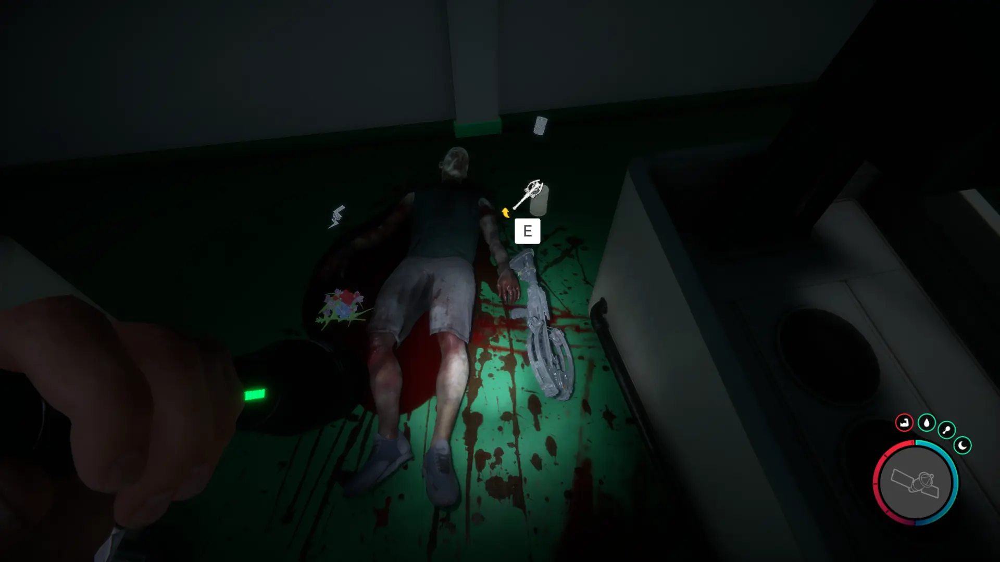
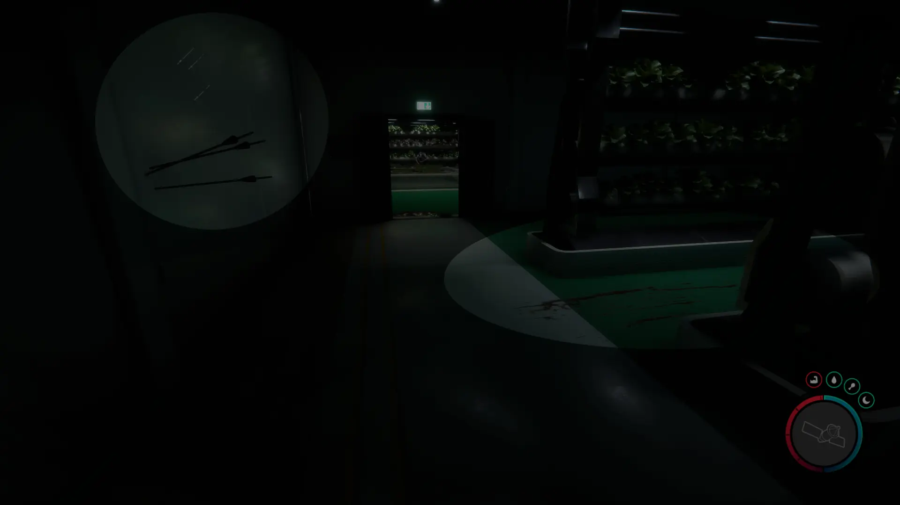


Where to find the Crossbow and the requirements to obtain it in the Sons of the Forest.


## Crossbow in Sons of the Forest
The Crossbow is a weapon used for demons! It's an AoE attack that will affect demons while you are holding it out in your right hand.

The Crossbow has no durability, doesn't require additional items, and can't be crafted into something else, so this is the final form.

## Requirements to Obtain
**Cave, Bunker, Combat, Maintenance Keycard, Gun Rope, Rebreather, & Shovel** - Some items require the player to solve a puzzle or use other collected items to obtain. For example, you may need to dig into the ground to find an item, so in situations like that, you will need a shovel. 

The [Gun Rope](/sons-of-the-forest/guides/gun-rope/), [Rebreather](/sons-of-the-forest/guides/rebreather/), and [Shovel](/sons-of-the-forest/guides/shovel/) are all requirements to obtain the Maintenance Keycard. They are not required while inside the Cave/Bunker to access the Crossbow, however.

## Crossbow Map
Below is a world map with all the known locations for the Crossbow.

## Crossbow Location 1
The green marker labeled 1 on the map is the location of the cave you need to enter to obtain the Crossbow. The location is naturally marked with a pulsing green circle on your map when you are close to the area. You can pinpoint the location by following that. You know you are close when you can spot 2 golf carts.

Once inside the cave, you will need to enter the bunker and progress past the maintenance keycard door to find the crossbow. Expect combat in this area!

### Tips for Finding Crossbow
Once past the Maintenace Door, you will enter a hydroponics research area. In the second room in between the third row of plant specimens, you can find the crossbow next to a dead body. There will be 3 bolts in the wall and a blood trail to the body to let you know that's the row where the crossbow is located (See below).

### More Items Nearby
The Dress and [VIP Keycard](/sons-of-the-forest/guides/vip-keycard/) are also in this bunker. Make sure to check out those guides for more information about them.

## More Possible Locations
Currently, there is only 1 known location for the Crossbow. More locations may come in future updates, but at this time players can only obtain it at the location above.
We will make sure to update our map with any new spots when Sons of the Forest gets any new updates for the Crossbow.

## Obtain Once
The Crossbow can only be obtained once. If the item had other spawn locations (Which may happen in the future), they would despawn preventing you from picking up multiple versions of the item. This is how Sons of the Forest enables the players to have multiple options when looting major items. 

## Conclusion
There are no requirements for the Crossbow and there is only 1 known location to obtain it. So, if you want to collect all the items in Sons of the Forest, make sure you head to the marked spot and collect your Crossbow!

Additionally; we would like to know if you enjoyed our guide. Let us know what you think and provide any feedback you may feel would improve the quality of the guide. To do so, join us on [Discord](https://discord.gg/ZXp93XsKnN) and let us know! We would love to hear from you! 