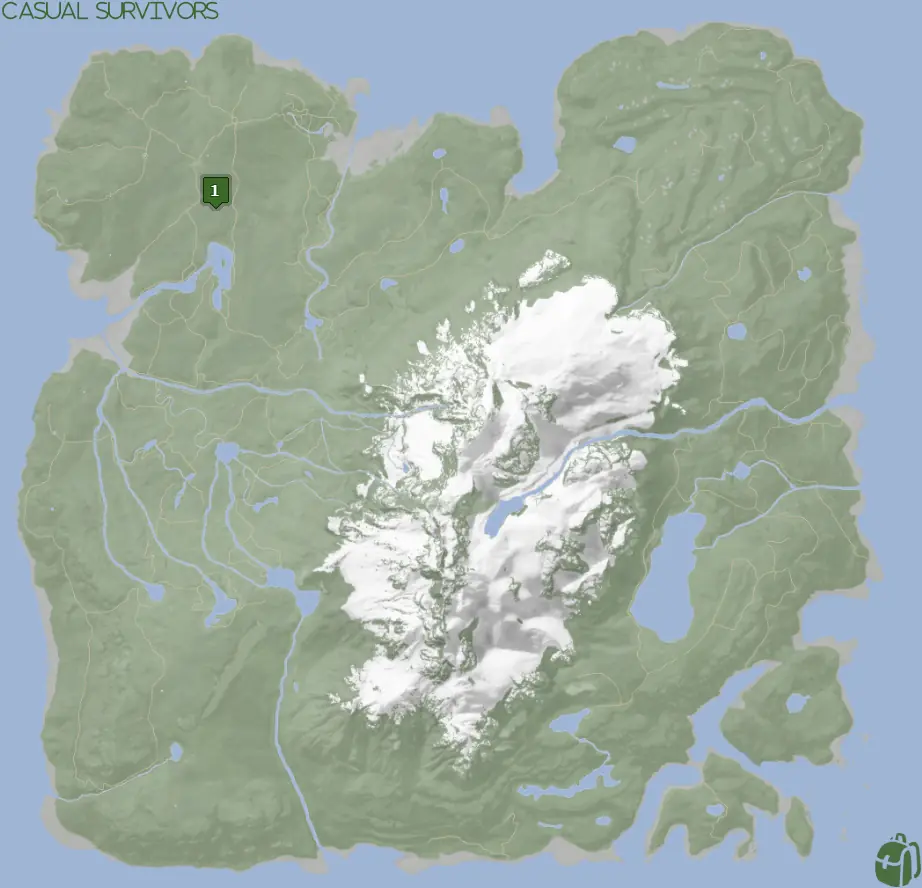
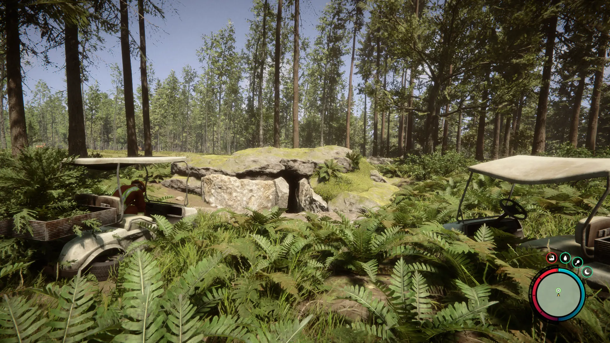
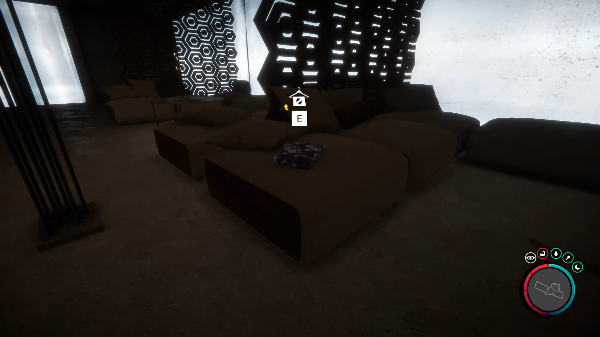


Where to find the Dress and the requirements to obtain it in the Sons of the Forest.


## Dress in Sons of the Forest
The Dress is cloth gear that you can give to Virginia for a cosmetic override. 

The Camouflage Suit has no durability, doesn't require additional items, and can't be crafted into something else, so this is the final form.

## Requirements to Obtain
**Cave, Bunker, Combat, VIP Keycard, Maintenance Keycard, Gun Rope, Rebreather, & Shovel** - Some items require the player to solve a puzzle or use other collected items to obtain. For example, you may need to dig into the ground to find an item, so in situations like that, you will need a shovel. 

The [Gun Rope](/sons-of-the-forest/guides/gun-rope/), [Rebreather](/sons-of-the-forest/guides/rebreather/), and [Shovel](/sons-of-the-forest/guides/shovel/) are all requirements to obtain the Maintenance Keycard. They are not required while inside the Cave/Bunker to access the VIP Keycard, however. The [VIP Keycard](/sons-of-the-forest/guides/vip-keycard/) is located in the same area as the Dress, however, you must obtain it before you can access the location of the dress.

## Dress Map
Below is a world map with all the known locations for the Dress.

## Dress Location 1
The green marker labeled 1 on the map is the location of the cave you need to enter to obtain the VIP Keycard. The location is naturally marked with a pulsing green circle on your map when you are close to the area. You can pinpoint the location by following that. You know you are close when you can spot 2 golf carts.

Once inside the cave, you will need to enter the bunker and progress past the maintenance keycard door and flooded areas to reach the security room with the [VIP Keycard](/sons-of-the-forest/guides/vip-keycard/). With the new keycard in hand, you can progress further into the area.

When you enter the lounge-style area, on the right-hand side of the room, the dress will be upon a cushioned chair as shown below.

### More Items Nearby
The [Crossbow](/sons-of-the-forest/guides/crossbow/) is also in this bunker closer toward the entrance of the bunker. The [VIP Keycard](/sons-of-the-forest/guides/vip-keycard/) is as well, but as mentioned above it's a required item to enter the area with the Dress, so you would have had to obtain it.

## More Possible Locations
Currently, there is only 1 known location for the Dress. More locations may come in future updates, but at this time players can only obtain it at the location above. We will make sure to update our map with any new spots when Sons of the Forest gets any new updates for the Dress.

## Achievements 
The Dress is an item required for the FASHIONISTA achievement. To earn this achievement, you need to gather all the possible clothing items. Check this Article's Series for the other locations of the clothes. 

## Obtain Once
The Dress can only be obtained once. If the item had other spawn locations (Which may happen in the future), they would despawn preventing you from picking up multiple versions of the item. This is how Sons of the Forest enables the players to have multiple options when looting major items. 

## Conclusion
There are no requirements for the Dress and there is only 1 known location to obtain it. So, if you want to collect all the items in Sons of the Forest or want the FASHIONISTA achievement, make sure you head to the marked spot and collect your Dress!

Additionally; we would like to know if you enjoyed our guide. Let us know what you think and provide any feedback you may feel would improve the quality of the guide. To do so, join us on [Discord](https://discord.gg/ZXp93XsKnN) and let us know! We would love to hear from you! 