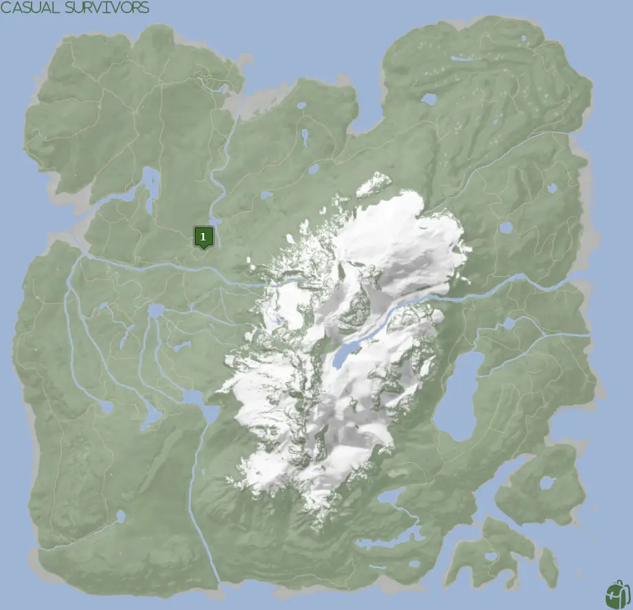
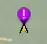
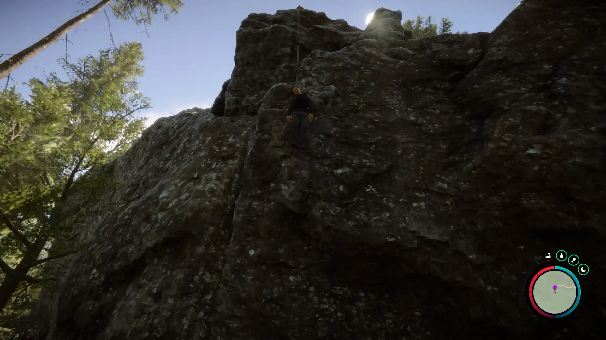
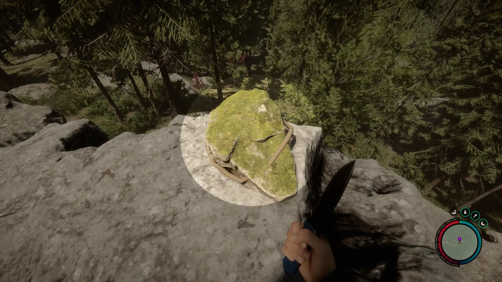
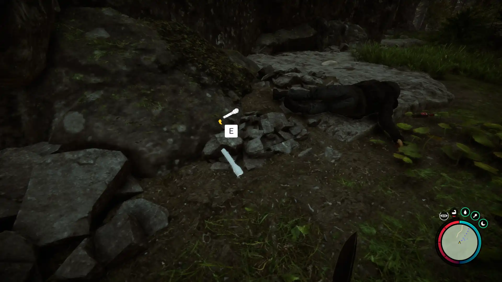


Where to find the Flashlight and the requirements to obtain it.


## Requirements to Obtain
Some items have multiple locations or requirements to obtain them. Make sure to keep this in mind when looking over the map below.
For the Flashlight, no additional items are required. You will need to cut the rope to obtain the flashlight off the dead body. 

## Map Location

You can also follow the Pink ! GPS Tracker icon on your map.

## Flashlight Location 1
The green marker on the map above is location 1. Head to that spot on the map.
You will want to be on the upper part of the ledge so that you can cut the rope.

### Cutting the Rope
There isn't anything special about cutting the rope. You just need to find a way up top and swing one of your sharp weapons at the rope.
Upon swinging your weapon, the rope will break causing the dead body to drop. You will want to circle back down as the fall will kill you.

## More Locations
There may be more locations for the Flashlight. If there are we will make sure to update the map with a more up-to-date version with the location(s).

Do you know of a spot that we've missed? Reach out to us on Discord with a screenshot of the location and we will update the guide with it! 
