
Where to find the Glider and the requirements to obtain it in the Sons of the Forest.


## Glider in Sons of the Forest
The Glider is a tool that lets you glide through the sky and scout out areas from far above. It's NOT an item you can keep in your bags and you will have to keep it with you if you wish to keep the glider. 

The Glider has no durability, doesn't require additional items, and can't be crafted into something else, so this is the final form.

## Requirements to Obtain
**None** - Some items require the player to solve a puzzle or use other collected items to obtain. For example, you may need to dig into the ground to find an item, so in situations like that, you will need a shovel. 

## Glider Map
Below is a world map with all the known locations for the Glider.
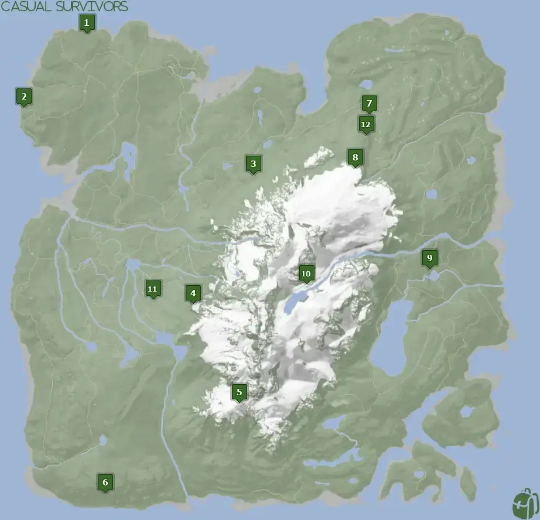

## Glider Location 1
Head to the location 1 icon on the map for this Glider. It's located on the edge of a grassy cliff. It's directly north of one of the [Shotgun Rail](/sons-of-the-forest/guides/shotgun-rail/) spawn locations.

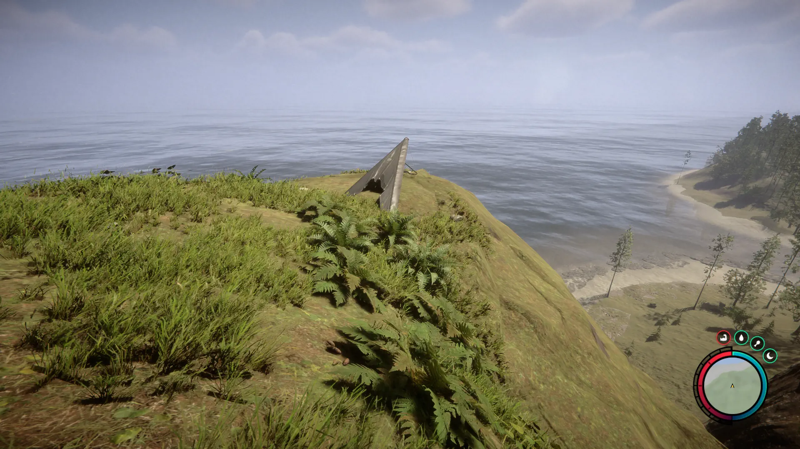

## Glider Location 2
Head to the location 2 icon on the map for this Glider. It's located on the edge of a cliff of rocks, so be on the lookout for an outcrop of rocks.

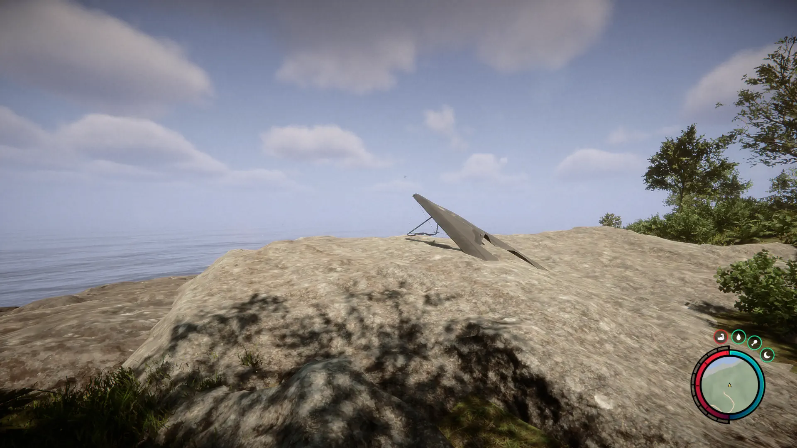

## Glider Location 3
Head to the location 3 icon on the map for this Glider. It's located in a small camp next to a small pond. When looking at your map, the small pond will show up a slightly darker green color than the rest and that should help you pinpoint the location of the camp.

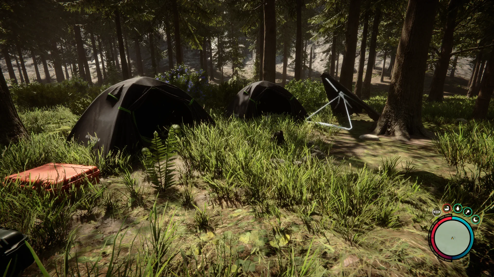

## Glider Location 4
Head to the location 4 icon on the map for this Glider. It's located on the edge of a snow cliff. There is a bit of climbing you will need to do to reach it, however, it's rather straightforward to find thankfully.

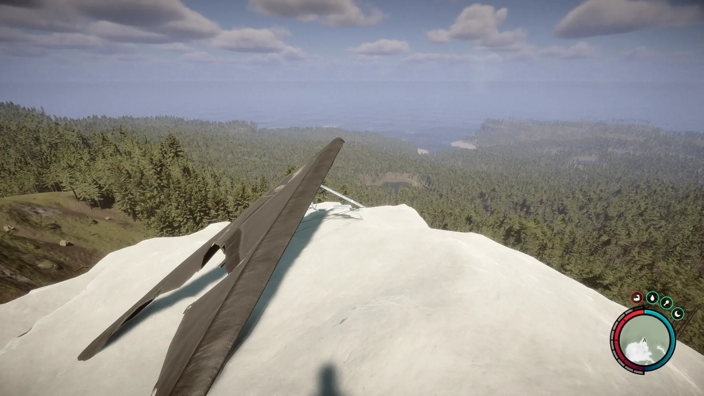

## Glider Location 5
Head to the location 5 icon on the map for this Glider. It's located in a small camp next to the tree lines in the mountains. When looking at your map, there is a cave nearby, so look for that cave icon and head toward that and then uphill from it.

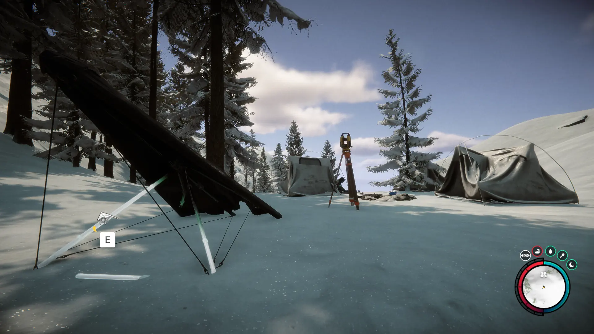

## Glider Location 6
Just down the hill next to a cannibal camp, so expect some resistance if you want to go after this one. 
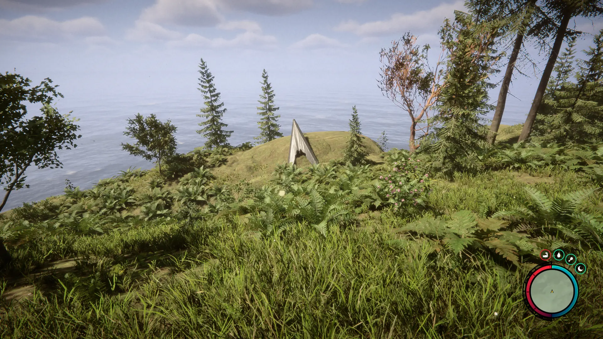

## Glider Location 7
High up on the cliff next to the path. Make sure not to fall to your death when picking it up!
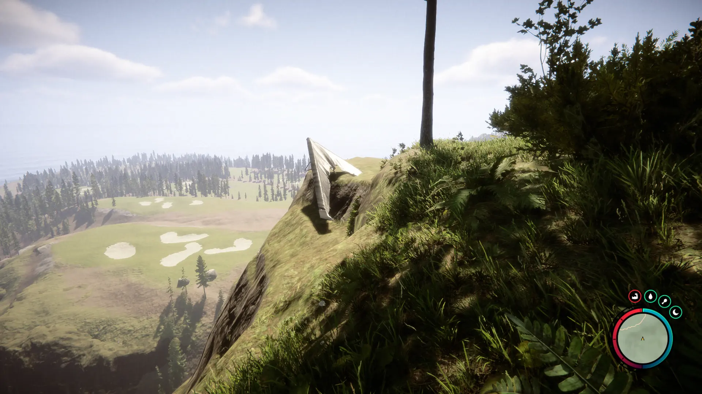

## Glider Location 8
At a camp located on the edge of a snow ridge. Look for the 2 tents for easy finding. 
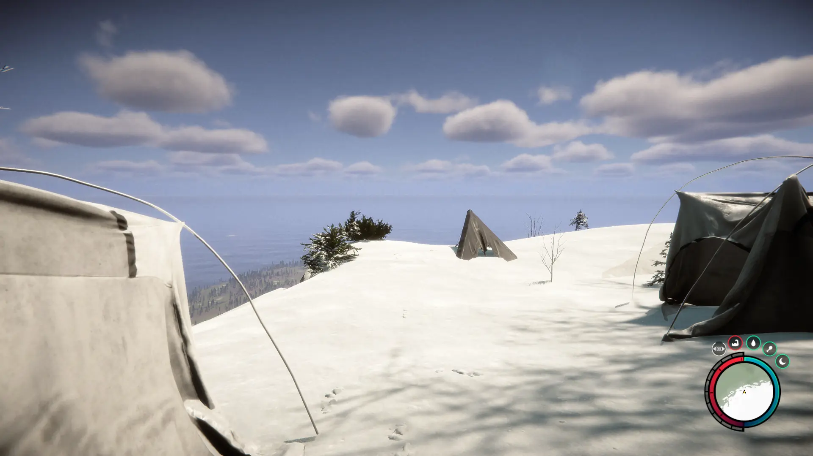

## Glider Location 9
Another grassy ridge where you can pick up the glider.
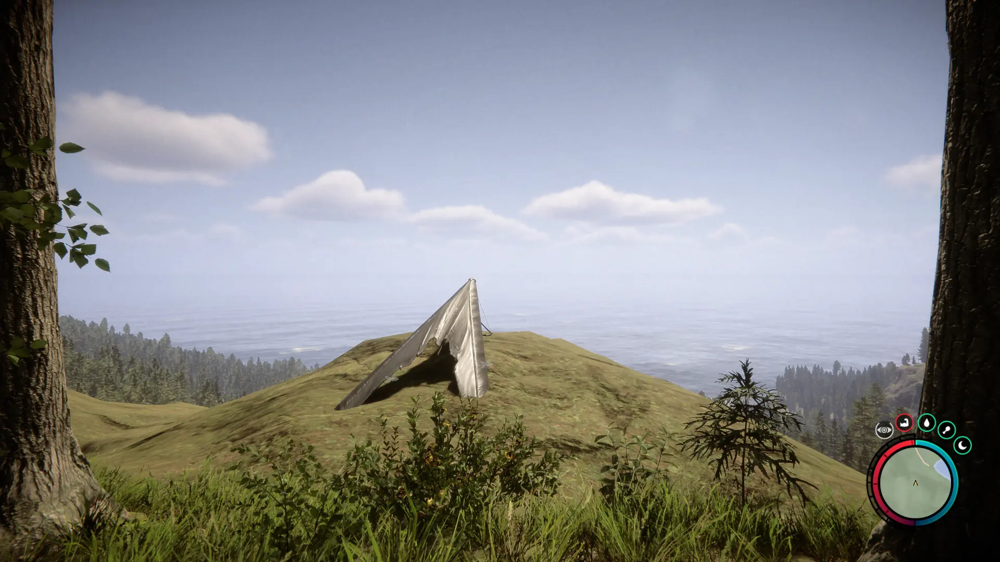

## Glider Location 10
Shockingly, this one is not on any ridge and is in a base camp area. It's great to get and then run up a ridge to fly off somewhere. 
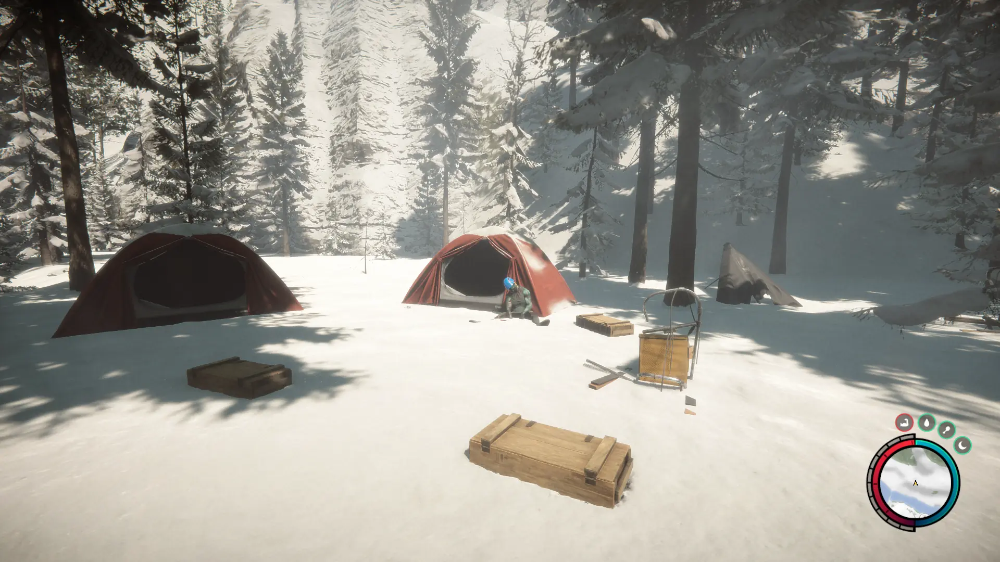

## Glider Location 11
Right above the lake on the rocky ridge. Great for starters.
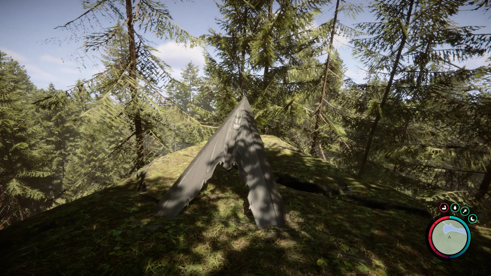

## Glider Location 12
Right above the lake on the rocky ridge. Great spot for those looking to explore the golf coarse.
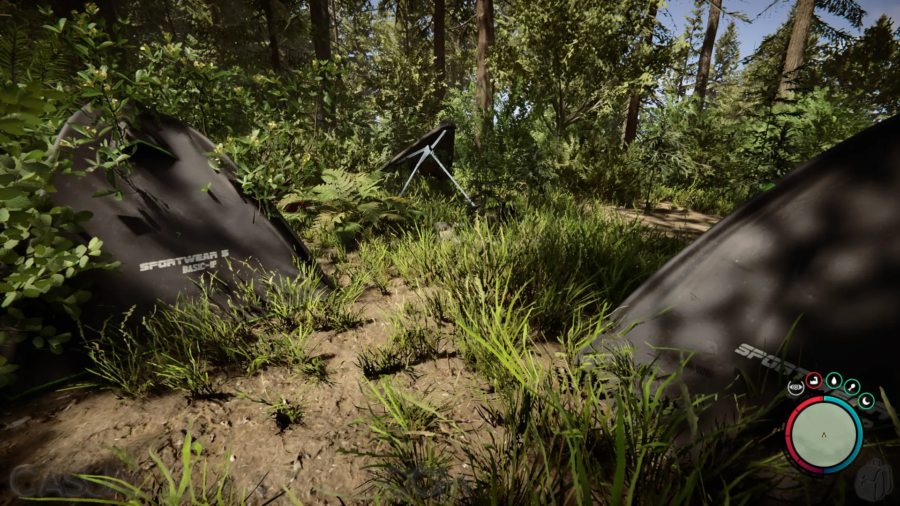

## More Possible Locations
Currently, there are 12 known locations for the Glider. More locations may come in future updates, but at this time players can only obtain it at the location above.
We will make sure to update our map with any new spots when Sons of the Forest gets any new updates for the Glider or if the community finds more spawn locations.

## Obtain Many
Each instance of the Glider will stay in the game as you play. Other instances of the glider will not despawn if you loot one as these are not permanently looted items. So, unlike other items in-game this one will behave slightly differently than what you are used to. 

## Conclusion
There are no requirements for the Glider and there are many known locations to obtain it. So, if you want to collect all the items in Sons of the Forest, make sure you head to one of the markers on the map above and collect your Glider!

Additionally; we would like to know if you enjoyed our guide. Let us know what you think and provide any feedback you may feel would improve the quality of the guide. To do so, join us on [Discord](https://discord.gg/ZXp93XsKnN) and let us know! We would love to hear from you! 

### Guide Updates
- [Mar 15th, 2023] Added more spawn locations of the Glider.

