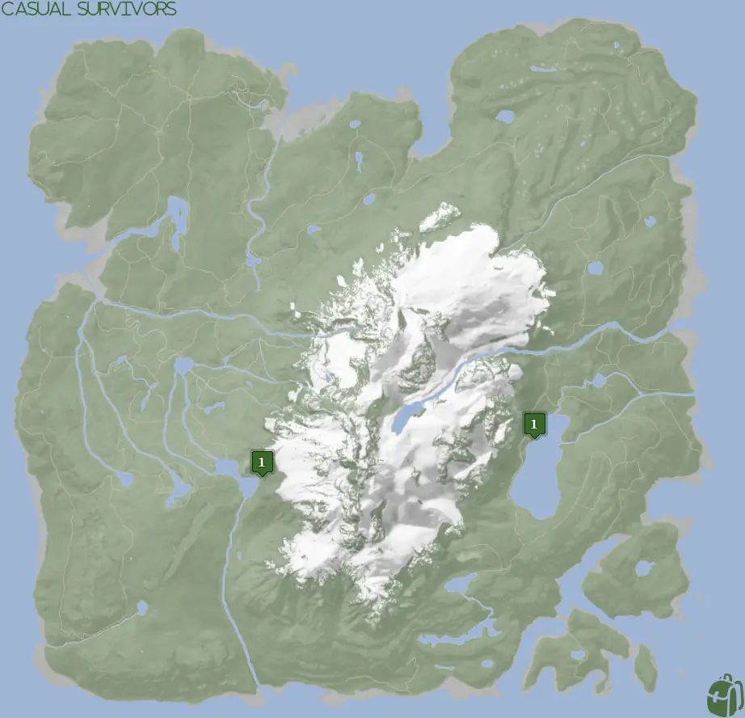
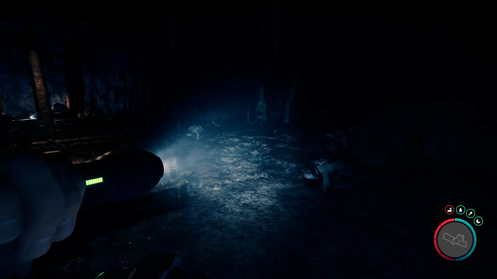
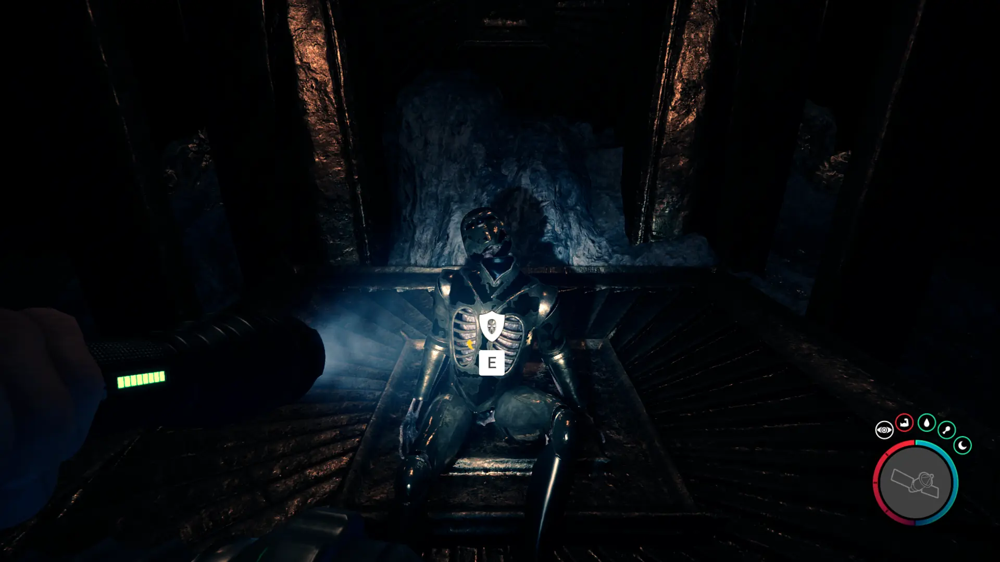
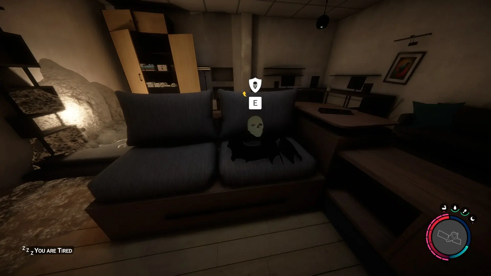


Where to find the Golden Armor and the requirements to obtain it in the Sons of the Forest.


## Golden Armor in Sons of the Forest
The Golden Armor is armor that you can use to protect yourself from attack and is a key item required to complete the game.

The Golden Armor had durability and will break after you are hit enough. Because of this, it is strongly encouraged to only use the armor once you need to use it to progress through the game. 

## Requirements to Obtain
**Rebreather** - Some items require the player to solve a puzzle or use other collected items to obtain. For example, you may need to dig into the ground to find an item, so in situations like that, you will need a  Shovel. 

The Golden Armor only requires the [Rebreather](/sons-of-the-forest/guides/rebreather/) to access it. However, there is **a lot** of combat in the caves where the Golden Armor is located, so you are strongly encouraged to bring a lot of armor for this adventure. 

## Golden Armor Map
Below is a world map with all the known locations for the Golden Armor.

## Golden Armor Location 1
Head to one of the Location 1 markers on the map above to enter the cave where the Golden Armor is located. The cave is massive and will take a good amount of time to traverse it. 

Whichever entrance you take will not matter as they all will eventually lead you to the golden armor. You will know you are progressing the right way when you fall or slide down areas that prevent you from traveling backward. 

You will know when you are getting close to the Golden Armor because you will start seeing men in astronaut-looking armor.

The dead body on display is wearing the Golden Armor. 

If you start to climb ropes back to back and go up 3-4 levels, then you've passed the Golden Armor. Head back down as far as you can go and look around for the armor in that area. 

## More Possible Locations
Currently, there is only 1 known location for the Golden Armor. More locations may come in future updates, but at this time players can only obtain it at the location above.
We will make sure to update our map with any new spots when Sons of the Forest gets any new updates for the Golden Armor.

### Old Location
Before [Patch 2](/sons-of-the-forest/news/patch-2/#improvements) the Golden Armor was located in the South-Eastern bunker as shown below;

## Conclusion
There are no requirements for the Golden Armor and there is only 1 known location to obtain it. So, if you want to collect all the items in Sons of the Forest, make sure you head to the marked spot and collect your Golden Armor!

Additionally; we would like to know if you enjoyed our guide. Let us know what you think and provide any feedback you may feel would improve the quality of the guide. To do so, join us on [Discord](https://discord.gg/ZXp93XsKnN) and let us know! We would love to hear from you! 