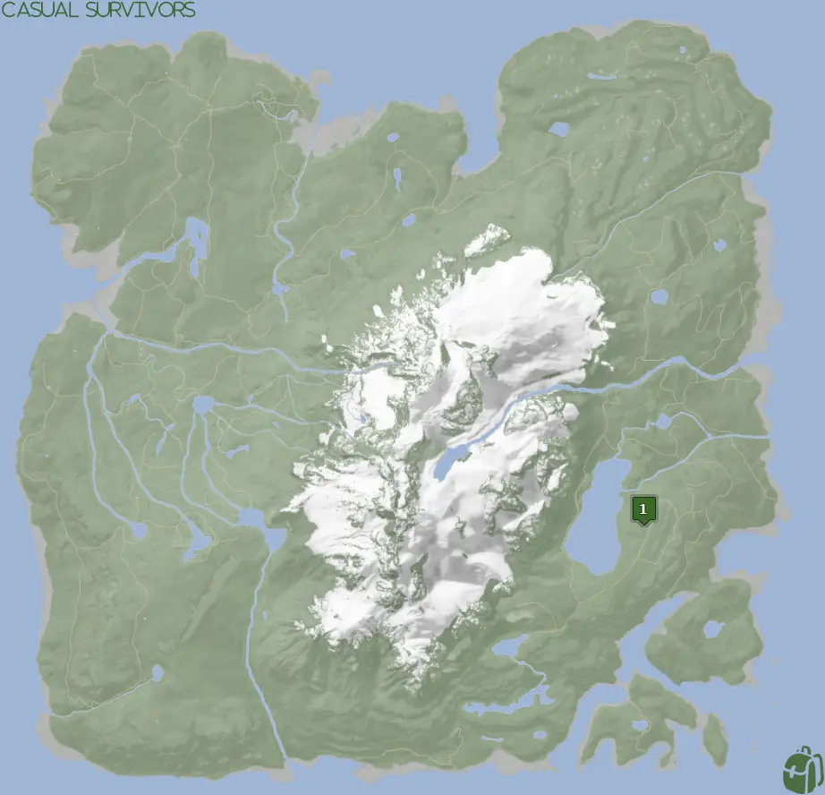
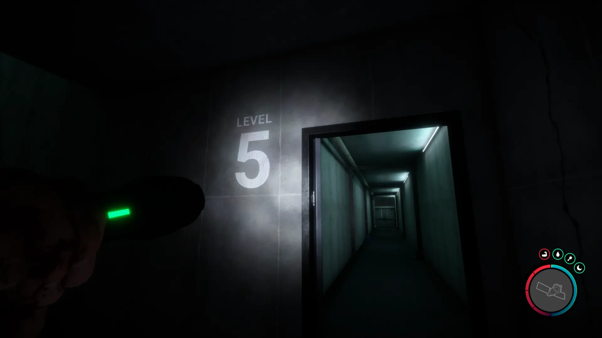


Where to find the Golden Mask and the requirements to obtain it in the Sons of the Forest.


## Golden Mask in Sons of the Forest
The Golden Mask is a tool you can use to scare away certain cannibal tribes. Simply, the low-level cannibals who have eyes are likely to be frightened by your Golden Mask while in use. It has better effects than the [Red Mask](/sons-of-the-forest/guides/red-mask/)

## Requirements to Obtain
**Guest Keycard, Maintenance Keycard, Gun Rope, Rebreather, & Shovel** - Location 4 requires the [Gun Rope](/sons-of-the-forest/guides/rope-gun/), [Rebreather](/sons-of-the-forest/guides/rebreather/), [Shovel](/sons-of-the-forest/guides/shovel/), [Maintenance Keycard](/sons-of-the-forest/guides/maintenance-keycard/), and the [Guest Keycard](/sons-of-the-forest/guides/guest-keycard/) to access the bunker.

## Golden Mask Map
Below is a world map with all the known locations for the Golden Mask.

## Golden Mask Location 1
Head towards the green location 1 marker on the map above. While heading to that location, look for the pulsing green icon on your map to appear so you can follow that. Once you reach the location, you will find the cave entrance.

Once inside, you will need to use the Guest Keycard to progress further in. The Golden Mask is near the end of the bunker. Keep progressing downwards until you reach Level 5.

Once on Level 5, head down the hallway until you reach the morgue area. The middle body on the table will have your Golden Mask.

### Items Nearby
You can find a 3D Printer in this bunker, so if you still need to craft anything from that you can do so. Additionally, you can find the [Leather Suit](/sons-of-the-forest/guides/leather-suit/), [Pistol](/sons-of-the-forest/guides/pistol/), [Pistol Rail](/sons-of-the-forest/guides/pistol-rail/), [Shotgun Rail](/sons-of-the-forest/guides/shotgun-rail/), and [Katana](/sons-of-the-forest/guides/katana/) in this same bunker.

## More Possible Locations
Currently, there is only 1 known location for the Golden Mask. More locations may come in future updates, but at this time players can only obtain it at the location above.
We will make sure to update our map with any new spots when Sons of the Forest gets any new updates for the Golden Mask.

## Obtain Once
The Golden Mask can only be obtained once. If the item had other spawn locations (Which may happen in the future), they would despawn preventing you from picking up multiple versions of the item. This is how Sons of the Forest enables the players to have multiple options when looting major items. 

## Conclusion
There are no requirements for the Golden Mask and there is only 1 known location to obtain it. So, if you want to collect all the items in Sons of the Forest, make sure you head to the marked spot and collect your Golden Mask!

Additionally; we would like to know if you enjoyed our guide. Let us know what you think and provide any feedback you may feel would improve the quality of the guide. To do so, join us on [Discord](https://discord.gg/ZXp93XsKnN) and let us know! We would love to hear from you! 