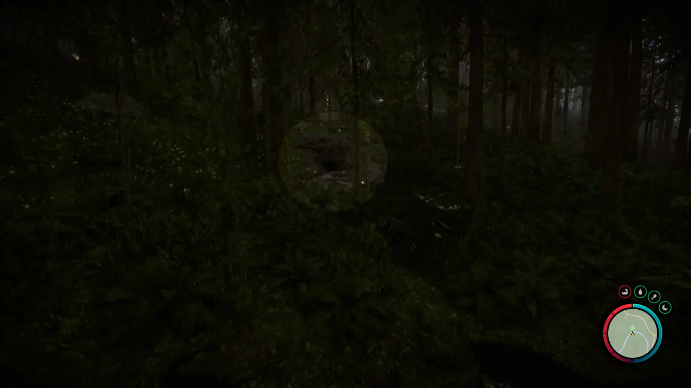


Where to find the Guest Keycard and the requirements to obtain it in the Sons of the Forest.


## Guest Keycard in Sons of the Forest
The Guest Keycard is a key item that gives you access to certain bunker doors around the game. 

The Maintenance Keycard has no durability, doesn't require additional items, and can't be crafted into something else, so this is the final form.

## Requirements to Obtain
**Maintenance Keycard, Gun Rope, Rebreather, & Shovel** - Some items require the player to solve a puzzle or use other collected items to obtain. For example, you may need to dig into the ground to find an item, so in situations like that, you will need a Shovel. 

The [Gun Rope](/sons-of-the-forest/guides/rope-gun/) and [Rebreather](/sons-of-the-forest/guides/rebreather/) are requirements for the [Shovel](/sons-of-the-forest/guides/shovel/), which is what you need to access the Bunker of Maintenance Shaft A where you can obtain the [Maintenance Keycard](/sons-of-the-forest/guides/maintenance-keycard/). The Maintenance Keycard is the only item you need to access the area within the cave where the Guest Keycard is located.

## Guest Keycard Map
Below is a world map with all the known locations for the Guest Keycard.

## Guest Keycard Location 1
Head to the green location 1 marked on the map and look for a pulsing green icon on your map in the game. The location is marked in the game with the pulsing green circle, so head toward that when you see it in the area.

Once in the area, you are searching the cave entrance or the abandoned golf cart.

Inside the cave, head further until you need to use your keycard.

Progress past the Gym and up to a second floor. On the second floor keep progressing until you reach the club area. In one of the cubby side spots, you will find a group of dead bodies where you can find the Guest Keycard on the table.

## More Possible Locations
Currently, there is only 1 known location for the Guest Keycard. More locations may come in future updates, but at this time players can only obtain it at the location above.
We will make sure to update our map with any new spots when Sons of the Forest gets any new updates for the Guest Keycard.

## Obtain Once
The Guest Keycard can only be obtained once. If the item had other spawn locations (Which may happen in the future), they would despawn preventing you from picking up multiple versions of the item. This is how Sons of the Forest enables the players to have multiple options when looting major items. 

## Conclusion
There are no requirements for the Guest Keycard and there is only 1 known location to obtain it. So, if you want to collect all the items in Sons of the Forest, make sure you head to the marked spot and collect your Guest Keycard!

Additionally; we would like to know if you enjoyed our guide. Let us know what you think and provide any feedback you may feel would improve the quality of the guide. To do so, join us on [Discord](https://discord.gg/ZXp93XsKnN) and let us know! We would love to hear from you! 