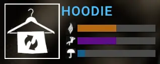
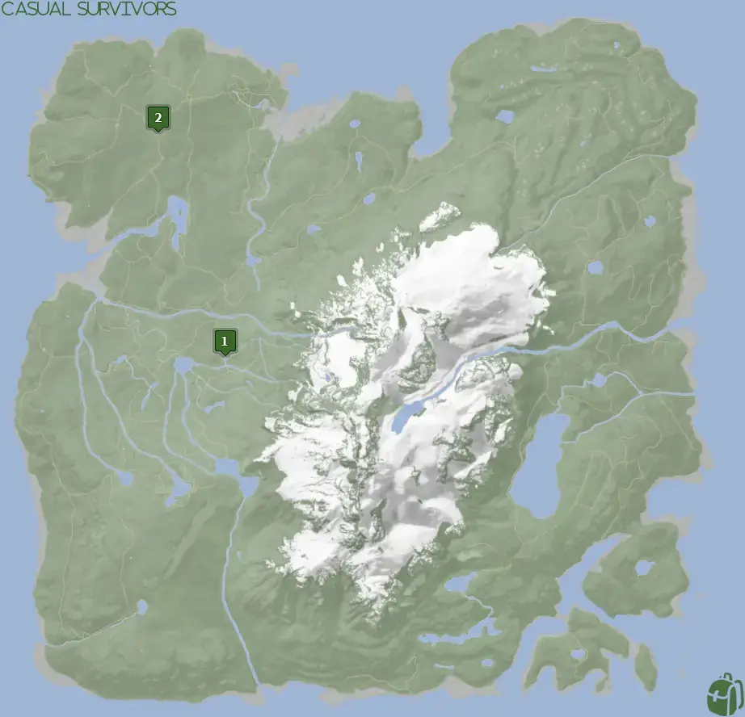
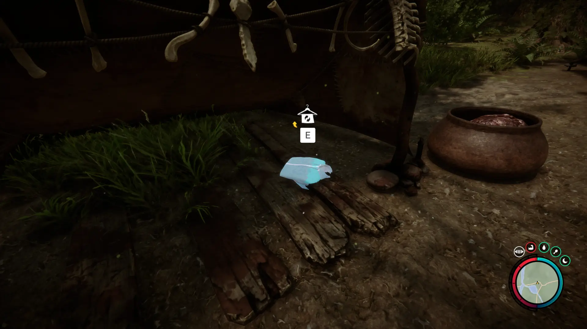
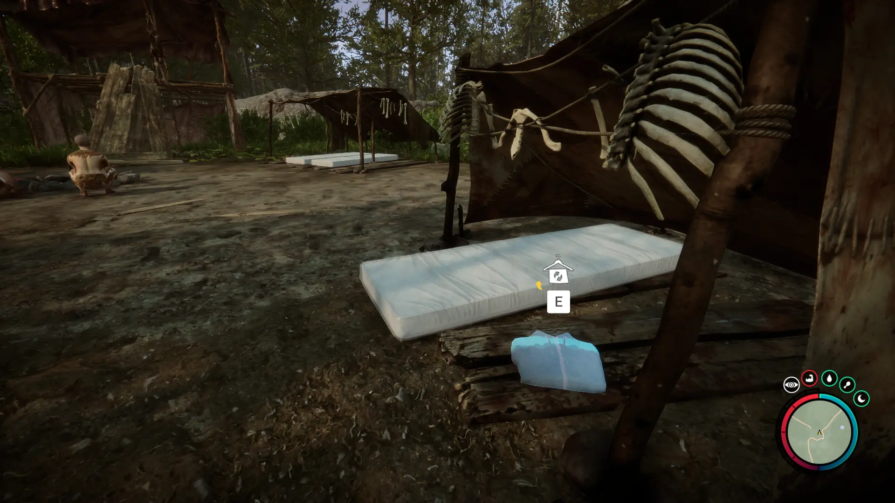


Where to find the Hoodie and the requirements to obtain it in the Sons of the Forest.


## Hoodie in Sons of the Forest
The Hoodie is cloth gear that will give you better protection from the cold than your default tactical gear does. 

The Hoodie has no durability, doesn't require additional items, and can't be crafted into something else, so this is the final form.

## Requirements to Obtain
**None** - Some items require the player to solve a puzzle or use other collected items to obtain. For example, you may need to dig into the ground to find an item, so in situations like that, you will need a shovel. 

You can walk up to the Hoodie and loot it at any point in the game.

## Hoodie Map
Below is a world map with all the known locations for the Hoodie.

## Hoodie Location 1
Head to the location 1 icon on the map for this Hoodie. You will find it inside a tent at the cannibalism camp. 

## Hoodie Location 2
Head to the location 2 icon on the map for this Hoodie. You will find it inside a tent at the cannibalism camp. 

## More Possible Locations
Currently, there are only 2 known locations for the Hoodie. More locations may come in future updates, but at this time players can only obtain it at the location above.
We will make sure to update our map with any new spots when Sons of the Forest gets any new updates for the Hoodie.

## Obtain Once
The Hoodie can only be obtained once. If the item had other spawn locations (Which may happen in the future), they would despawn preventing you from picking up multiple versions of the item. This is how Sons of the Forest enables the players to have multiple options when looting major items. 

## Achievements 
The Leather Jacket is an item required for the FASHIONISTA achievement. To earn this achievement, you need to gather all the possible clothing items. Check this Article's Series for the other locations of the clothes. 

## Conclusion
There are no requirements for the Hoodie and there is only 1 known location to obtain it. So, if you want to collect all the items in Sons of the Forest, make sure you head to the marked spot and collect your Hoodie!

Additionally; we would like to know if you enjoyed our guide. Let us know what you think and provide any feedback you may feel would improve the quality of the guide. To do so, join us on [Discord](https://discord.gg/ZXp93XsKnN) and let us know! We would love to hear from you! 