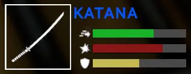
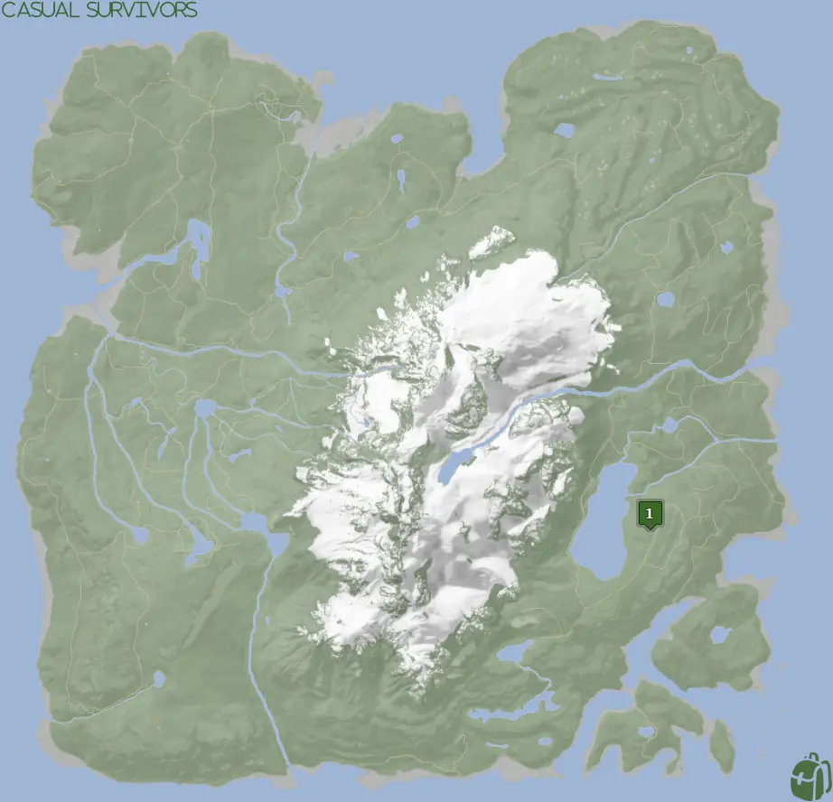
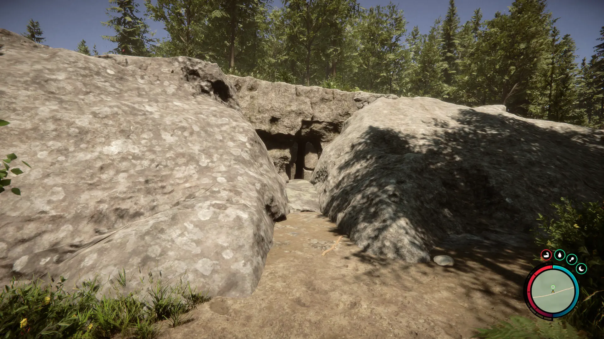
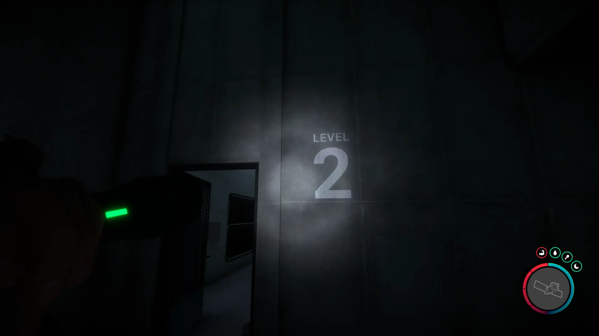
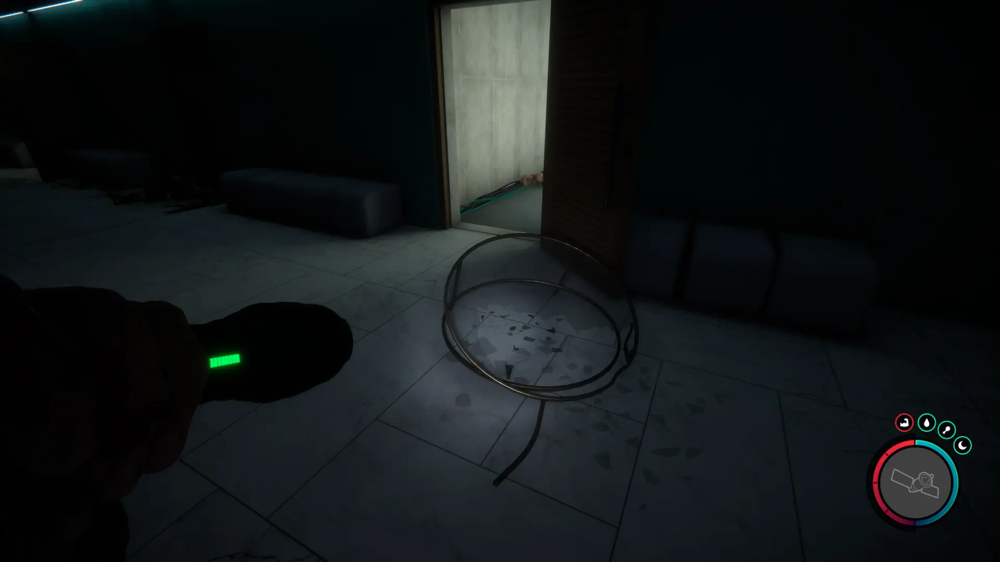
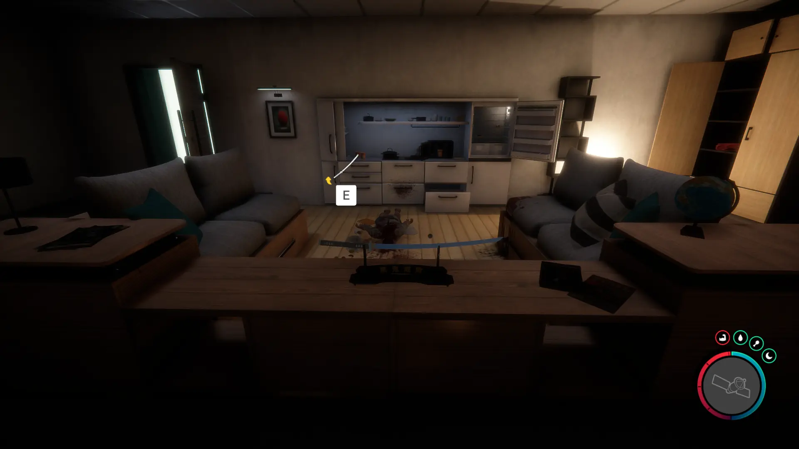


Where to find the Katana and the requirements to obtain it in the Sons of the Forest.


## Katana in Sons of the Forest
The Katana is a 1-handed weapon that can be used with your [Flashlight](/sons-of-the-forest/guides/flashlight/). It's a high damaging weapon that is great for late game. Check out the stats!

The Katana has no durability, doesn't require additional items, and can't be crafted into something else, so this is the final form.

## Requirements to Obtain
**Guest Keycard, Maintenance Keycard, Gun Rope, Rebreather, & Shovel** - Location 4 requires the [Gun Rope](/sons-of-the-forest/guides/rope-gun/), [Rebreather](/sons-of-the-forest/guides/rebreather/), [Shovel](/sons-of-the-forest/guides/shovel/), [Maintenance Keycard](/sons-of-the-forest/guides/maintenance-keycard/), and the [Guest Keycard](/sons-of-the-forest/guides/guest-keycard/) to access the bunker.

## Katana Map
Below is a world map with all the known locations for the Katana.

## Katana Location 1
Head towards the green location 1 marker on the map above. While heading to that location, look for the pulsing green icon on your map to appear so you can follow that. Once you reach the location, you will find the cave entrance.

Once inside, you will need to use the Guest Keycard to progress further in. Once you can start exploring the residential areas you want to be on level 2.

Once on level 2, you are looking for the second residential room that has a broken glass table outside of the hallway of it. Once found, head inside and look around.

### Items Nearby
You can find a 3D Printer in this bunker, so if you still need to craft anything from that you can do so. Additionally, you can find the [Leather Suit](/sons-of-the-forest/guides/leather-suit/), [Pistol](/sons-of-the-forest/guides/pistol/), [Pistol Rail](/sons-of-the-forest/guides/pistol-rail/), [Shotgun Rail](/sons-of-the-forest/guides/shotgun-rail/), and [Golden Mask](/sons-of-the-forest/guides/golden-mask/) in this same bunker.

## More Possible Locations
Currently, there is only 1 known location for the Katana. More locations may come in future updates, but at this time players can only obtain it at the location above.
We will make sure to update our map with any new spots when Sons of the Forest gets any new updates for the Katana.

## Obtain Once
The Katana can only be obtained once. If the item had other spawn locations (Which may happen in the future), they would despawn preventing you from picking up multiple versions of the item. This is how Sons of the Forest enables the players to have multiple options when looting major items. 

## Conclusion
There are no requirements for the Katana and there is only 1 known location to obtain it. So, if you want to collect all the items in Sons of the Forest, make sure you head to the marked spot and collect your Katana!

Additionally; we would like to know if you enjoyed our guide. Let us know what you think and provide any feedback you may feel would improve the quality of the guide. To do so, join us on [Discord](https://discord.gg/ZXp93XsKnN) and let us know! We would love to hear from you! 