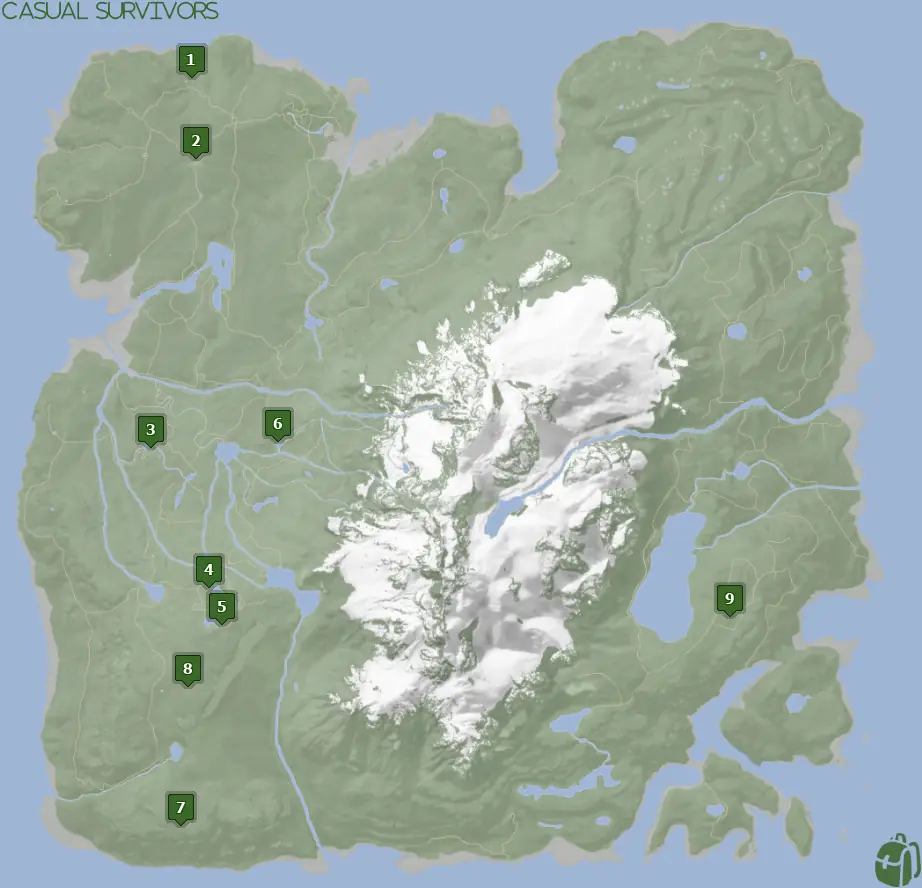
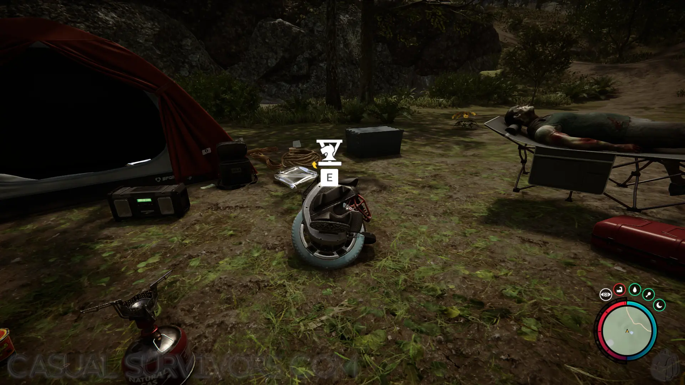
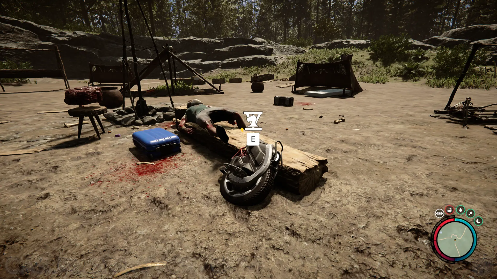
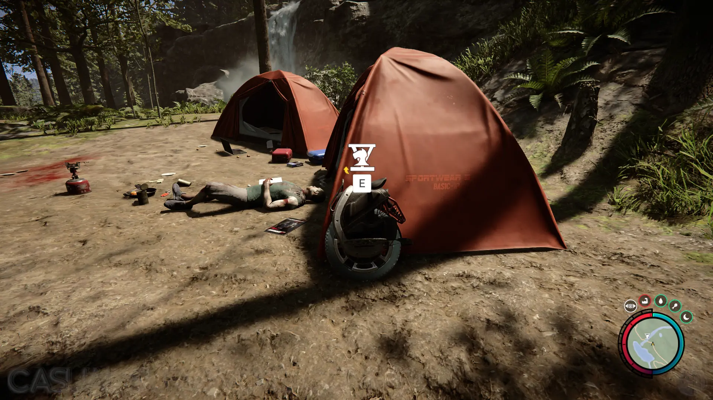
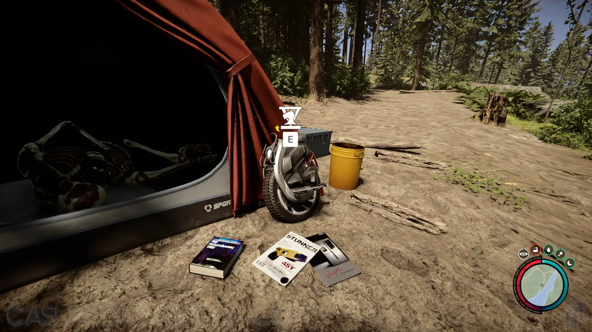
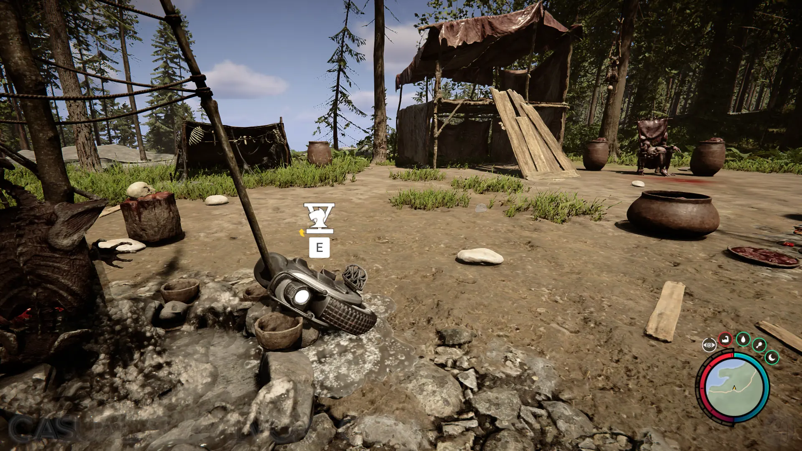
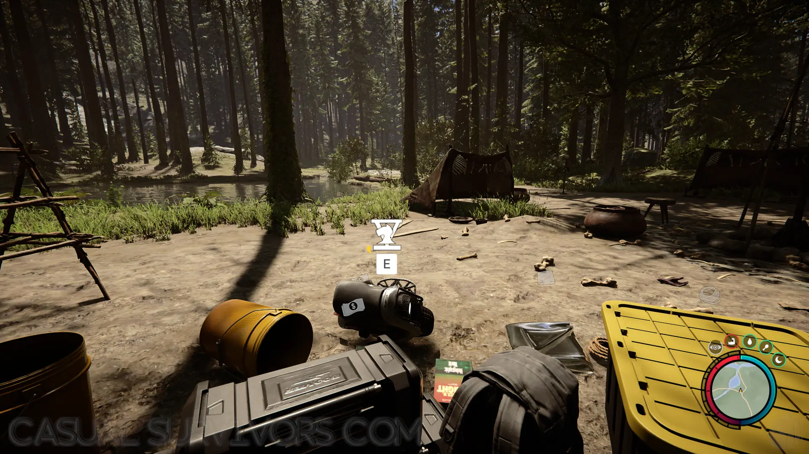
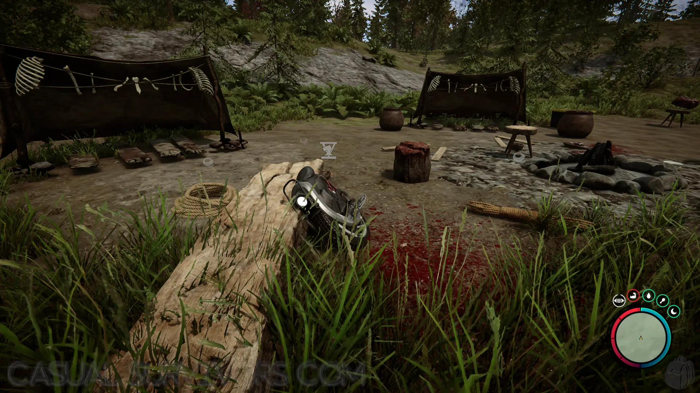
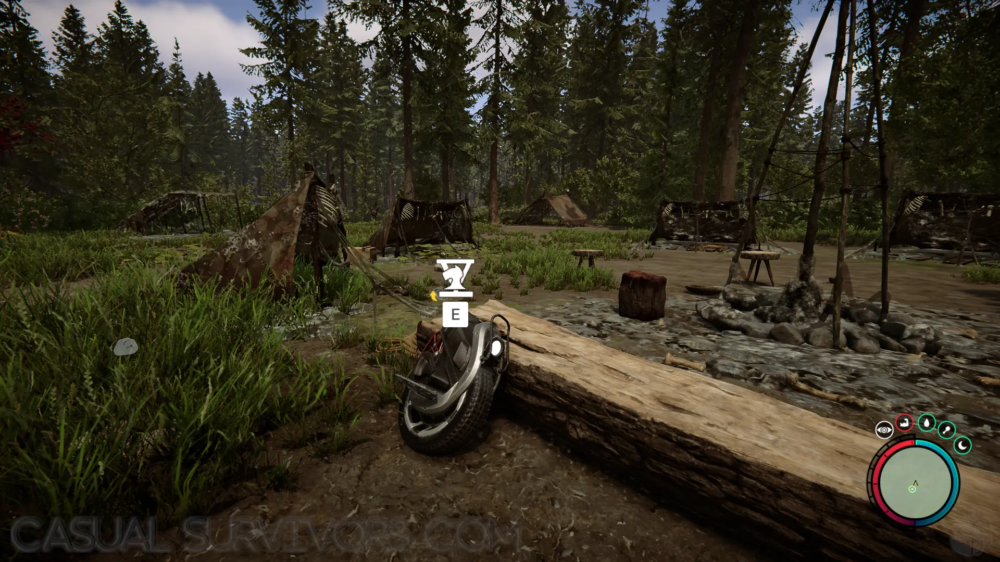
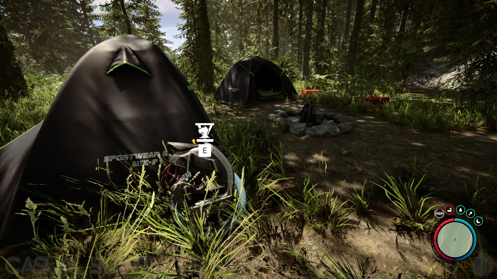


Sons of the Forest Knight V location, requirements, and everything you need to know about them and more!


## Sons of the Forest Knight V
The Knight V is an electric unicycle that is very similar to a hoverboard. It is a terrestrial vehicle that can be used for faster traveling in Sons of the Forest. The device requires batteries to power, however when first finding one it comes fully charged. 

When dismounted from Knight V, it will appear on your map so you can locate it again in the future. 

### Using the Knight V
The Knight V counts as a vehicle, so you can mount and dismount it. Double jump to dismount and interact with E when close to mount it. Movement is a bit 'loose' and slow to respond when using it. Additionally, when traversing over rough terrain you may fly off and injure yourself.

It's great for long distances and over semi-flat terrain. Make sure to bring an extra pair of batteries with you just in case you run low on power. 

## Requirements to Obtain
**None** - You can walk up and start using any of the Knight V without the need for any other items.

## Knight V Map
Below is a world map with all the known locations for the Knight V.

## Knight V Location 1
The green marker labeled 1 on the above map is the location of a human camp with a small pond nearby. You can find the [Binoculars](/sons-of-the-forest/guides/binoculars/) and [Camouflage Suit](/sons-of-the-forest/guides/camouflage-suit/) just a short walk to the north of this location.

## Knight V Location 2
The green marker labeled 2 on the above map is the location of a large cannibal camp. You can find the [Hoodie](/sons-of-the-forest/guides/hoodie/) in this same camp.

## Knight V Location 3
The green marker labeled 3 on the above map is the location of a human camp with two orange tents near a waterfall.

## Knight V Location 4
The green marker labeled 4 on the above map is the location of a small human camp with two orange tents next to the river. You can find the [Winter Jacket](/sons-of-the-forest/guides/winter-jacket/) in the tent directly next to this spot.

## Knight V Location 5
The green marker labeled 5 on the above map is the location of a large cannibal camp. 

## Knight V Location 6
The green marker labeled 6 on the above map is the location of the medium cannibal camp.

## Knight V Location 7
The green marker labeled 7 on the above map is the location of a small cannibal camp facing off the cliff. There is also a [Glider](/sons-of-the-forest/guides/glider/) just down the slope a little.

## Knight V Location 8
The green marker labeled 8 on the above map is the location of a large cannibal camp. The [Compound Bow](/sons-of-the-forest/guides/compound-bow/) and [Silencer](/sons-of-the-forest/guides/silencer) can be found next to the camp in Maintenance Bunker B.

## Knight V Location 9
The green marker labeled 9 on the above map is the location of a human camp with 2 black tents.

## More Possible Locations
Currently, there are only 9 known locations for the Knight V. More locations may come in future updates, but at this time players can only obtain it at the locations above.
We will make sure to update our map with any new spots when Sons of the Forest gets any new updates for the Stun Baton.

## Many Exsist At Once
You can obtain the Knight V more than once unlike other items in Sons of the Forest. This item, similar to the [Glider](/sons-of-the-forest/guides/glider/), doesn't store in your inventory and will exist in the world after you are done using it. If you want to start a collection of these, head to each of the locations and big them all home! 

## Conclusion
There are no requirements for the Knight V and there are  9 known locations to obtain them. 

Additionally; we would like to know if you enjoyed our guide. Let us know what you think and provide any feedback you may feel would improve the quality of the guide. To do so, join us on [Discord](https://discord.gg/ZXp93XsKnN) and let us know! We would love to hear from you! 
