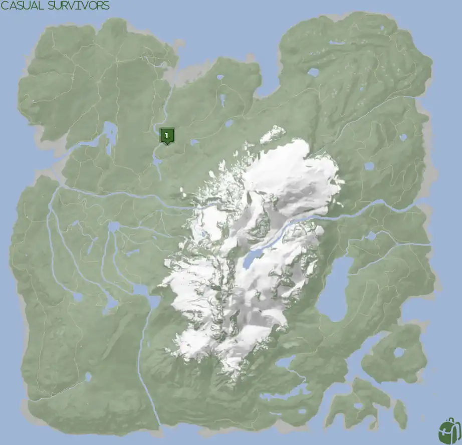
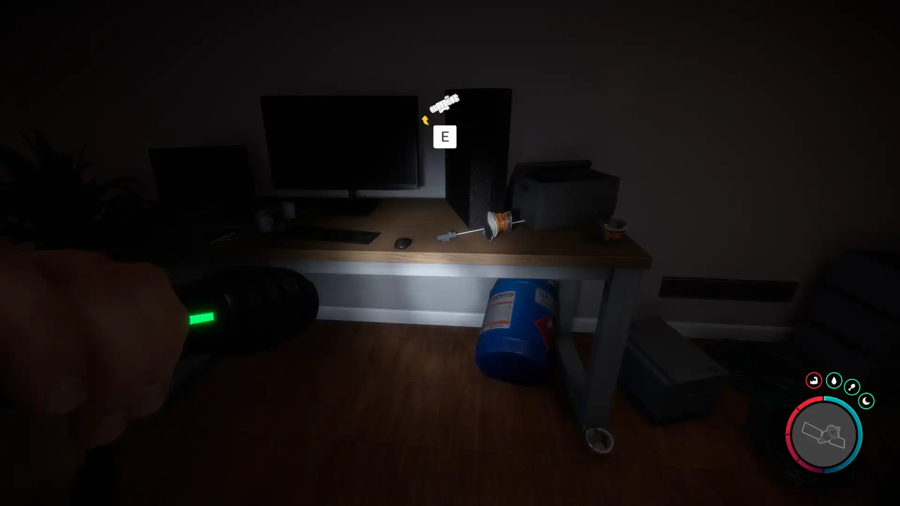


Where to find the Laser Sight and the requirements to obtain it in the Sons of the Forest.


## Laser Sight in Sons of the Forest
The Laser Sight is an item you can attach to certain weapons such as the [Pistol](/sons-of-the-forest/guides/pistol/) or [Shotgun](/sons-of-the-forest/guides/shotgun/). 

The Laser Sight has no durability, doesn't require additional items, and can be crafted onto weapons. Meaning you will need to combine it with the weapon you wish to attach it to.

## Requirements to Obtain
**Gun Rope, Rebreather, & Shovel** - Some items require the player to solve a puzzle or use other collected items to obtain. For example, you may need to dig into the ground to find an item, so in situations like that, you will need a  Shovel. 

The Laser Sight requires the [Gun Rope](/sons-of-the-forest/guides/rope-gun/), [Rebreather](/sons-of-the-forest/guides/rebreather/), and [Shovel](/sons-of-the-forest/guides/shovel/) to access the bunker with it.

To be exact, you only need the **Shovel to access the Bunker** and gain access to all the contents within. However, to access the Shovel you need the Gun Rope and the Rebreather, which is why you need all 3 of these items to access the Laser Sight. Meaning, if a new method of obtaining the Shovel without the Gun Rope & Rebreather would lower the item requirements for the Laser Sight. 

## Laser Sight Map
Below is a world map with all the known locations for the Laser Sight.

## Laser Sight Location #1
The green marker labeled 1 on the map is the location of the bunker where you can find the Laser Sight. Once inside the bunker go down the hallway into the living area and look next to the computer on the desk with cups of noodles. 

### Tips for Finding the Laser Sight
Head towards the location on the map and look for a golf kart and 2 construction levelers on yellow stands (see below). As you get closer, a **pulsing green circle** will appear near the area to let you know there is something there. Once you find the location, walk in the middle of all 3 objects and you should see a shovel icon letting you know that you need to dig here. Well, do just that! Dig using your [Shovel](/sons-of-the-forest/guides/shovel/) to access the Bunker.

### More Items Nearby
The [Maintenance Keycard](/sons-of-the-forest/guides/maintenance-keycard/), [Firefighter Axe](/sons-of-the-forest/guides/firefighter-axe/), and [Tuxedo](/sons-of-the-forest/guides/tuxedo/) can all be found within this bunker as well. Make sure you pick them all up while you are visiting this spot!

## More Possible Locations
Currently, there is only 1 known location for the Laser Sight. More locations may come in future updates, but at this time players can only obtain it at the location above.
We will make sure to update our map with any new spots when Sons of the Forest gets any new updates for the Stun Baton.

## Obtain Once
The Laser Sight can only be obtained once. If the item had other spawn locations (Which may happen in the future), they would despawn preventing you from picking up multiple versions of the item. This is how Sons of the Forest enables the players to have multiple options when looting major items. 

## Conclusion
There are no requirements for the Laser Sight and there is only 1 known location to obtain it. So, if you want to collect all the items in Sons of the Forest, make sure you head to the marked spot and collect your used Laser Sight!

Additionally; we would like to know if you enjoyed our guide. Let us know what you think and provide any feedback you may feel would improve the quality of the guide. To do so, join us on [Discord](https://discord.gg/ZXp93XsKnN) and let us know! We would love to hear from you! 
