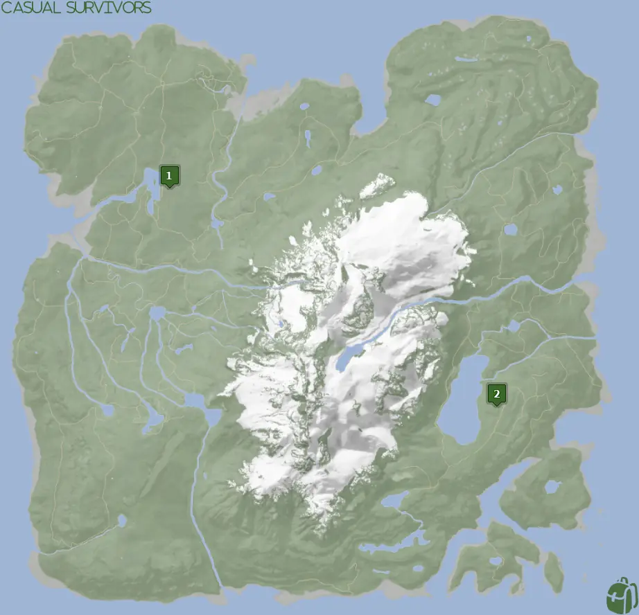
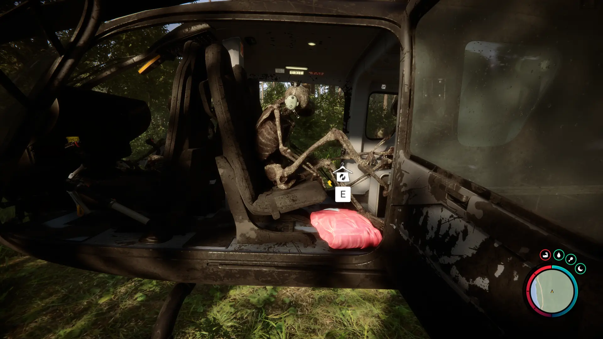
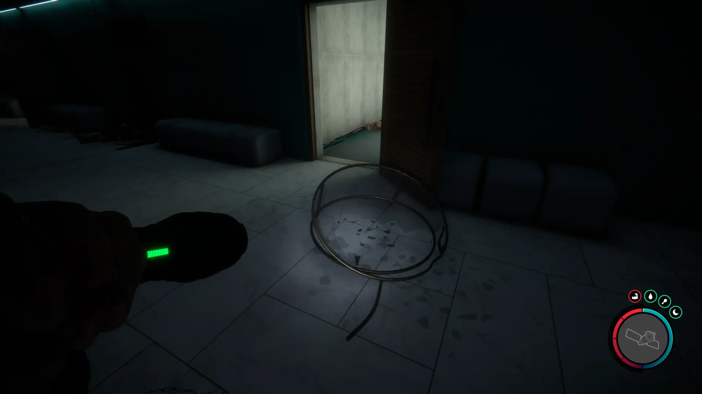
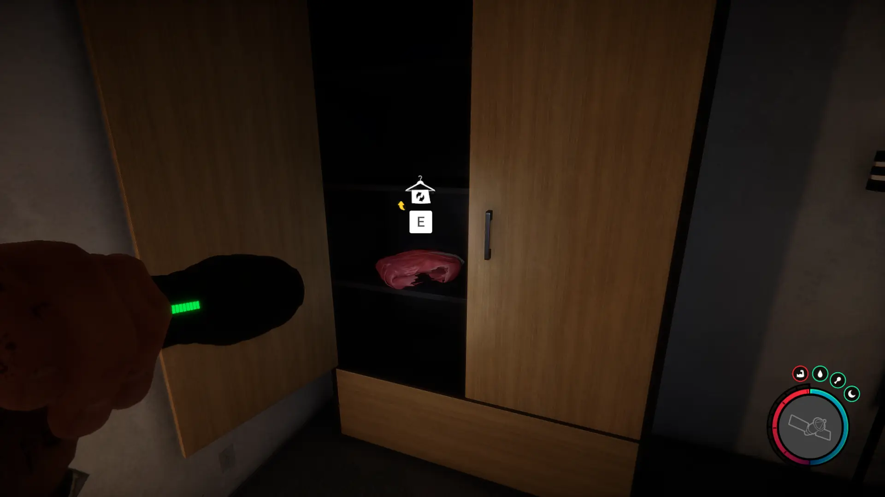


Where to find the Leather Suit and the requirements to obtain it in the Sons of the Forest.


## Leather Suit in Sons of the Forest
The Leather Suit is a cosmetic item for Virginia. Walk up to her after she's friendly and interact with her to equip her with the outfit. 

The Track Suit has no durability, doesn't require additional items, and can't be crafted into something else, so this is the final form.

## Requirements to Obtain
**None to Varies** - Some items require the player to solve a puzzle or use other collected items to obtain. For example, you may need to dig into the ground to find an item, so in situations like that, you will need a shovel. 

Check the location's Requirements for more information.

## Leather Suit Map
Below is a world map with all the known locations for the Leather Suit.

## Leather Suit Location 1
Head to the location 1 icon on the map for the Leather Suit. Look for a crashed helicopter as that is where the Leather Suit is located. 

### Requirements for Location 1
**None** - You can walk up to Location 1 Leather Suit and loot it at any point in the game. You do not need anything else for this. 

## Leather Suit Location 2
Head towards the green location 2 marker on the map above. While heading to that location, look for the pulsing green icon on your map to appear so you can follow that. Once you reach the location, you will find the cave entrance.

Once inside, you will need to use the Guest Keycard to progress further in. Once you can start exploring the residential areas you want to be on level 2.

Once on level 2, you are looking for the second residential room that has a broken glass table outside of the hallway of it. Once found, head inside and look around.

### Requirements for Location 2
**Guest Keycard, Maintenance Keycard, Gun Rope, Rebreather, & Shovel** - Location 4 requires the [Gun Rope](/sons-of-the-forest/guides/rope-gun/), [Rebreather](/sons-of-the-forest/guides/rebreather/), [Shovel](/sons-of-the-forest/guides/shovel/), [Maintenance Keycard](/sons-of-the-forest/guides/maintenance-keycard/), and the [Guest Keycard](/sons-of-the-forest/guides/guest-keycard/) to access the bunker with the Leather Suit.

## More Possible Locations
Currently, there is only 1 known location for the Leather Suit. More locations may come in future updates, but at this time players can only obtain it at the location above.
We will make sure to update our map with any new spots when Sons of the Forest gets any new updates for the Leather Suit.

## Obtain Once
The Leather Suit can only be obtained once. If the item had other spawn locations (Which may happen in the future), they would despawn preventing you from picking up multiple versions of the item. This is how Sons of the Forest enables the players to have multiple options when looting major items. 

## Conclusion
There are no requirements for the Leather Suit and there is only 1 known location to obtain it. So, if you want to collect all the items in Sons of the Forest, make sure you head to the marked spot and collect your Leather Suit!

Additionally; we would like to know if you enjoyed our guide. Let us know what you think and provide any feedback you may feel would improve the quality of the guide. To do so, join us on [Discord](https://discord.gg/ZXp93XsKnN) and let us know! We would love to hear from you! 