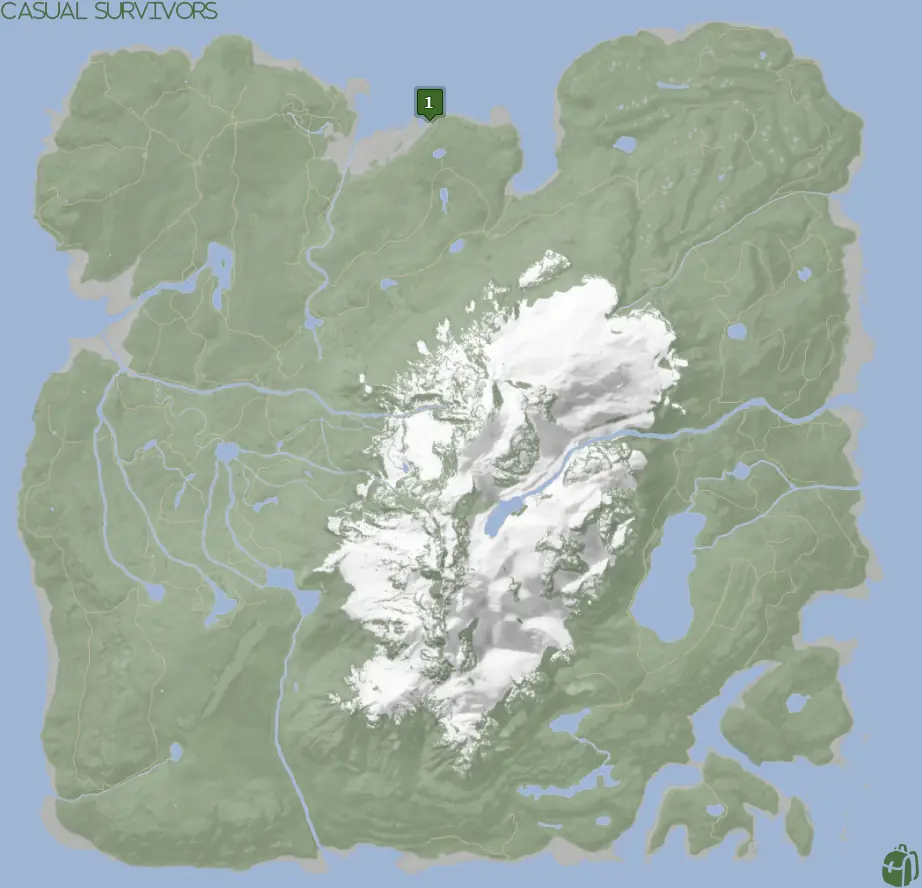
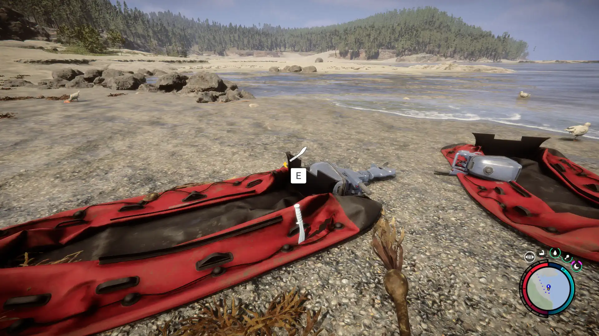


Where to find the Machete and the requirements to obtain it in the Sons of the Forest.


## Machete in Sons of the Forest
The Machete is a melee weapon that swings fast. The weapon doesn't have any durability, so there is no concern about it breaking. It doesn't have additional requirements to use it as [the Flashlight](/sons-of-the-forest/guides/flashlight/) does.

## Requirements for the Machete
**None** - Some items require the player to solve a puzzle or use other collected items to obtain. For example, you may need to dig into the ground to find an item, so in situations like that, you will need a shovel. 

Thankfully the Machete is not one of the items that require additional items or puzzles to obtain it. Just run on up to it and collect it! 

## Machete Map
Below is a world map with all the known locations for the Machete.

## Machete Location 1
The green marker on the map above is location 1. Head to that spot on the map and look for two deflated red boats on the shore.
Pull the Machete out from the side of the boat and enjoy your new sharp toy!

### Tips for Finding Location 1
Head towards Location 1 on the map; when you reach the ocean area follow the ocean line until you run across two red boats. One of these 2 boats will have the Machete you seek.

### Shotgun Rail
[The Machete](/sons-of-the-forest/guides/shotgun-rail/) is **very** close to this location. It is strongly suggested that you pick up the Shotgun Rail while you are here as it doesn't have any requirements to pick up.

## More Possible Locations
Currently, there is only 1 known location for the Machete. More locations may come in future updates, but at this time players can only obtain it at the location above.
We will make sure to update our map with any new spots when Sons of the Forest gets any new updates for the Machete.

## Obtain Once
The Machete can only be obtained once. If the item had other spawn locations (Which may happen in the future), they would despawn preventing you from picking up multiple versions of the item. This is how Sons of the Forest enables the players to have multiple options when looting major items. 

## Conclusion
There are no requirements for the Machete and there is only 1 known location to obtain it. So, if you want to collect all the items in Sons of the Forest, make sure you head to the marked spot and collect your Machete!

Additionally; we would like to know if you enjoyed our guide. Let us know what you think and provide any feedback you may feel would improve the quality of the guide. To do so, join us on [Discord](https://discord.gg/ZXp93XsKnN) and let us know! We would love to hear from you! 