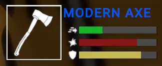
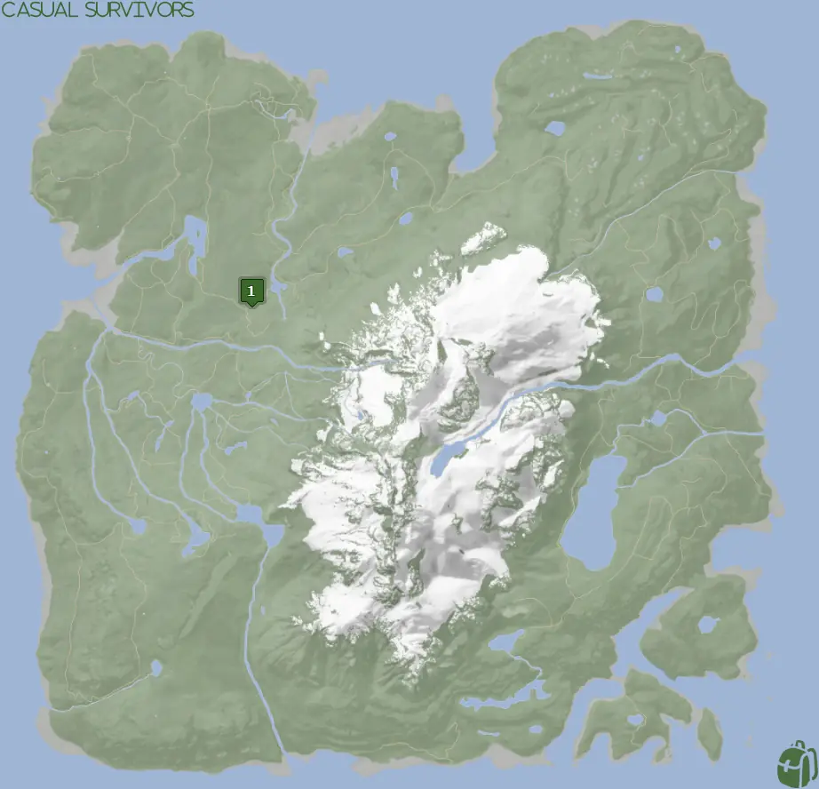
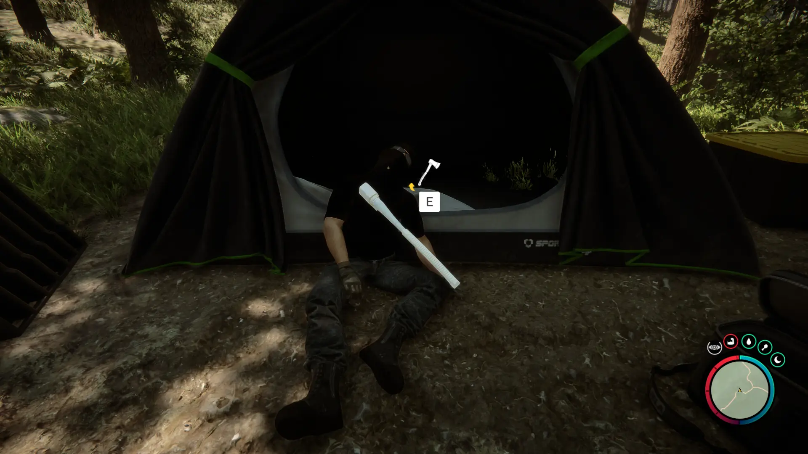


Where to find the Modern Axe and the requirements to obtain it in the Sons of the Forest.


## Modern Axe in Sons of the Forest
The Modern Axe is a melee weapon with the following stats;

The Modern Axe has no durability, doesn't require additional items, and can't be crafted into something else, so this is the final form.

## Requirements to Obtain
**None** - Some items require the player to solve a puzzle or use other collected items to obtain. For example, you may need to dig into the ground to find an item, so in situations like that, you will need a shovel. 

At any point in the game, you can walk up to the dead body and loot the Modern Axe.

## Modern Axe Map
Below is a world map with all the known locations for the Modern Axe.

## Modern Axe Location 1
Head to the location 1 icon on the map for the Modern Axe. There will additionally be a GPS Marker nearby that leads you to the [Flashlight](/sons-of-the-forest/guides/flaslight/), so you can mostly follow that first and then head to the Modern Axe. After the Flashlight, just head on down the hill towards the small camp with the pond and you can find the Modern Axe on the dead body next to the tent.

### Items Nearby
As mentioned above, the [Flashlight](/sons-of-the-forest/guides/flaslight/) is nearby and is directly on the GPS marker. Everything else is a bit of a further runaway. If you have the [Rebreather](/sons-of-the-forest/guides/flashlight/), you head South-East towards the cave for the [Shovel](/sons-of-the-forest/guides/shovel/), [Wet Suit](/sons-of-the-forest/guides/wet-suit/), and [Flashlight Attachment](/sons-of-the-forest/guides/flashlight-attachment/)

## More Possible Locations
Currently, there is only 1 known location for the Modern Axe. More locations may come in future updates, but at this time players can only obtain it at the location above.
We will make sure to update our map with any new spots when Sons of the Forest gets any new updates for the Modern Axe.

## Obtain Once
The Modern Axe can only be obtained once. If the item had other spawn locations (Which may happen in the future), they would despawn preventing you from picking up multiple versions of the item. This is how Sons of the Forest enables the players to have multiple options when looting major items. 

## Conclusion
There are no requirements for the Modern Axe and there is only 1 known location to obtain it. So, if you want to collect all the items in Sons of the Forest, make sure you head to the marked spot and collect your Modern Axe!

Additionally; we would like to know if you enjoyed our guide. Let us know what you think and provide any feedback you may feel would improve the quality of the guide. To do so, join us on [Discord](https://discord.gg/ZXp93XsKnN) and let us know! We would love to hear from you! 