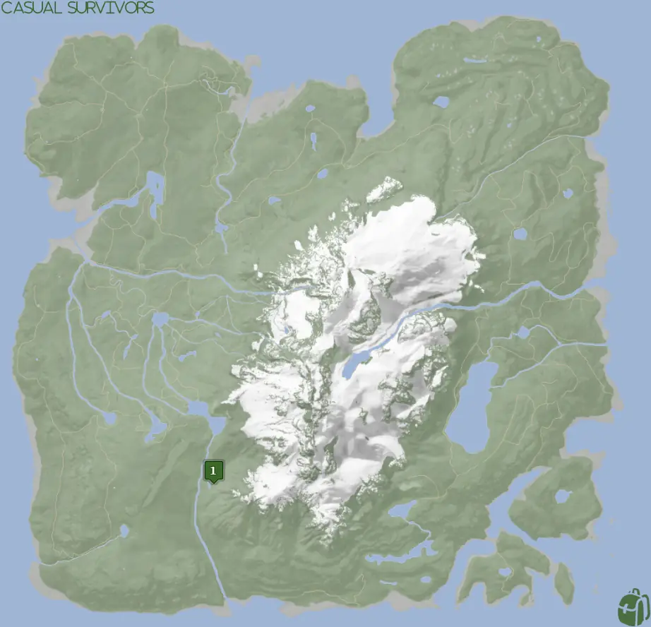
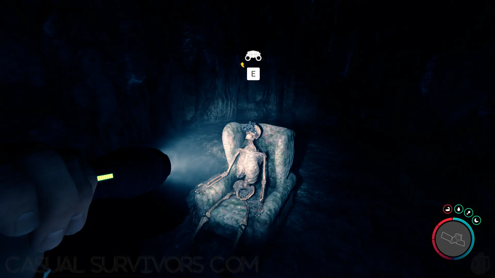


Sons of the Forest Night Vision Goggles location, requirements, and everything you need to know about them and more!


## Sons of the Forest Night Vision Goggles
The Night Vision Goggles are another light source for the player for seeing things in the dark. These goggles require the use of batteries to keep them charged.

### Using the Night Vision Goggles
Once obtained, open your inventory and left-click on the Night Vision Goggles to equip them. Right-click to unequip them while in the inventory. Additionally, equipping them will update your light source hotkey (Default 'L') to turn them on and off. To switch back to the Lighter or [Flashlight](/sons-of-the-forest/guides/flashlight/) for your light source key, simply equip them from your inventory.

Battery levels can be checked in two different locations. While equipped the batter levels are shown on the top right of the screen.

While unequipped, you can check the blue bar in the inventory to see how much of a charge is remaining.

#### Recharging the Power
You do not need to manually recharge these goggles as the game will automagically repower them if you have batteries in your inventory. So, just make sure that you have extra batteries with you and pick up any you find while exploring.

## Requirements to Obtain
**None** - You can walk up and start using any of the Night Vision Goggles without the need for any other items. As a reminder however, you do need batteries to keep operating them.

## Night Vision Goggles Map
Below is a world map with all the known locations for the Night Vision Goggles.

## Night Vision Goggles Location 1
The green marker labeled 1 on the above map is the location of a cave. As you get closer to the cave, it will appear on your in-game map. So, once you spot the cave icon head towards that and go inside. Just a few steps forward after entering, you can find the Night Vision Goggles.

## More Possible Locations
Currently, there is only 1 known location for the Night Vision Goggle. More locations may come in future updates, but at this time players can only obtain it at the locations above.
We will make sure to update our map with any new spots when Sons of the Forest gets any new updates for the Stun Baton.

## Obtain Once
The Night Vision Goggles can only be obtained once. If the item had other spawn locations (Which may happen in the future), they would despawn preventing you from picking up multiple versions of the item. This is how Sons of the Forest enables the players to have multiple options when looting major items. 

## Conclusion
There are no requirements for the Night Vision Goggles and there is 1 known location to obtain them. So head on over to the cave and get yourself a pair today!

Additionally; we would like to know if you enjoyed our guide. Let us know what you think and provide any feedback you may feel would improve the quality of the guide. To do so, join us on [Discord](https://discord.gg/ZXp93XsKnN) and let us know! We would love to hear from you! 
