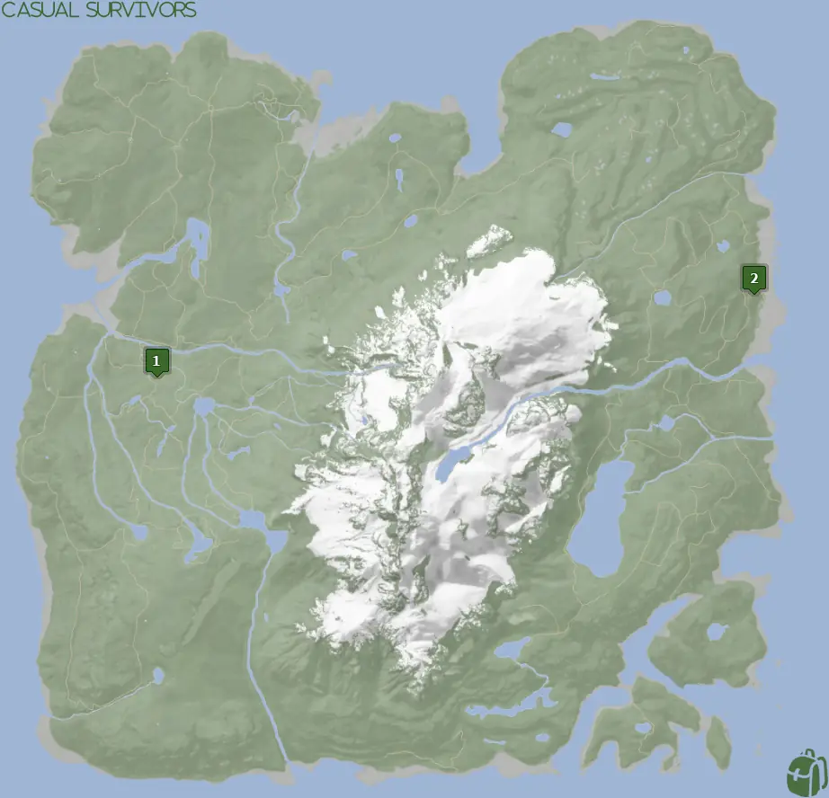
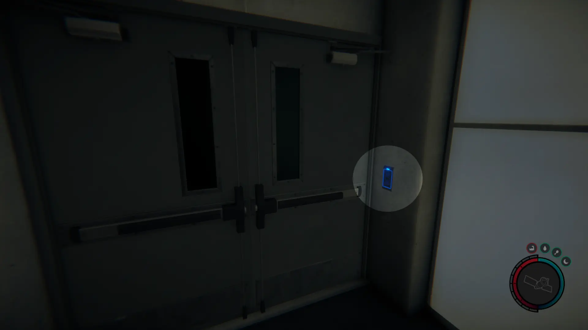
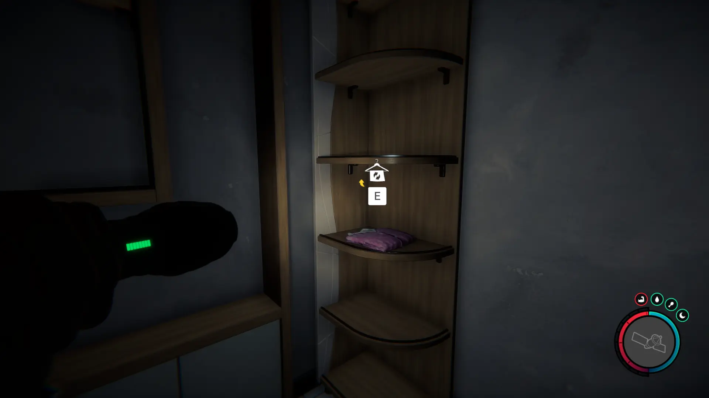
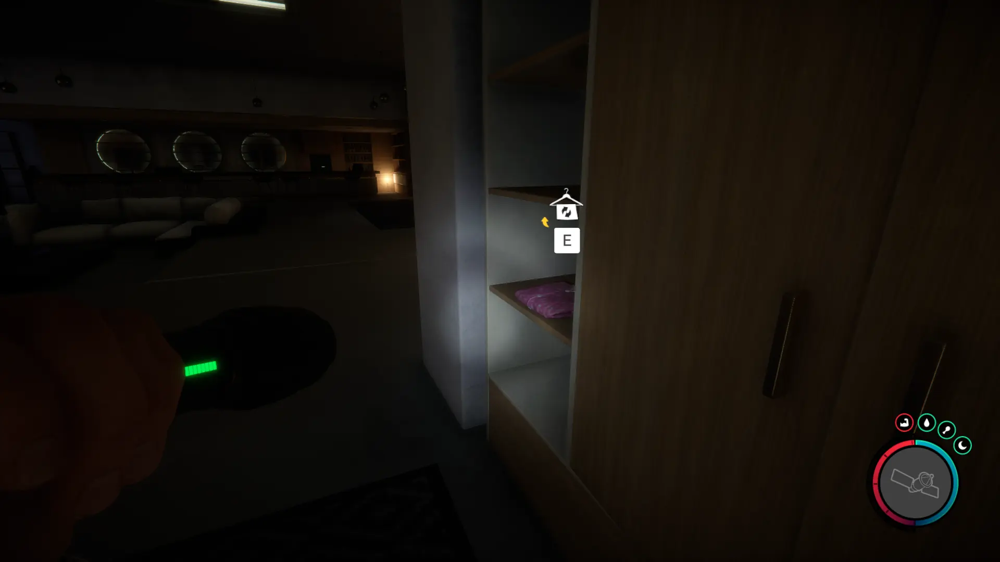


Where to find the Pajamas and the requirements to obtain them in the Sons of the Forest.


## Pajamas in Sons of the Forest
The Pajamas is clothing armor that provides maximum comfort levels for your character. See the stats below;

## Requirements to Obtain
**Varies On Location** - Some items require the player to solve a puzzle or use other collected items to obtain. For example, you may need to dig into the ground to find an item, so in situations like that, you will need a shovel. 

Check each Location's Requirements for exact information on what you need to obtain them.

## Pajamas Map
Below is a world map with all the known locations for the Pajamas.

## Pajamas Location 1
Head to the green location 1 marked on the map and look for a pulsing green icon on your map in the game. The location is marked in the game with the pulsing green circle, so head toward that when you see it in the area.

Once in the area, you are searching the cave entrance or the abandoned golf cart.

Inside the cave, head further until you need to use your keycard.

Shortly past the gym area, there is a reception desk for a sauna area. Turn right and head toward the back area (Shown below).

Once in the back room, look on the corner shelves for the pajamas.

### Location 1 Requirements
**Maintenance Keycard, Gun Rope, Rebreather, & Shovel** - The [Gun Rope](/sons-of-the-forest/guides/rope-gun/) and [Rebreather](/sons-of-the-forest/guides/rebreather/) are requirements for the [Shovel](/sons-of-the-forest/guides/shovel/), which is what you need to access the Bunker of Maintenance Shaft A where you can obtain the [Maintenance Keycard](/sons-of-the-forest/guides/maintenance-keycard/). The Maintenance Keycard is the only item you need to access the area within the cave where the Pajams are located.

## Pajamas Location 2
The green marker labeled 2 on the map is the location of the final bunker. You have to unlock the doors to gain entry. Once inside, head towards the lounge area shown below to find the Pajamas. 

The are located just on the righthand side of the bar room upon entry.

### Location 2 Requirements
**Locked Door, Guest Keycard, Maintenance Keycard, Gun Rope, Rebreather, & Shovel** - Location 4 requires the [Gun Rope](/sons-of-the-forest/guides/rope-gun/), [Rebreather](/sons-of-the-forest/guides/rebreather/), [Shovel](/sons-of-the-forest/guides/shovel/), [Maintenance Keycard](/sons-of-the-forest/guides/maintenance-keycard/), and the [Guest Keycard](/sons-of-the-forest/guides/guest-keycard/) to access the bunker. On top of all of these items, you need to unlock the doors while at the Residential Bunker to unlock the final Bunker.

## More Possible Locations
Currently, there is only 1 known location for the Pajamas. More locations may come in future updates, but at this time players can only obtain it at the location above.
We will make sure to update our map with any new spots when Sons of the Forest gets any new updates for the Pajamas.

## Achievements 
The Pajamas are an item required for the FASHIONISTA achievement. To earn this achievement, you need to gather all the possible clothing items. Check this Article's Series for the other locations of the clothes. 

## Obtain Once
The Pajamas can only be obtained once. If the item had other spawn locations (Which may happen in the future), they would despawn preventing you from picking up multiple versions of the item. This is how Sons of the Forest enables the players to have multiple options when looting major items. 

## Conclusion
There are no requirements for the Pajamas and there is only 1 known location to obtain them. So, if you want to collect all the items in Sons of the Forest, make sure you head to the marked spot and collect your Pajamas!

Additionally; we would like to know if you enjoyed our guide. Let us know what you think and provide any feedback you may feel would improve the quality of the guide. To do so, join us on [Discord](https://discord.gg/ZXp93XsKnN) and let us know! We would love to hear from you! 