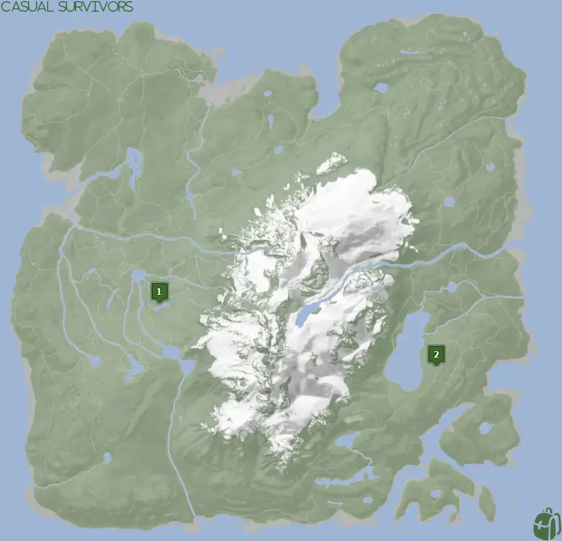
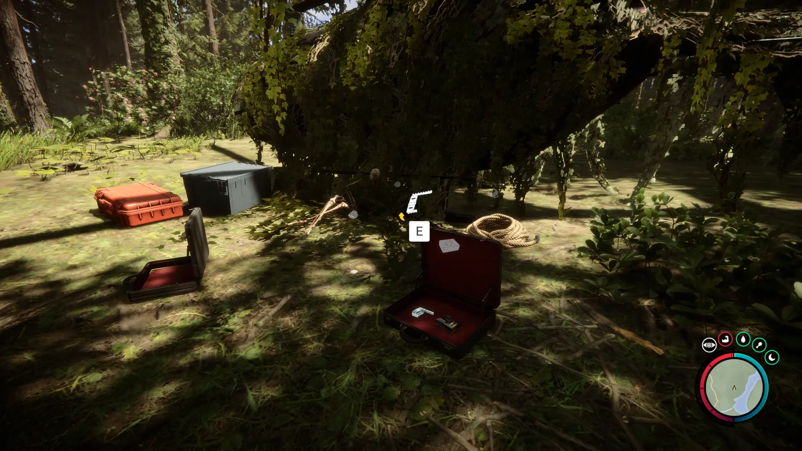
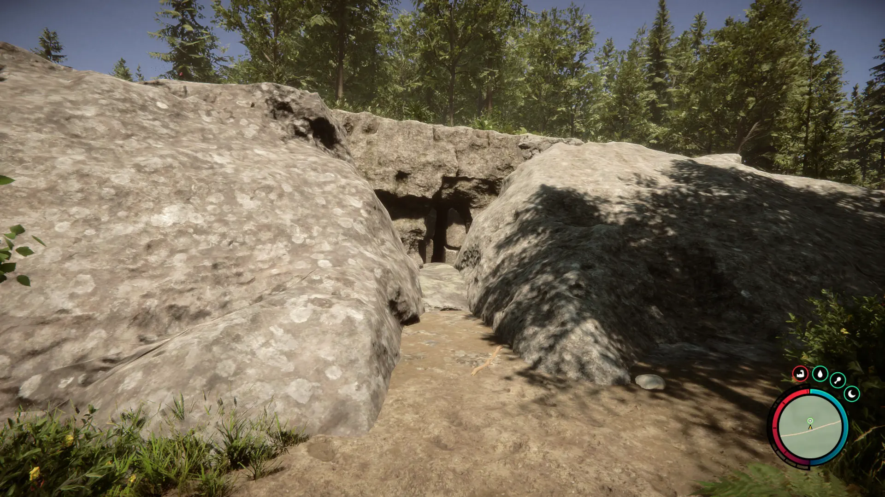
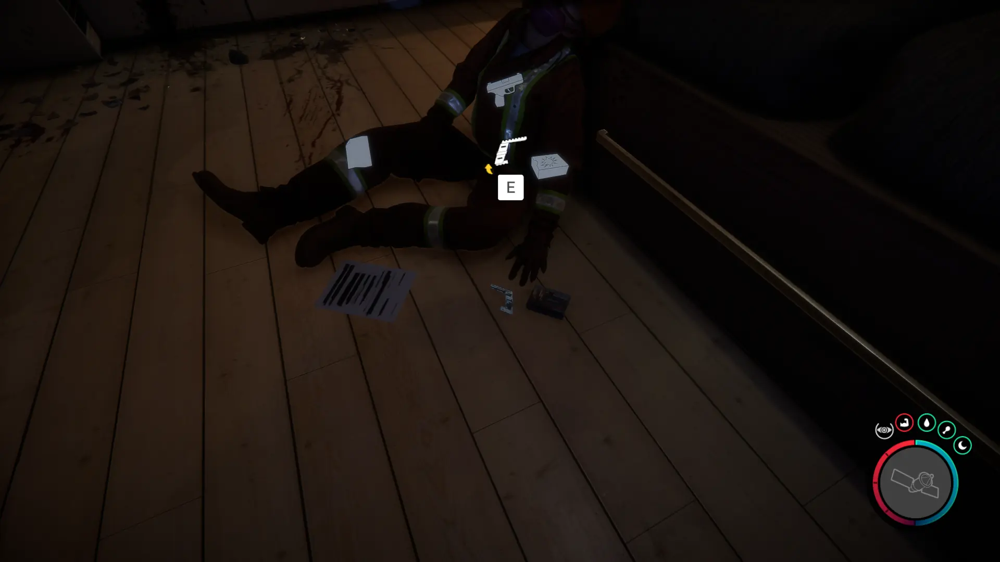


Where to find the Pistol Rail and the requirements to obtain it in the Sons of the Forest.


## Pistol Rail in Sons of the Forest
The Pistol Rail is an attachment for the [Pistol](/sons-of-the-forest/guides/pistol/) so you can add attachments to it, such as the [Flashlight Attachment](/sons-of-the-forest/guides/flashlight-attachment/).

## Requirements to Obtain
**None to Varries** - Some items require the player to solve a puzzle or use other collected items to obtain. For example, you may need to dig into the ground to find an item, so in situations like that, you will need a shovel. 

Depending on which Pistol Rail you want to obtain will depend on what you will need to loot it. Check the location requirements for further information.

## Pistol Rail Map
Below is a world map with all the known locations for the Pistol Rail.

## Pistol Rail Location 1
Head to the location 1 icon on the map for a crashed helicopter. The helicopter will be covered in vines and a lot of plant life, so it's easy to miss or overlook it as a huge bush.

The Pistol Rail can be found in one of the item cases just next to the helicopter.

### Location 1 Requirements
**None** - Location 1 for the Pistol Rail has no requirements, so you can just walk up to it and loot it at any point you feel like it.

### Items Nearby
The [Silencer](/sons-of-the-forest/guides/silencer/) is in another case just next to the Pistol Rail, so make sure you pick it up while in the area! A short run to the west you can find the [Stun Baton](/sons-of-the-forest/guides/stun-baton/) and in the cave near that you can obtain the [Rope Gun](/sons-of-the-forest/guides/rope-gun/).

## Pistol Rail Location 2
Head towards the green location 2 marker on the map above. While heading to that location, look for the pulsing green icon on your map to appear so you can follow that. Once you reach the location, you will find the cave entrance.

Once inside, you will need to use the Guest Keycard to progress further in. Once you can start exploring the residential areas you want to look inside the first residential room to find the Pistol Rail next to the [Pistol](/sons-of-the-forest/guides/pistol/) on the ground. 

### Location 2 Requirements
**Guest Keycard, Maintenance Keycard, Gun Rope, Rebreather, & Shovel** - Location 4 requires the [Gun Rope](/sons-of-the-forest/guides/rope-gun/), [Rebreather](/sons-of-the-forest/guides/rebreather/), [Shovel](/sons-of-the-forest/guides/shovel/), [Maintenance Keycard](/sons-of-the-forest/guides/maintenance-keycard/), and the [Guest Keycard](/sons-of-the-forest/guides/guest-keycard/) to access the bunker.

### Items Nearby
You can find a 3D Printer in this bunker, so if you still need to craft anything from that you can do so. Additionally, you can find the [Leather Suit](/sons-of-the-forest/guides/leather-suit/), [Pistol](/sons-of-the-forest/guides/pistol/), [Katana](/sons-of-the-forest/guides/katana/), [Shotgun Rail](/sons-of-the-forest/guides/shotgun-rail/), and [Golden Mask](/sons-of-the-forest/guides/golden-mask/) in this same bunker.

## More Possible Locations
Currently, there is only 2 known location for the Pistol Rail. More locations may come in future updates, but at this time players can only obtain it at the location above.
We will make sure to update our map with any new spots when Sons of the Forest gets any new updates for the Stun Baton.

## Obtain Once
The Pistol Rail can only be obtained once. If the item had other spawn locations (Which may happen in the future), they would despawn preventing you from picking up multiple versions of the item. This is how Sons of the Forest enables the players to have multiple options when looting major items. 

## Conclusion
There are no requirements for the Pistol Rail and there is only 1 known location to obtain it. So, if you want to collect all the items in Sons of the Forest, make sure you head to the marked spot and collect your Pistol Rail and kill that Shark!

Additionally; we would like to know if you enjoyed our guide. Let us know what you think and provide any feedback you may feel would improve the quality of the guide. To do so, join us on [Discord](https://discord.gg/ZXp93XsKnN) and let us know! We would love to hear from you! 
