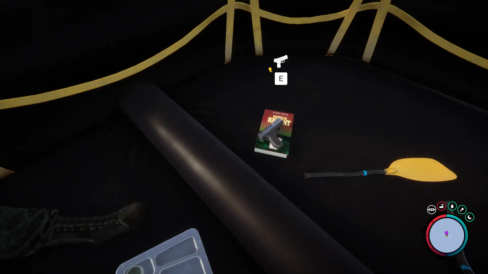


Where to find the Pistol and the requirements to obtain it in the Sons of the Forest.


## Pistol in Sons of the Forest
The pistol is a ranged weapon that requires 9mm ammunition rounds to fire the gun.

The pistol has no durability, so there is no concern about losing the item due to this.

## Requirements to Obtain
**None** - Some items require the player to solve a puzzle or use other collected items to obtain. For example, you may need to dig into the ground to find an item, so in situations like that, you will need a shovel. 

Thankfully the Pistol is not one of the items that require additional items or puzzles to obtain it. Just swim up to it and collect it! However...

**Shark Warning** - While there are no requirements to obtain the pistol, you do need to fight a shark after obtaining the pistol. As a shark will appear around the boat after you pick up the pistol. Attempting to swim to shore without killing the shark will result in your death as the shark is ruthless.

## Pistol Map
Below is a world map with all the known locations for the Pistol.

The Pistol also has a GPS Marker, so if you follow the pink circle with the !, you will head directly to it. 

## Pistol Location #1
The green marker on the map above is location 1. Head to that spot on the map and swim out to the boat in the water. Climb upon the boat (You will need to interact 'E' to do this.) and then pick up your new shiny pew pewer!

### Tips for Finding the Pistol
Follow the West-most Pink ! Marker that is on your map as it will lead directly to it. It will be the only GPS Marker in the water. That will be the best way to locate the Pistol.

## Pistol Location #2
**Coming Soon** - Location Found; gathering data. Does Require a Key Card.

## More Possible Locations
Currently, there is only 2 known location for the Pistol. More locations may come in future updates, but at this time players can only obtain it at the location above.
We will make sure to update our map with any new spots when Sons of the Forest gets any new updates for the Stun Baton.

## Obtain Once
The Pistol can only be obtained once. If the item had other spawn locations (Which may happen in the future), they would despawn preventing you from picking up multiple versions of the item. This is how Sons of the Forest enables the players to have multiple options when looting major items. 

## Conclusion
There are no requirements for the Pistol and there is only 1 known location to obtain it. So, if you want to collect all the items in Sons of the Forest, make sure you head to the marked spot and collect your Pistol and kill that Shark!

Additionally; we would like to know if you enjoyed our guide. Let us know what you think and provide any feedback you may feel would improve the quality of the guide. To do so, join us on [Discord](https://discord.gg/ZXp93XsKnN) and let us know! We would love to hear from you! 
