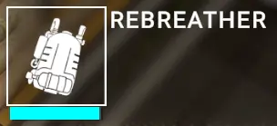
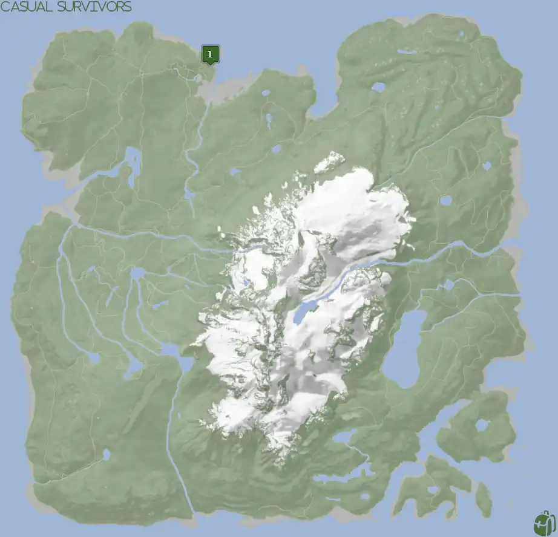
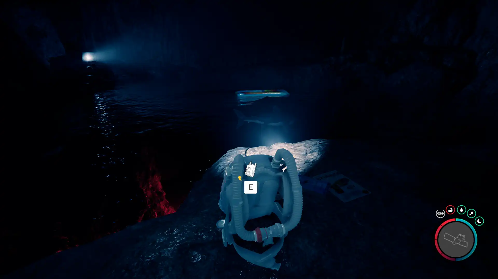
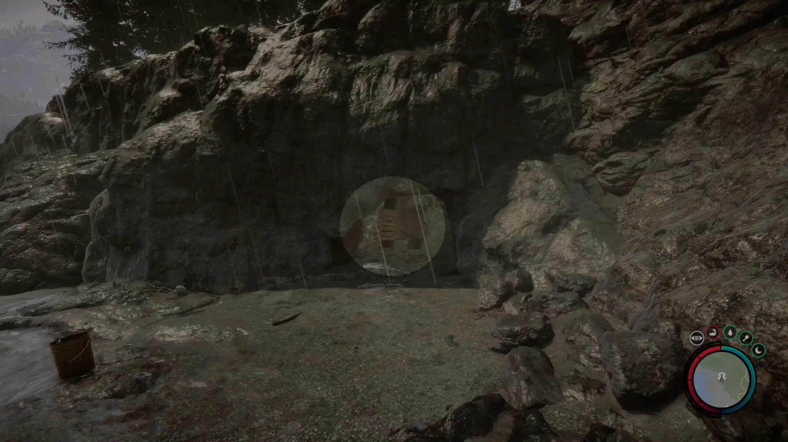
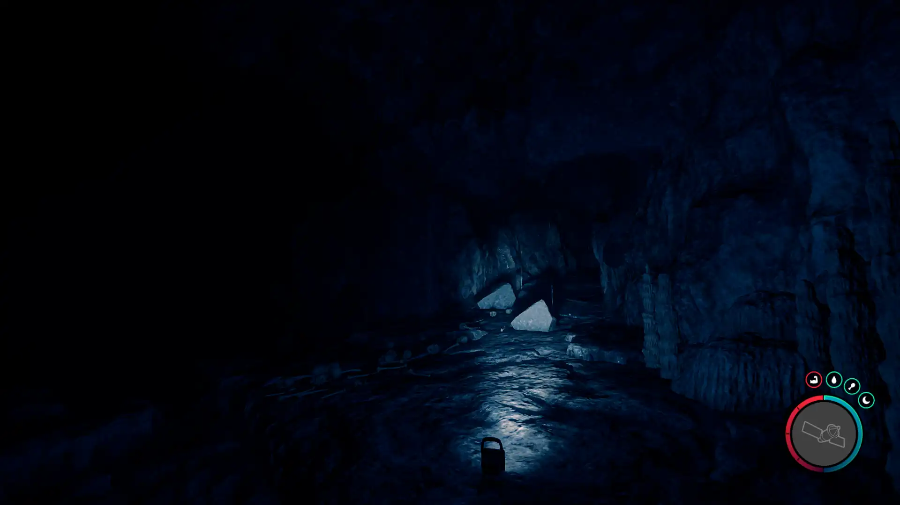


Where to find the Rebreather and the requirements to obtain it in the Sons of the Forest.


## Rebreather in Sons of the Forest
The Rebreather is the equipment you wear so that you can breathe while underwater. It requires Air Tanks to use and comes full of air when you first find it, so there is no concern about having an Air Tank when you obtain it.

To check the oxygen levels of the Rebreather, hover the mouse over it while in the inventory. The light blue bar under the item's icon is your indicator of how much air you have left (See the image below).

## Requirements to Obtain
**Cave & Combat** - Some items require the player to solve a puzzle or use other collected items to obtain. For example, you may need to dig into the ground to find an item, so in situations like that, you will need a shovel. 

The Rebreather requires you to explore a cave with cannibals to obtain it, so expect combat. 

## Rebreather Map
Below is a world map with all the known locations for the Rebreather.

## Rebreather Location 1
The green marker labeled 1 on the map is the location of the cave you need to enter to obtain the Stun Gun. Once inside, if you hug the left wall you will eventually reach your destination. If you see a room with 2 cave lights and a pool of water with a water-air mat in it, you are at the right spot. Beware, however, there is a shark that lives in the waters here, so don't go jumping in!

The Rebreather is the 2nd light in the distance, so hug the right wall around the water to reach it and the sweet device is yours!

### WARNING
Once you fall down the small ledge in the room with the Rebreather, you must exit using the water. You will need to kill the shark or attempt to quickly leave. It's strongly suggested that you kill the shark if able so you can learn how to use the Rebreather, but it is not required as it will not follow you once inside the small path out. 

### Tips for Finding Rebreather
The cave is on the shoreline, so head toward the ocean and follow the water until you find the cave shown below. Additionally, the cave shows up on your map when you are close enough, so you can head toward that when you can see it. 

Once inside the cave, 4 cave lights will help brighten up your path. The 4th light is where the cave forks left or right. It's at that point you want to make sure you take the left path (which the light is *NOT* shining towards, see image below) and you will eventually reach the Stun Gun. 

## Other Nearby Items 
You are encouraged to pick up the [Stun Gun](/sons-of-the-forest/guides/stun-gun/) before obtaining the Rebreather. If you fall off the ledge before obtaining it, you will need to enter the cave again. It is not a required item, however, so if you are not concerned about having it you can leave it behind. The [Leather Jacket](/sons-of-the-forest/guides/leather-jacket/) can be found in the same room as the [Stun Gun](/sons-of-the-forest/guides/stun-gun/).

## More Possible Locations
Currently, there is only 1 known location for the Rebreather. More locations may come in future updates, but at this time players can only obtain it at the location above.
We will make sure to update our map with any new spots when Sons of the Forest gets any new updates for the Rebreather.

## Obtain Once
The Rebreather can only be obtained once. If the item had other spawn locations (Which may happen in the future), they would despawn preventing you from picking up multiple versions of the item. This is how Sons of the Forest enables the players to have multiple options when looting major items. 

## Conclusion
There are no requirements for the Rebreather and there is only 1 known location to obtain it. So, if you want to collect all the items in Sons of the Forest, make sure you head to the marked spot and collect your Rebreather!

Additionally; we would like to know if you enjoyed our guide. Let us know what you think and provide any feedback you may feel would improve the quality of the guide. To do so, join us on [Discord](https://discord.gg/ZXp93XsKnN) and let us know! We would love to hear from you! 