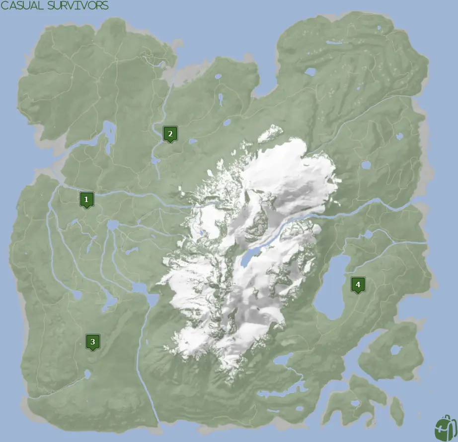
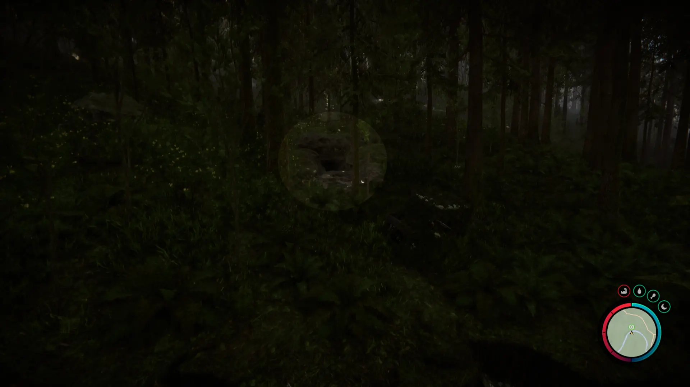
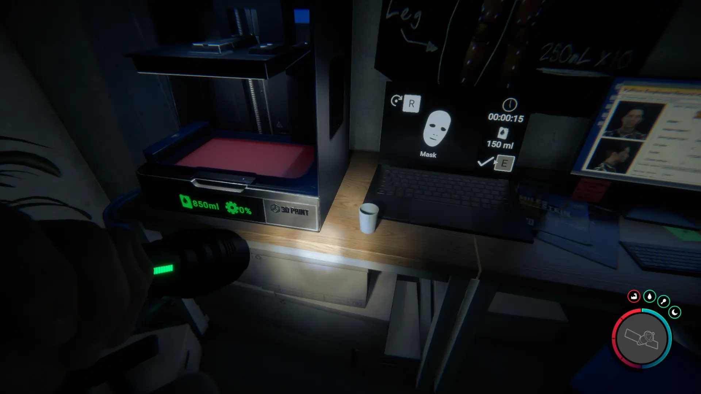
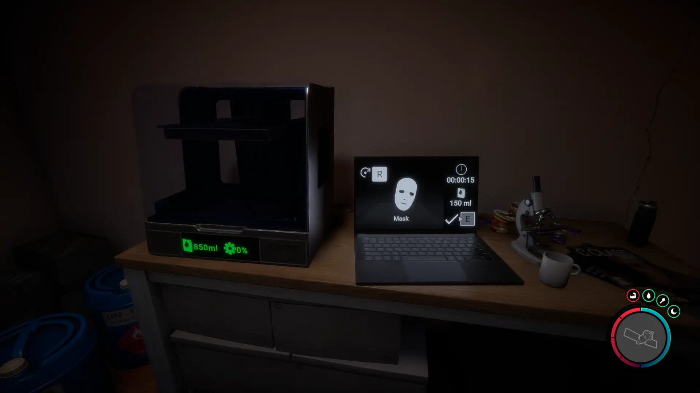
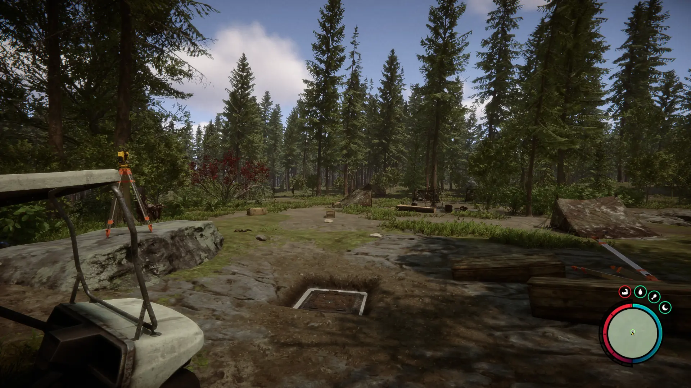
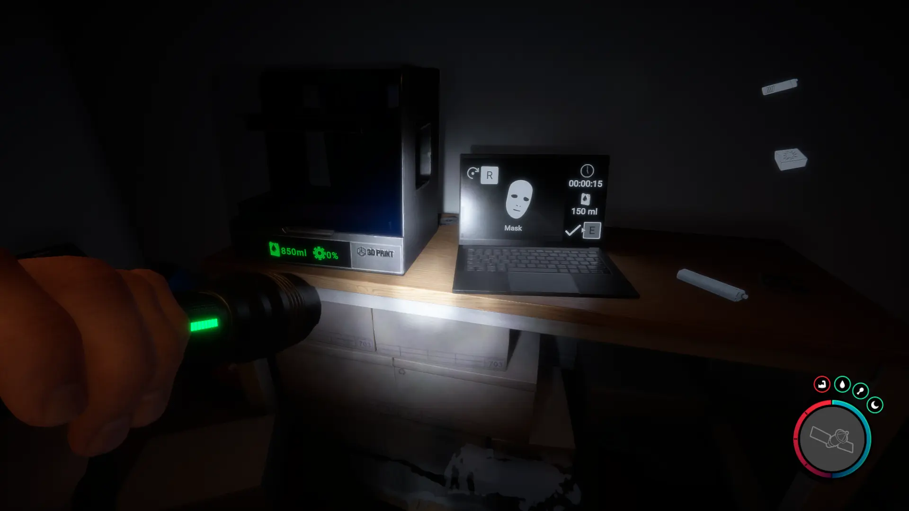
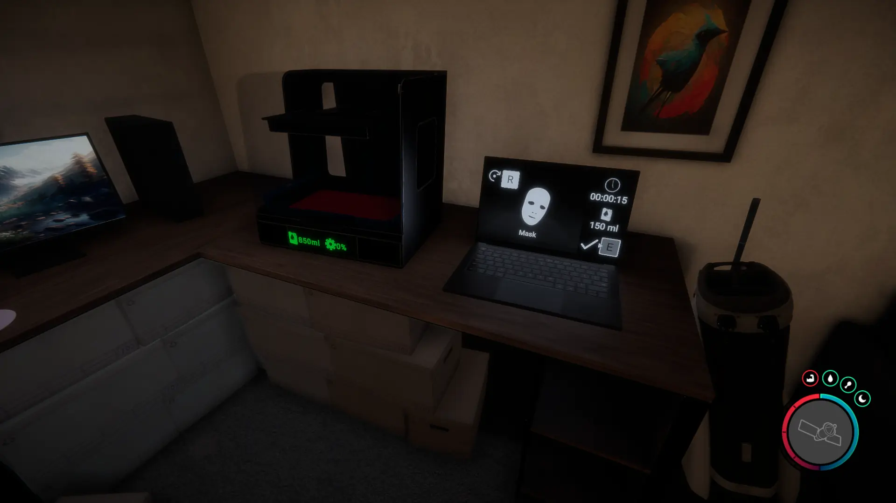


Where to find the Red Mask and the requirements to obtain it in the Sons of the Forest.


## Red Mask in Sons of the Forest
The Red Mask is a tool you can use to scare away certain cannibal tribes. Simply, the low-level cannibals who have eyes are likely to be frightened by your Red Mask while in use. 

## Requirements to Obtain
**Varries on Location** - Some items require the player to solve a puzzle or use other collected items to obtain. For example, you may need to dig into the ground to find an item, so in situations like that, you will need a shovel. 

Ultimately, you need 3D Printer Ink and a 3D Printer to craft a Red Mask. Each 3D Printer location already comes with 3D Printer Ink, so there is no need to find extra, however, it may be desired to have extra to craft other items at the 3D Printer.

## Red Mask Map
Below is a world map with all the known locations for 3D Printers to craft your Red Mask.

## Red Mask Location 1
Head to the location 1 icon on the map and look for a pulsing green circle to appear on your map. It will lead you to a cave where you can find the 3D Printer inside. 

Head down the hallway until you reach a small room with the 3D Printer inside. You can rest in this room and save-reload the game to re-loot the room over and over.

### Requirements for Location 1
**None** - You can enter the cave and access the 3D Printer at any stage of the game. It also makes for a great early game resting and save location for you.

## Red Mask Location 2
The green marker labeled 2 on the map is the location of the bunker where you can find the Tuxedo. Once inside the bunker go down the hallway and turn right into the living area.

### Requirements for Location 2
**Gun Rope, Rebreather, & Shovel** - The 3D Printer location 2 requires the [Gun Rope](/sons-of-the-forest/guides/rope-gun/), [Rebreather](/sons-of-the-forest/guides/rebreather/), and [Shovel](/sons-of-the-forest/guides/shovel/) to access the bunker with the 3D Printer.

## Red Mask Location 3
Head to the green location 3 marked on the map and look for a pulsing green icon on your map in the game. The location is marked in the game with the pulsing green circle, so head toward that when you see it in the area. Be mindful of the cannibal camp nearby.

Once in the area, you are searching for a clear spot of dirt to dig up. The shovel icon will appear when you are close enough to the dig location.

Once inside Maintenace B Bunker, you will want to head down the hallway and enter the living quarters to find the 3D Printer on the desk.

### Requirements for Location 3
**Gun Rope, Rebreather, & Shovel** - The 3D Printer location 3 requires the [Gun Rope](/sons-of-the-forest/guides/rope-gun/), [Rebreather](/sons-of-the-forest/guides/rebreather/), and [Shovel](/sons-of-the-forest/guides/shovel/) to access the bunker with the 3D Printer.

## Red Mask Location 4
Head towards the green location 4 marker on the map above. While heading to that location, look for the pulsing green icon on your map to appear so you can follow that. Once you reach the location, you will find the cave entrance to where you can find this 3D Printer.

Once inside, you will need to use the Guest Keycard to progress further in. Once you can start exploring the residential areas, the second apartment that you can enter will have the 3D Printer inside along with a lot of Golfing Supplies. 

### Requirements for Location 4
**Guest Keycard, Maintanence Keycard, Gun Rope, Rebreather, & Shovel** - The 3D Printer location 4 requires the [Gun Rope](/sons-of-the-forest/guides/rope-gun/), [Rebreather](/sons-of-the-forest/guides/rebreather/), [Shovel](/sons-of-the-forest/guides/shovel/), [Maintanence Keycard](/sons-of-the-forest/guides/maintanence-keycard/), and the [Guest Keycard](/sons-of-the-forest/guides/guest-keycard/) to access the bunker with this 3D Printer.

## More Possible Locations
Currently, there is only 1 known location for the Red Mask. More locations may come in future updates, but at this time players can only obtain it at the location above.
We will make sure to update our map with any new spots when Sons of the Forest gets any new updates for the Red Mask.

## Obtain Once
The Red Mask can only be obtained once. If the item had other spawn locations (Which may happen in the future), they would despawn preventing you from picking up multiple versions of the item. This is how Sons of the Forest enables the players to have multiple options when looting major items. 

## Conclusion
There are no requirements for the Red Mask and there is only 1 known location to obtain it. So, if you want to collect all the items in Sons of the Forest, make sure you head to the marked spot and collect your Red Mask!

Additionally; we would like to know if you enjoyed our guide. Let us know what you think and provide any feedback you may feel would improve the quality of the guide. To do so, join us on [Discord](https://discord.gg/ZXp93XsKnN) and let us know! We would love to hear from you! 