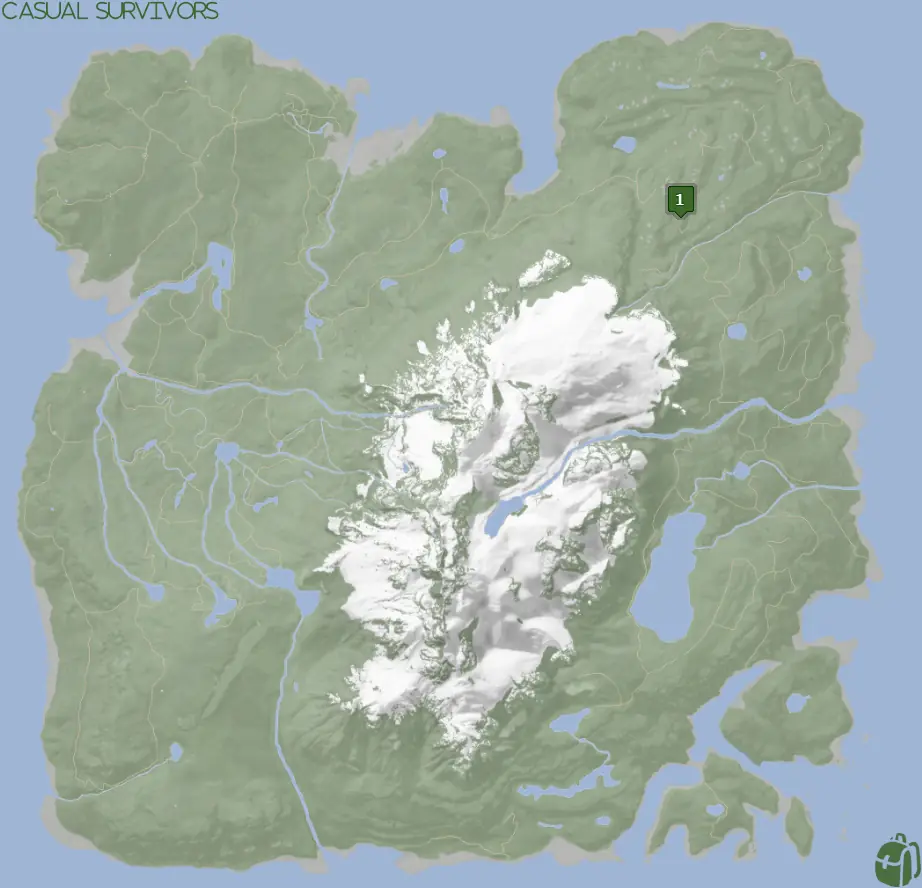
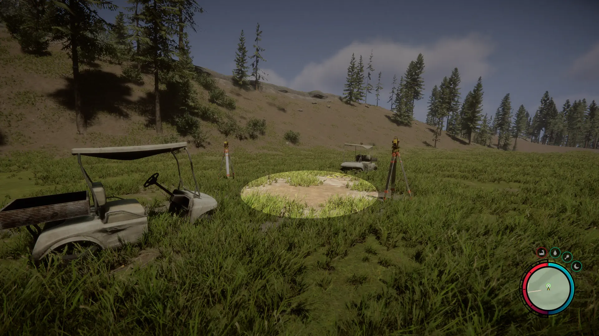
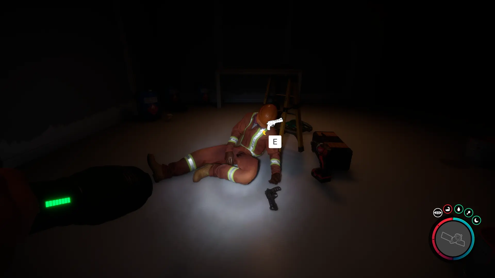


Where to find the Revolver and the requirements to obtain it in the Sons of the Forest.


## Revolver in Sons of the Forest
The Revolver is a ranged weapon that holds 6 shots before you have to reload it. The weapon uses 9mm Ammo.

The Cross has no durability, doesn't require additional items, and can't be crafted into something else, so this is the final form. This means this weapon has no attachments for it, unlike the [Pistol](/sons-of-the-forest/guides/pistol/) and [Shotgun](/sons-of-the-forest/guides/shotgun/). 

## Requirements to Obtain
**Gun Rope, Rebreather, & Shovel** - Some items require the player to solve a puzzle or use other collected items to obtain. For example, you may need to dig into the ground to find an item, so in situations like that, you will need a  Shovel. 

The Maintenance Keycard requires the [Gun Rope](/sons-of-the-forest/guides/rope-gun/), [Rebreather](/sons-of-the-forest/guides/rebreather/), and [Shovel](/sons-of-the-forest/guides/shovel/) to access the bunker with it.

To be exact, you only need the **Shovel to access the Bunker** and gain access to all the contents within. However, to access the Shovel you need the Gun Rope and the Rebreather, which is why you need all 3 of these items to access the Maintenance Keycard. Meaning, if a new method of obtaining the Shovel without the Gun Rope & Rebreather would lower the item requirements for the Maintenance Keycard. 

## Revolver Map
Below is a world map with all the known locations for the Revolver.

## Revolver Location 1
Head to the location 1 icon on the map and look for a pulsing green icon to appear. When you see the pulsing green, head towards that to pinpoint the location. Once there, look for a small sit location around the objects in the area to show you where to dig. 

Once inside, you are looking for the dead body in the main room.

## More Possible Locations
Currently, there is only 1 known location for the Revolver. More locations may come in future updates, but at this time players can only obtain it at the location above.
We will make sure to update our map with any new spots when Sons of the Forest gets any new updates for the Revolver.

## Obtain Once
The Revolver can only be obtained once. If the item had other spawn locations (Which may happen in the future), they would despawn preventing you from picking up multiple versions of the item. This is how Sons of the Forest enables the players to have multiple options when looting major items. 

## Conclusion
There are no requirements for the Revolver and there is only 1 known location to obtain it. So, if you want to collect all the items in Sons of the Forest, make sure you head to the marked spot and collect your Revolver!

Additionally; we would like to know if you enjoyed our guide. Let us know what you think and provide any feedback you may feel would improve the quality of the guide. To do so, join us on [Discord](https://discord.gg/ZXp93XsKnN) and let us know! We would love to hear from you! 