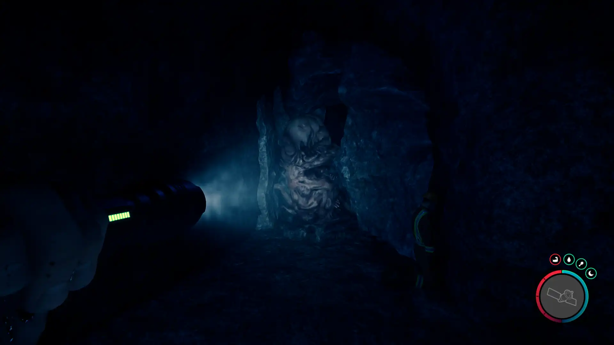


Where to find the Rope Gun and the requirements to obtain it in the Sons of the Forest.


## Rope Gun in Sons of the Forest
The Rope Gun is a tool that lets you travel across zip lines.

The Rope Gun has no durability, doesn't require additional items, and can't be crafted into something else, so this is the final form.

## Requirements to Obtain
**Long Cave & Combat** - Some items require the player to solve a puzzle or use other collected items to obtain. For example, you may need to dig into the ground to find an item, so in situations like that, you will need a shovel. 

The Rope Gun requires you to explore an extensive cave with cannibals to obtain it, so expect combat and bring lots of healing with you.

## Rope Gun Map
Below is a world map with all the known locations for the Rope Gun.

## Rope Gun Location 1
The green marker labeled 1 on the map is the location of the cave you need to enter to obtain the Rope Gun. There are very few forks inside the cave, but most of the wrong paths will lead to a dead end fast, so you will know if you've gone the wrong way or not very easily. 

You will need to kill a Sluggy creature that is stuck in the cave to progress through. It is suggested that you use some kind of explosive, like Grenades or C4, so that you can unlock the achievement PINATA for doing so. 

Once again, this is a very long path, so don't feel discouraged if you feel like you've been in here a long time and haven't found the Rope Gun yet. 

The Rope Gun is in a case that is already open with a light shining toward it. There is also a ledge close by, so make sure not to fall to your death. You can safely get down the ledge side by using the Zip Line close by.

### Tips for Finding Rope Gun
The cave is on the shoreline, so head toward the ocean and follow the water until you find the cave shown below. Additionally, the cave shows up on your map when you are close enough, so you can head toward that when you can see it. 

Once you are inside the cave, start exploring your way through it. Your first major landmark will be Sluggy. This poor creature is stuck in the gap and is blocking your way to progress forward. The dead body on the right-hand side has some explosives next to him that you can use for the PINATA achievement. 

#### 33% Into the Cave
After some further wandering into the cave, you will find a lot of dead bodies hanging around. There will also be an image of a cube on the wall with a stick figure inside of it. If you have reached this far into the cave, then you are only 1/3rd through it and still have a bit more to go.

#### 66% Into the Cave
When you reach a narrow path where 3 dead bodies are hanging, then you are 2/3rds done with exploring the cave and over halfway done! Make sure to pick up the rope that can be found underneath these hanging bodies.

#### Wrong Turn
If you reach a point that seems like a dead end with a body holding onto a news article about a missing CEO, then you've missed your turn. Don't panic though, you are not that far away from the fork. It's an easy mistake to make as the left turn is tucked away and easy to miss. 

Once you finish looking in this spot, go back from where you came and hug the right wall to progress further into the cave toward the Rope Gun. As long as you are hugging the right wall after turning around from this dead end, you will make it to the exit. 

## More Possible Locations
Currently, there is only 1 known location for the Rope Gun. More locations may come in future updates, but at this time players can only obtain it at the location above.
We will make sure to update our map with any new spots when Sons of the Forest gets any new updates for the Rope Gun.

## Obtain Once
The Rope Gun can only be obtained once. If the item had other spawn locations (Which may happen in the future), they would despawn preventing you from picking up multiple versions of the item. This is how Sons of the Forest enables the players to have multiple options when looting major items. 

## Conclusion
There are no requirements for the Rope Gun and there is only 1 known location to obtain it. So, if you want to collect all the items in Sons of the Forest, make sure you head to the marked spot and collect your Rope Gun!

Additionally; we would like to know if you enjoyed our guide. Let us know what you think and provide any feedback you may feel would improve the quality of the guide. To do so, join us on [Discord](https://discord.gg/ZXp93XsKnN) and let us know! We would love to hear from you! 