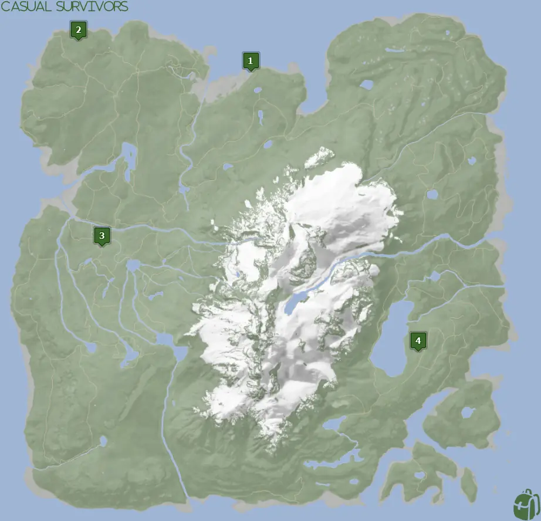
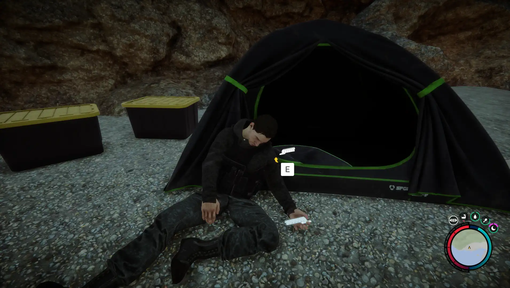
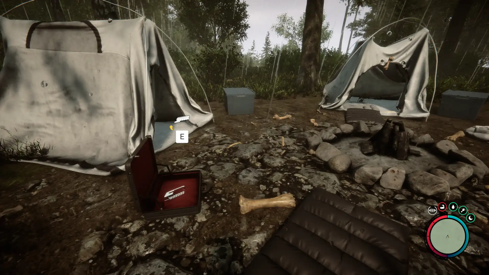


Where to find the Shotgun Rail and the requirements to obtain it in the Sons of the Forest.


## Shotgun Rail in Sons of the Forest
The Shotgun Rail is an attachment for the Shotgun that enables you to modify your Shotgun. With the rail, you can add a flashlight and sights to your Shotgun. The rail also includes shell loops which enable you to store shells on the side for a faster reload.

The Shotgun Rail has no durability, so there should be no concern about losing the item due to this. You do however, need the Shotgun to make any use of this item, so make sure you grab it first!

## Requirements to Obtain
**None & Varies** - Some items require the player to solve a puzzle or use other collected items to obtain. For example, you may need to dig into the ground to find an item, so in situations like that, you will need a shovel. 

Depending on which location you go to for the Shotgun Rail will depend on the requirements for it. Check each section location for additional information on these requirements. 

## Shotgun Rail Map Location
Below is a world map with all the known locations for the Shotgun Rail.

## Shotgun Rail Location 1
**No Requirements to Obtain** - The green marker on the map above is location 1. Head to that spot on the map and look for the dead person up against a tent.
Don't mind the dead body. Grab the Shotgun Rail and it will be added to the orange case in your inventory!

### Tips for Finding Location 1
Head towards Location 1 on the map; when you reach the ocean area follow the ocean line until you run across two red boats. From there you should be able to see 2 tents towards the east near the cliff edge. Head towards the tents and pick up the Shotgun Rail from the dead body.

### The Machete
[The Machete](/sons-of-the-forest/guides/machete/) is **very** close to this location. It is strongly suggested that you pick up the Machete while you are here as it doesn't have any requirements to pick up.

## Shotgun Rail Location 2
**Requires Shovel & Maintenance Key** - Location 2 on the map is where a small food bunker is located. You will need to enter a cave at the location before entering the bunker. Inside you need to use the Maintenance Key to obtain the Shotgun Rail. However, to obtain the Maintenance Key, you will need The Shovel.

Location 'S' on the map shows where the Shovel can be found. From there you will need to head to Location 'K' to pick up the Maintenance Key. Then finally you will want to head to Location 2 and then you can loot the Shotgun Rail there. 

### Tips for Finding Location 2
Head towards Location 2 on the map. As you get closer, a pulsing green beacon will show up on your map. Head directly towards it to find the cave entrance that leads into the bunker. 

## Shotgun Rail Location 3
**No Requirements to Obtain** - Head to location 3 on the above map and look for 2 white tents. Outside one of the tents will be a briefcase with the Shotgun Rail inside (See image below).

### Tips for Finding Location 3
Head towards Location 3 on the map. This one is a bit tricky as the area isn't the easiest to spot. It's in a very small clearing and off any beaten path. When searching you want to try and spot any small clearings without much tree coverage to help you find the spot. 

## More Possible Locations
Currently, these 3 locations are the only known locations for the Shotgun Rail. More locations may come in future updates, but at this time players can obtain it at the locations above.
We will make sure to update our map with any new spots when Sons of the Forest gets any new updates for the Shotgun Rail.

## Obtain Once
The Shotgun Rail can only be obtained once. After obtaining one the others will despawn preventing you from looting it from other locations. This is how Sons of the Forest enables the players to have multiple options when looting major items. 

With that in mind, we suggest going after the Location 1 Spawn as it doesn't have any requirements to obtain and is easy to locate. 

## Conclusion
There are 3 different spawn locations for the Shotgun Rail and various requirements to obtain them based on which one you are after. Location 1 is the quickest and easiest to obtain as it's next to the ocean and has no requirements. While Location 2 is the hardest to obtain because it's in a bunker and requires a keycard to enter. However Location 2 is on the path to story completion, so it's ultimately up to you when you want to obtain the Shotgun Rail. 

Additionally; we would like to know if you enjoyed our guide. Let us know what you think and provide any feedback you may feel would improve the quality of the guide. To do so, join us on [Discord](https://discord.gg/ZXp93XsKnN) and let us know! We would love to hear from you! 