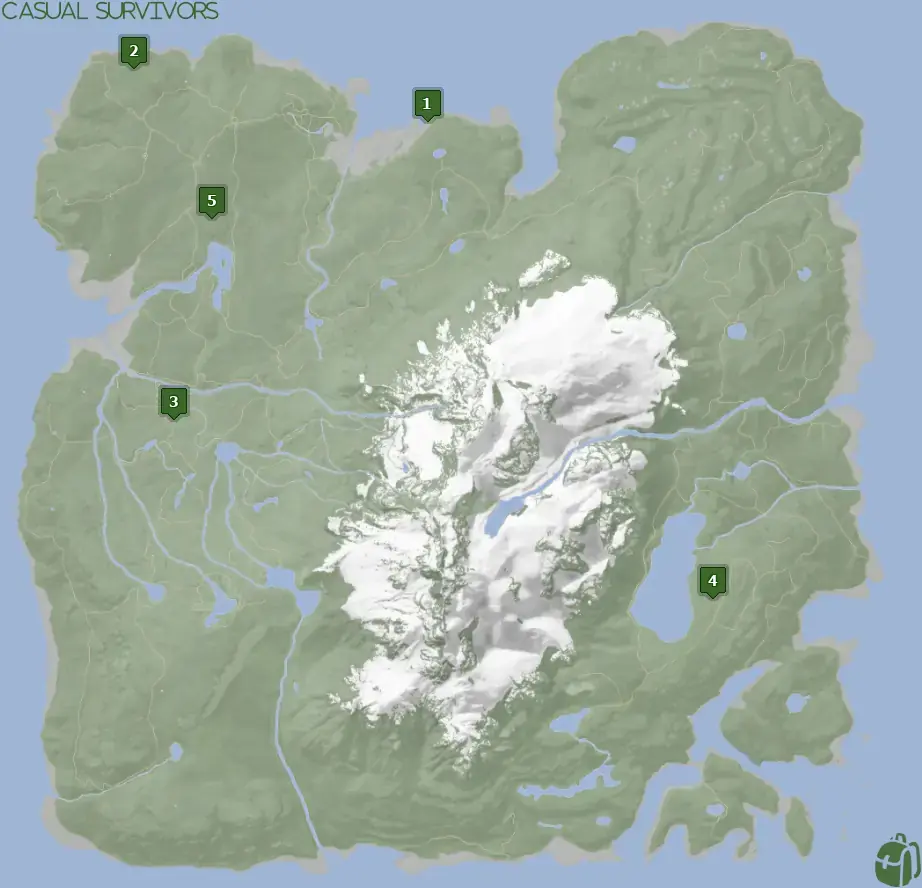
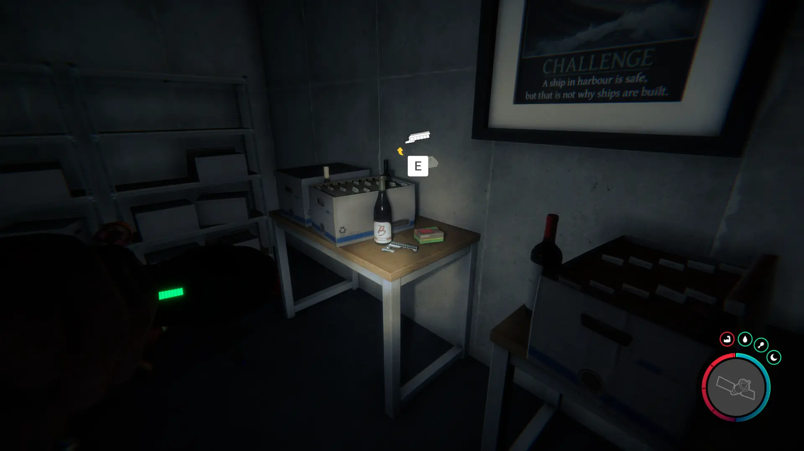


Where to find the Shotgun Rail and the requirements to obtain it in the Sons of the Forest.


## Shotgun Rail in Sons of the Forest
The Shotgun Rail is an attachment for the Shotgun that enables you to modify your Shotgun. With the rail, you can add a flashlight and sights to your Shotgun. The rail also includes shell loops which enable you to store shells on the side for a faster reload.

The Shotgun Rail has no durability, so there should be no concern about losing the item due to this. You do however, need the Shotgun to make any use of this item, so make sure you grab it first!

## Requirements to Obtain
**None & Varies** - Some items require the player to solve a puzzle or use other collected items to obtain. For example, you may need to dig into the ground to find an item, so in situations like that, you will need a shovel. 

Depending on which location you go to for the Shotgun Rail will depend on the requirements for it. Check each section location for additional information on these requirements. 

## Shotgun Rail Map Location
Below is a world map with all the known locations for the Shotgun Rail.

## Shotgun Rail Location 1
**No Requirements to Obtain** - The green marker on the map above is location 1. Head to that spot on the map and look for the dead person up against a tent.
Don't mind the dead body. Grab the Shotgun Rail and it will be added to the orange case in your inventory!

### Tips for Finding Location 1
Head towards Location 1 on the map; when you reach the ocean area follow the ocean line until you run across two red boats. From there you should be able to see 2 tents towards the east near the cliff edge. Head towards the tents and pick up the Shotgun Rail from the dead body.

### The Machete
[The Machete](/sons-of-the-forest/guides/machete/) is **very** close to this location. It is strongly suggested that you pick up the Machete while you are here as it doesn't have any requirements to pick up.

## Shotgun Rail Location 2
**No Requirements to Obtain** - Head to location 3 on the above map and look for 2 white tents. Outside one of the tents will be a briefcase with the Shotgun Rail inside (See image below).

### Tips for Finding Location 2
Head towards Location 3 on the map. This one is a bit tricky as the area isn't the easiest to spot. It's in a very small clearing and off any beaten path. When searching you want to try and spot any small clearings without much tree coverage to help you find the spot. 

## Shotgun Rail Location 3
**VIP Keycard, Maintenance Keycard, Gun Rope, Rebreather, & Shovel** are all required items in order to access Shotgun Rail located at spot 3. The [Gun Rope](/sons-of-the-forest/guides/gun-rope/), [Rebreather](/sons-of-the-forest/guides/rebreather/), and [Shovel](/sons-of-the-forest/guides/shovel/) are all requirements to obtain the [Maintenance Keycard](/sons-of-the-forest/guides/maintenance-keycard/). Only the Maintenance Keycard is required once inside the cave. The [VIP Keycard](/sons-of-the-forest/guides/vip-keycard/) is located in the same area, so it's fine to head to this spot with only the Maintenance Keycard.

### Tips for Finding Location 3
Head towards Location 3 on the map. As you get closer, a pulsing green beacon will show up on your map. Head directly towards it to find the cave entrance that leads into the bunker. Once inside, you will need to use the [Maintenance Keycard](/sons-of-the-forest/guides/maintenance-keycard/) to progress further into the bunker.

When entering the bar area, directly across from the entrance there is another door that requires a Keycard for entry. However, the [VIP Keycard](/sons-of-the-forest/guides/vip-keycard/) is required to enter. Obtain it and then open this door to gain entry to the Shotgun Rail Location 3. 

## Shotgun Rail Location 4
**VIP Keycard, Maintenance Keycard, Gun Rope, Rebreather, & Shovel** are all required items to access Shotgun Rail located at spot 4. The [Gun Rope](/sons-of-the-forest/guides/gun-rope/), [Rebreather](/sons-of-the-forest/guides/rebreather/), [Shovel](/sons-of-the-forest/guides/shovel/), and [Maintenance Keycard](/sons-of-the-forest/guides/maintenance-keycard/) are all requirements to obtain the [VIP Keycard](/sons-of-the-forest/guides/vip-keycard/). Technically all you need is the VIP Keycard to enter the location for the Shotgun Rail Location 4, however, it's never just that simple. 

### Tips for Finding Location 4
Head towards Location 4 on the map. As you get closer, a pulsing green beacon will show up on your map. Head directly towards it to find the cave entrance that leads into the bunker. Once inside, you will need to use the [VIP Keycard](/sons-of-the-forest/guides/vip-keycard/) to progress further into the bunker. 

Once you can access Level 2, the second living quarters you can enter will have the Shotgun Rail on the shelves for you to loot. While on the stairs before entering any of the hallways, you can see what level you are on (see below).

## Shotgun Rail Location 5
**Maintenance Keycard, Gun Rope, Rebreather, & Shovel** are all required items to access Shotgun Rail located at spot 5. The [Gun Rope](/sons-of-the-forest/guides/gun-rope/), [Rebreather](/sons-of-the-forest/guides/rebreather/), and [Shovel](/sons-of-the-forest/guides/shovel/) are requirements for the [Maintenance Keycard](/sons-of-the-forest/guides/maintenance-keycard/) that you have to use to access the location for this Shotgun Rail.

In the Security Room in the Food and Dinner Bunker, you can find the Shotgun rail on the shelving on the righthand side of the room upon entry.

## More Possible Locations
Currently, these 5 locations are the only known locations for the Shotgun Rail. More locations may come in future updates, but at this time players can obtain it at the locations above.
We will make sure to update our map with any new spots when Sons of the Forest gets any new updates for the Shotgun Rail.

## Obtain Once
The Shotgun Rail can only be obtained once. After obtaining one the others will despawn preventing you from looting it from other locations. This is how Sons of the Forest enables the players to have multiple options when looting major items. 

With that in mind, we suggest going after the Location 1 Spawn as it doesn't have any requirements to obtain and is easy to locate. 

## Conclusion
There are 4 different spawn locations for the Shotgun Rail and various requirements to obtain them based on which one you are after. Location 1 is the quickest and easiest to obtain as it's next to the ocean and has no requirements. While Locations 3, 4, and 5 are the hardest to obtain because they are in a bunker that requires keycards to enter. However, Locations 3, 4, and 5 are on the path to story completion, so it's ultimately up to you when and how you want to obtain the Shotgun Rail. 

Additionally; we would like to know if you enjoyed our guide. Let us know what you think and provide any feedback you may feel would improve the quality of the guide. To do so, join us on [Discord](https://discord.gg/ZXp93XsKnN) and let us know! We would love to hear from you! 