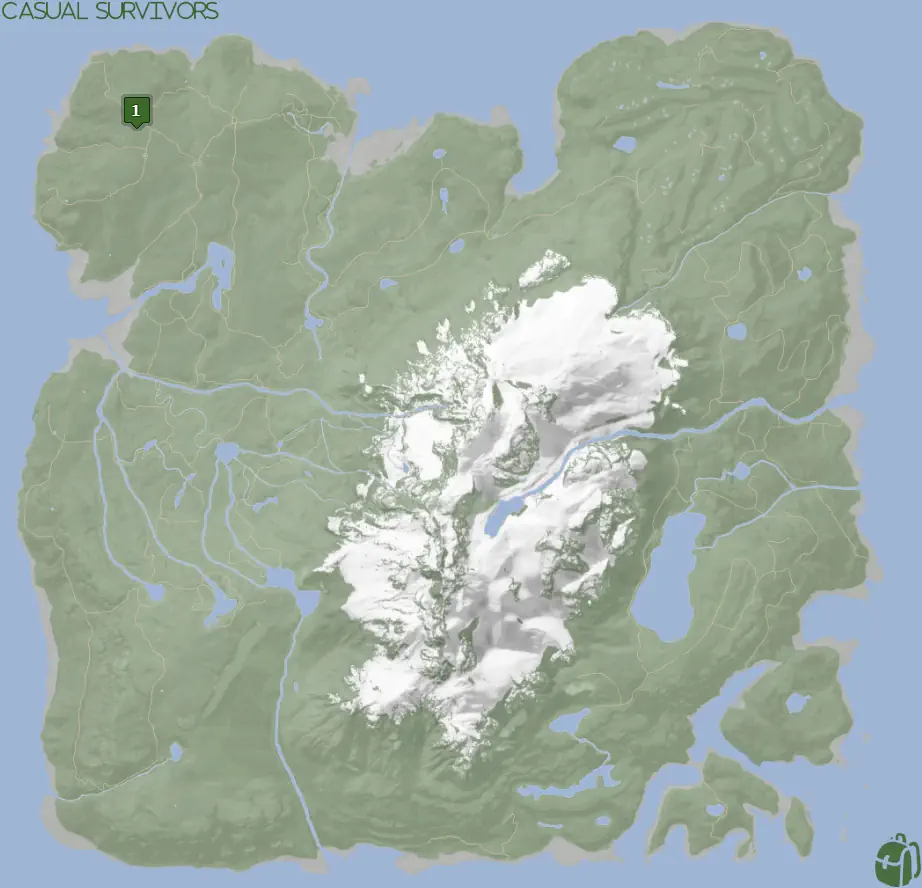
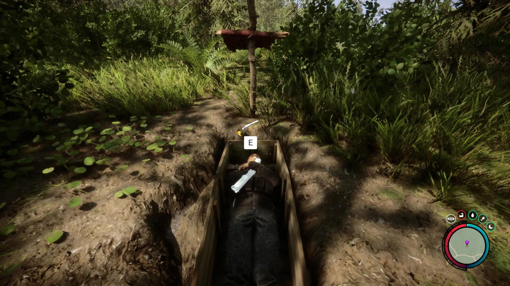


Where to find the Shotgun and the requirements to obtain it in the Sons of the Forest.


## Shotgun in Sons of the Forest
The Shotgun is a weapon that can hold 8 rounds of shotgun shells. After each shot, you must pump-chamber the next shotgun shell. After shooting all 8 shells, you are prompted to reload your Shotgun by pressing "R".

The Shotgun has no durability, requires buckshot for ammo, and can be crafted with the [Shotgun Rail](/sons-of-the-forest/guides/shotgun-rail/) to add attachments to it. 

## Requirements to Obtain
**Gun Rope, Rebreather, & Shovel** - Some items require the player to solve a puzzle or use other collected items to obtain. For example, you may need to dig into the ground to find an item, so in situations like that, you will need a  Shovel. 

The Maintenance Keycard requires the [Gun Rope](/sons-of-the-forest/guides/rope-gun/), [Rebreather](/sons-of-the-forest/guides/rebreather/), and [Shovel](/sons-of-the-forest/guides/shovel/) to access the bunker with it.

To be exact, you only need the **Shovel to access the Bunker** and gain access to all the contents within. However, to access the Shovel you need the Gun Rope and the Rebreather, which is why you need all 3 of these items to access the Maintenance Keycard. Meaning, if a new method of obtaining the Shovel without the Gun Rope & Rebreather would lower the item requirements for the Maintenance Keycard. 

## Shotgun Map
Below is a world map with all the known locations for the Shotgun.

## Shotgun Location #1
The green marker labeled 1 on the map is the location of the Shotgun. There is a GPS Marker at the location, so it's easy to find if you follow the Pink "!" mark on your map in that location. You will find a simple stick-cross grave at this location and you will need to use your shovel to dig it up. There is no prompt for you to use the shovel.

### Other Items Nearby
There are no other items in the direct area of the Shotgun, however, there are a few other items close to you. Here are a few other items in a short walking distance from you; [Shotgun Rail](/sons-of-the-forest/guides/shotgun-rail/), [Glider](/sons-of-the-forest/guides/glider/), [Camouflage Suit](/sons-of-the-forest/guides/camouflage-suit/), and [Binoculars](/sons-of-the-forest/guides/binoculars/).

## More Possible Locations
Currently, there is only 1 known location for the Shotgun. More locations may come in future updates, but at this time players can only obtain it at the location above.
We will make sure to update our map with any new spots when Sons of the Forest gets any new updates for the Stun Baton.

## Achievements 
The Shotgun is not required for any achievements in the game at this time. We will update this section if that ever changes in the future. 

## Obtain Once
The Shotgun can only be obtained once. If the item had other spawn locations (Which may happen in the future), they would despawn preventing you from picking up multiple versions of the item. This is how Sons of the Forest enables the players to have multiple options when looting major items. 

## Conclusion
There are no requirements for the Shotgun and there is only 1 known location to obtain it. So, if you want to collect all the items in Sons of the Forest, make sure you head to the marked spot and collect your used Shotgun!

Additionally; we would like to know if you enjoyed our guide. Let us know what you think and provide any feedback you may feel would improve the quality of the guide. To do so, join us on [Discord](https://discord.gg/ZXp93XsKnN) and let us know! We would love to hear from you! 
