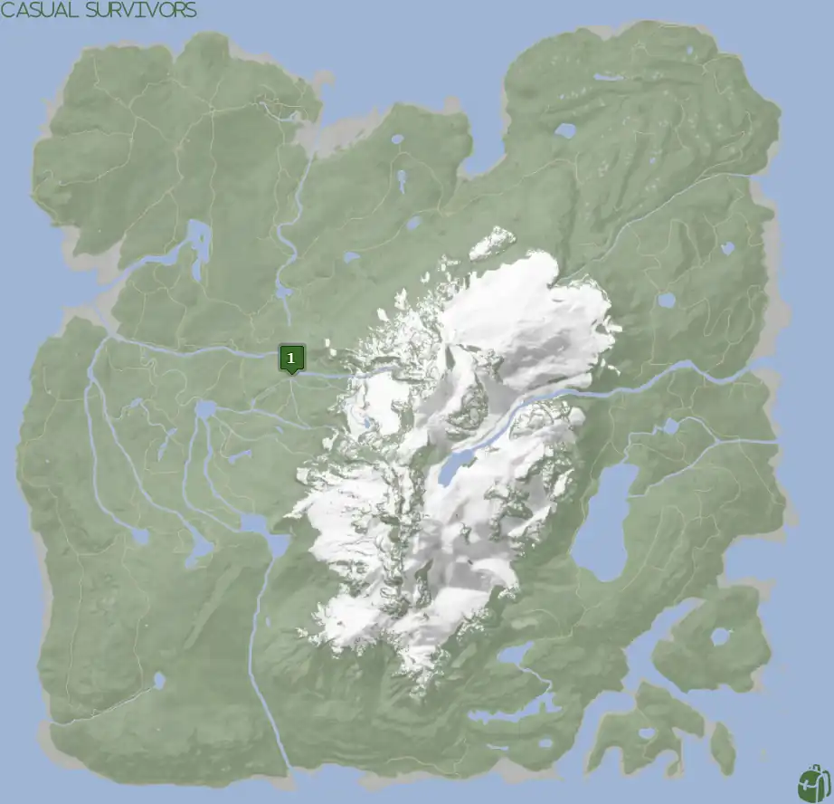
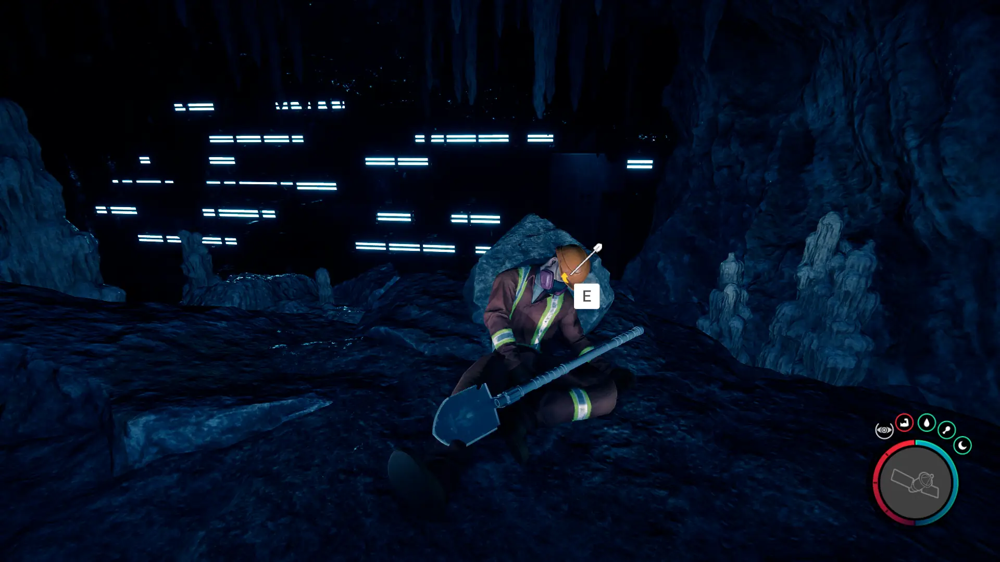
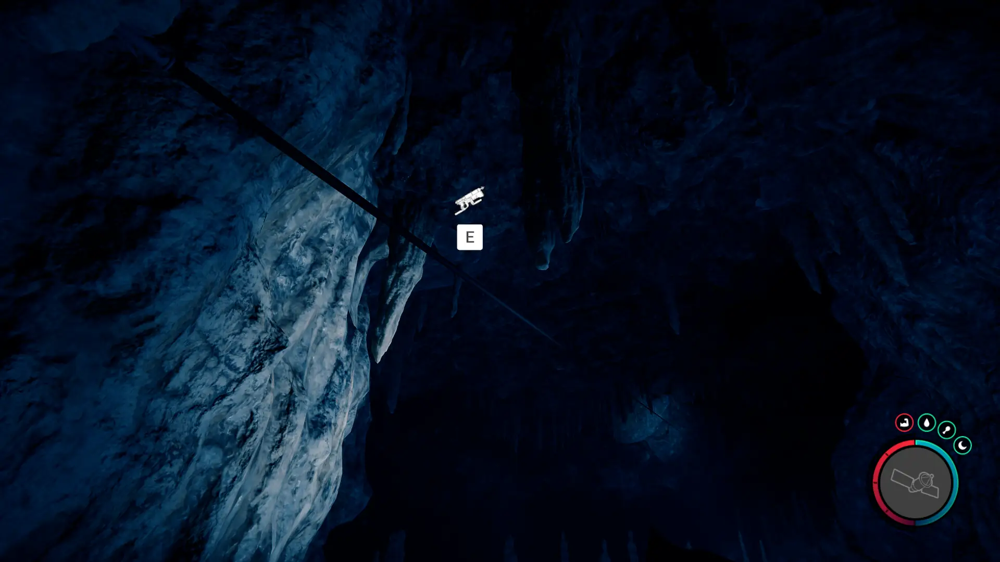
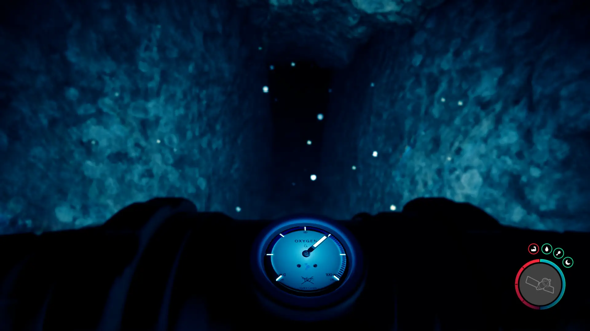
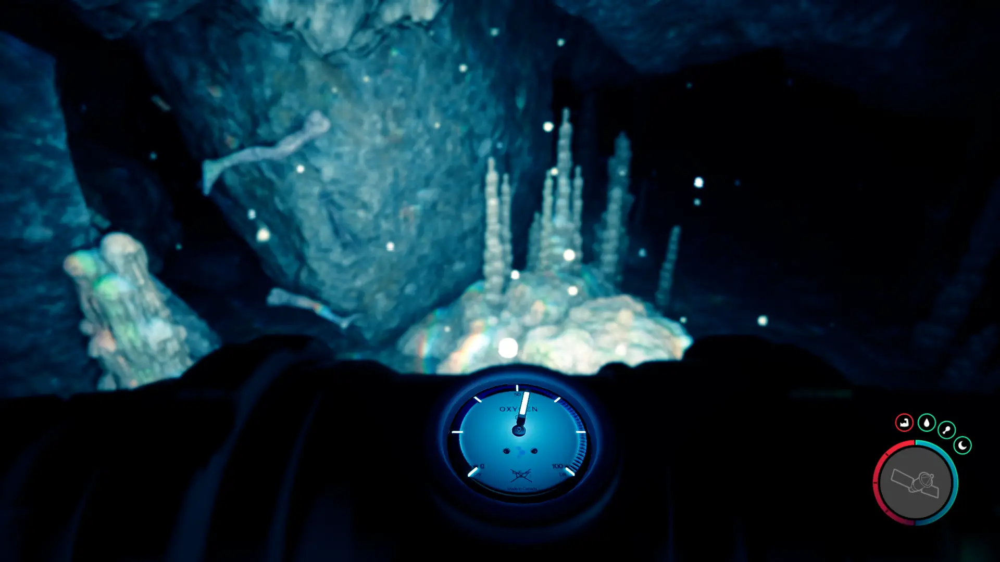


Where to find the Shovel and the requirements to obtain it in the Sons of the Forest.


## Shovel in Sons of the Forest
The Shovel is a tool that you can use to dig up the ground to find hidden bunkers, items, and unlock achievements. 

The Shovel has no durability, doesn't require additional items, and can't be crafted into something else, so this is the final form.

## Requirements to Obtain
**Cave, Gun Rope, & Rebreather** - Some items require the player to solve a puzzle or use other collected items to obtain. For example, you may need to dig into the ground to find an item, so in situations like that, you will need a Shovel. 

The Shovel requires [Gun Rope](/sons-of-the-forest/guides/rope-gun/) and the [Rebreather](/sons-of-the-forest/guides/rebreather/) to progress into the cave. Without these items, it will just lead to a dead end preventing further exploration of the cave. 

## Shovel Map
Below is a world map with all the known locations for the Shovel.

## Shovel Location #1
The green marker labeled 1 on the map is the location of the cave where you can find the Shovel. Once inside the cave and you use the Rebreather, you will come across the Shovel.

### Tips for Finding the Shovel
Head towards the location on the map and keep your eyes peeled for the cave icon to show up. Once it appears, head towards it to find the bodies just outside the cave. Head on inside.

Once inside, you will need to use the Rope Gun to cross the gap.

Then use your Rebreather to go underwater to the next section. If you need some oxygen, there is some underneath the zipline at the start of the cave. You can head back to pick it up and then use the Zip Line to cross back into the area.

Keep exploring the cave until you reach another spot where you need to use your Rebreather again. This time, it forks while underwater. It's suggested that you head left first towards the dismembered limbs as it leads to a dead end with useful items such as an Air Tank. When leaving from the dead-end section, hug the left at the fork to continue progressing further into the cave.

Just a little bit further after coming out of the water and you will find the shovel on the dead body of a maintenance crew member. 

### WARNING (Spoilers)
When heading towards the entrance of the cave to exit, you might recall a wall that looks like it could have something behind it. A Sluggy will burst through the wall for a surprise attack! So be on guard as you are leaving the cave. You can take the path that the Sluggy opened up for you to exit the cave.

### More Items Nearby
The [Flashlight Attachment](/sons-of-the-forest/guides/flashlight-attachment/), and [Wet Suit](/sons-of-the-forest/guides/wet-suit/) can be found further in this cave as well. You should have already looted them along the way to the Shovel, however, if you haven't make sure to keep an eye out for them as you are heading back out.

## More Possible Locations
Currently, there is only 1 known location for the Shovel. More locations may come in future updates, but at this time players can only obtain it at the location above.
We will make sure to update our map with any new spots when Sons of the Forest gets any new updates for the Stun Baton.

## Obtain Once
The Shovel can only be obtained once. If the item had other spawn locations (Which may happen in the future), they would despawn preventing you from picking up multiple versions of the item. This is how Sons of the Forest enables the players to have multiple options when looting major items. 

## Conclusion
There are no requirements for the Shovel and there is only 1 known location to obtain it. So, if you want to collect all the items in Sons of the Forest, make sure you head to the marked spot and collect your used Shovel!

Additionally; we would like to know if you enjoyed our guide. Let us know what you think and provide any feedback you may feel would improve the quality of the guide. To do so, join us on [Discord](https://discord.gg/ZXp93XsKnN) and let us know! We would love to hear from you! 
