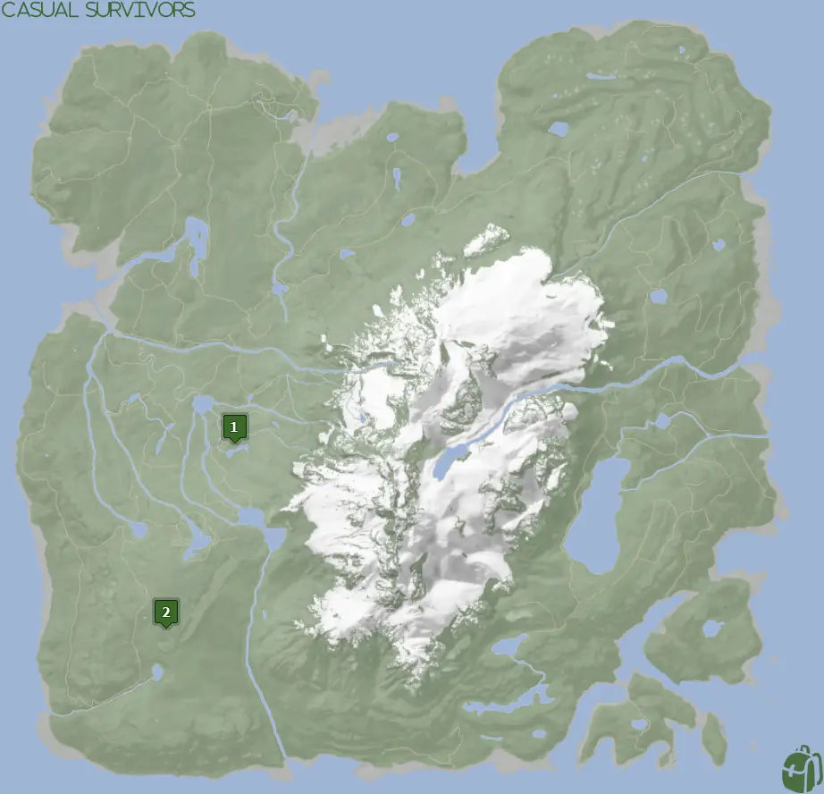
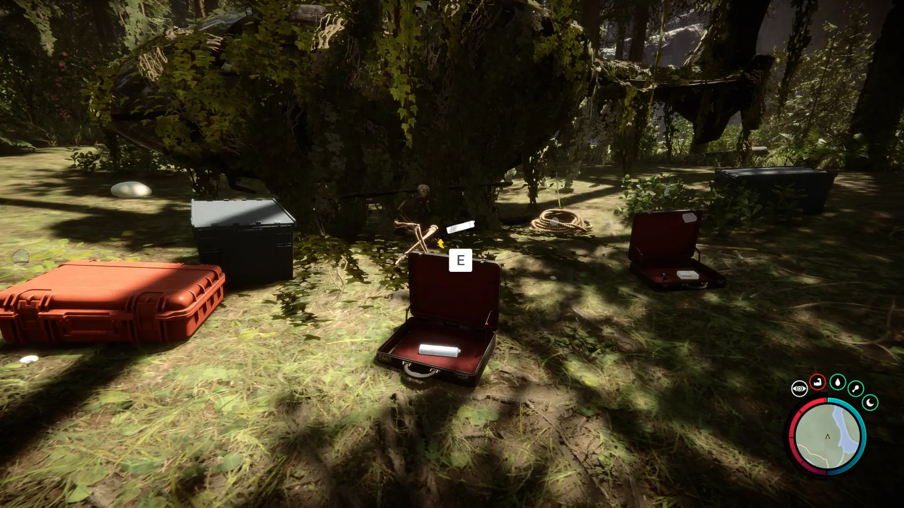
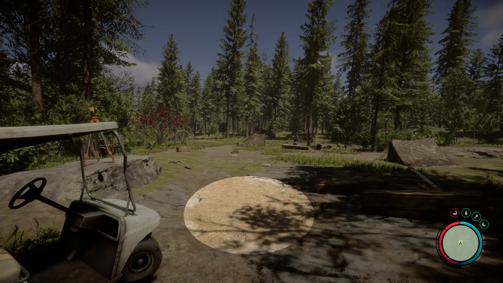
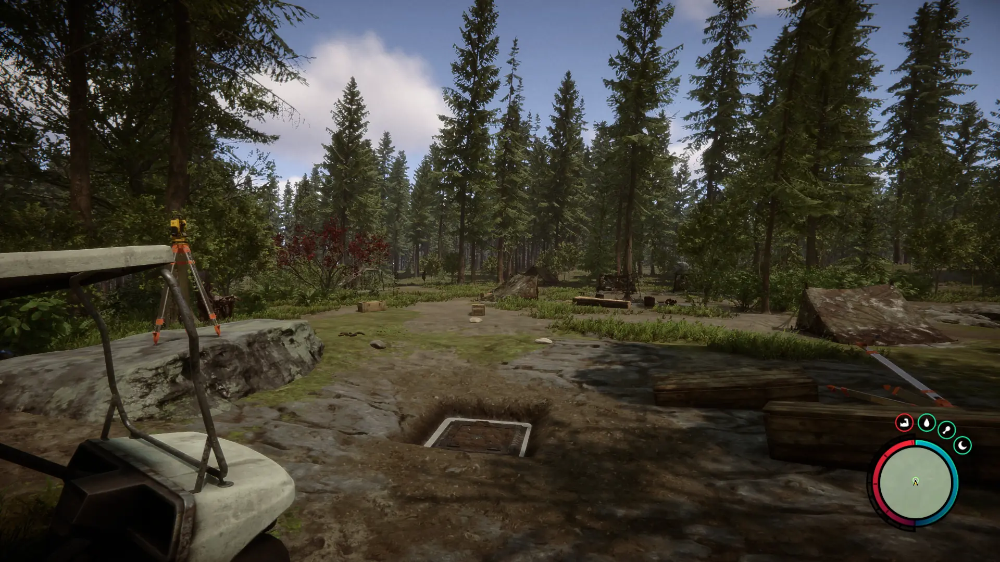


Where to find the Silencer and the requirements to obtain it in the Sons of the Forest.


## Silencer in Sons of the Forest
The Silencer is a [Pistol](/sons-of-the-forest/guides/pistol/) attachment used to make your shots silenced. Combine the Silencer with the Pistol to add the attachment.

## Requirements to Obtain
**Varries** - Some items require the player to solve a puzzle or use other collected items to obtain. For example, you may need to dig into the ground to find an item, so in situations like that, you will need a Shovel. Please check each item's location requirements for more information.

## Silencer Map
Below is a world map with all the known locations for the Silencer.

## Silencer Location 1
Head to the location 1 icon on the map for a crashed helicopter. The helicopter will be covered in vines and a lot of plant life, so it's easy to miss or overlook it as a huge bush.

The Silencer can be found in one of the item cases just next to the helicopter.

### Location 1 Requirements
**None** - You can walk up to this item and pick it up at any time in the game.

### Items Nearby
The [Pistol Rail](/sons-of-the-forest/guides/pistol-rail/) is in another case just next to the Silencer, so make sure you pick it up while in the area! A short run to the west you can find the [Stun Baton](/sons-of-the-forest/guides/stun-baton/) and in the cave near that you can obtain the [Rope Gun](/sons-of-the-forest/guides/rope-gun/).

## Silencer Location 2
Head to the green location 1 marked on the map and look for a pulsing green icon on your map in the game. The location is marked in the game with the pulsing green circle, so head toward that when you see it in the area. Be mindful of the cannibal camp nearby.

Once in the area, you are searching for a clear spot of dirt to dig up. The shovel icon will appear when you are close enough to the dig location.

The Silencer is on the desk right next to the 3D printer in the office area.  

### Location 2 Requirements
**Gun Rope, Rebreather, & Shovel** - The [Gun Rope](/sons-of-the-forest/guides/rope-gun/) and [Rebreather](/sons-of-the-forest/guides/rebreather/) are requirements for the [Shovel](/sons-of-the-forest/guides/shovel/), which is what you need to access the Bunker of Maintenance Shaft B.

### Items Nearby
The [Compound Bow](/sons-of-the-forest/guides/compound-bow/) is the only item in the immediate area of the Compound Bow. Aside from that, a short run to the northeast can yield you the [Leather Jacket](/sons-of-the-forest/guides/leather-jacket/).

## More Possible Locations
Currently, there are only 2 known locations for the Silencer. More locations may come in future updates, but at this time players can only obtain it at the locations above.
We will make sure to update our map with any new spots when Sons of the Forest gets any new updates for the Silencer.

## Obtain Once
The Silencer can only be obtained once. If the item had other spawn locations (Which may happen in the future), they would despawn preventing you from picking up multiple versions of the item. This is how Sons of the Forest enables the players to have multiple options when looting major items. 

## Conclusion
Silencer Location 1 is the ideal spot as there are no requirements for it and it's next to the Pistol Rail that you need for using it. While Location 2 has many requirements. So, if you want to collect all the items in Sons of the Forest, make sure you head to the marked spot and collect your Silencer!

Additionally; we would like to know if you enjoyed our guide. Let us know what you think and provide any feedback you may feel would improve the quality of the guide. To do so, join us on [Discord](https://discord.gg/ZXp93XsKnN) and let us know! We would love to hear from you! 