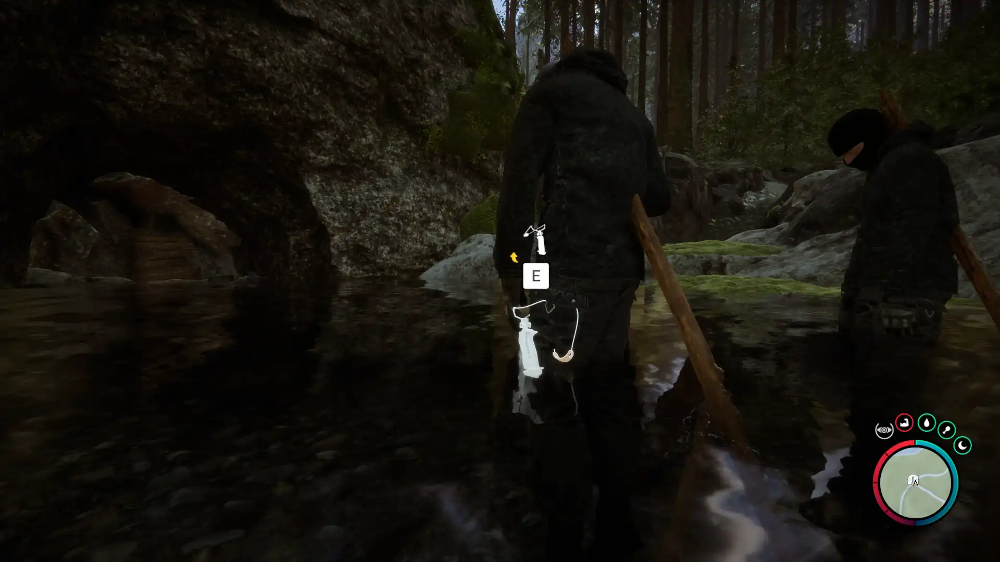


Where to find the Sling Shot and the requirements to obtain it in the Sons of the Forest.


## Sling Shot in Sons of the Forest
The Sling Shot is a ranged weapon that uses small objects, mostly small rocks, to shoot with. If you happen to find any golf balls, you can use them as ammo too!
While this weapon does a small amount of damage, there is a lot of ammo that you can loot making it very dependable.

The Sling Shot has no durability, so there is no concern about losing the item due to this. Just make sure to keep lots of Small Rocks in your back for ammo! 

## Requirements to Obtain
**None** - Some items require the player to solve a puzzle or use other collected items to obtain. For example, you may need to dig into the ground to find an item, so in situations like that, you will need a Sling Shot. 

Thankfully the Sling Shot is not one of the items that require additional items or puzzles to obtain it. Just walk up to the dead body and loot it.

## Sling Shot Map
Below is a world map with all the known locations for the Sling Shot.

## Sling Shot Location #1
The green marker labeled 1 on the map is the location of the Sling Shot. It is also the location of a Cave, making it that much easier to find the spot. As you get closer, the cave icon will appear on your map. Once you reach the point all 3 streams connect, you will see 3 dead bodies on spikes. Walk up to the middle one and loot your used Sling Shot. 

### Tips for Finding the Sling Shot
Head towards the location on the map and keep your eyes peeled for the cave icon to show up. Once it appears, head towards it to find the bodies just outside the cave. Additionally, it's the point that the 3 streams connect and make a T-shape, so you can also look for that.

## More Items Nearby
The cave entrance in front of the dead bodies has some additional items of interest. The [Flashlight Attachment](/sons-of-the-forest/guides/flashlight-attachment/), [Shovel](/sons-of-the-forest/guides/shovel/), and Wet Suit can all be found inside this cave. However, the [Rope Gun](/sons-of-the-forest/guides/rope-gun/) is required for them. Make sure to check out those guides for more information!

## More Possible Locations
Currently, there is only 1 known location for the Sling Shot. More locations may come in future updates, but at this time players can only obtain it at the location above.
We will make sure to update our map with any new spots when Sons of the Forest gets any new updates for the Stun Baton.

## Obtain Once
The Sling Shot can only be obtained once. If the item had other spawn locations (Which may happen in the future), they would despawn preventing you from picking up multiple versions of the item. This is how Sons of the Forest enables the players to have multiple options when looting major items. 

## Conclusion
There are no requirements for the Sling Shot and there is only 1 known location to obtain it. So, if you want to collect all the items in Sons of the Forest, make sure you head to the marked spot and collect your used Sling Shot!

Additionally; we would like to know if you enjoyed our guide. Let us know what you think and provide any feedback you may feel would improve the quality of the guide. To do so, join us on [Discord](https://discord.gg/ZXp93XsKnN) and let us know! We would love to hear from you! 
