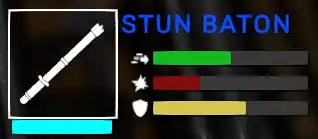
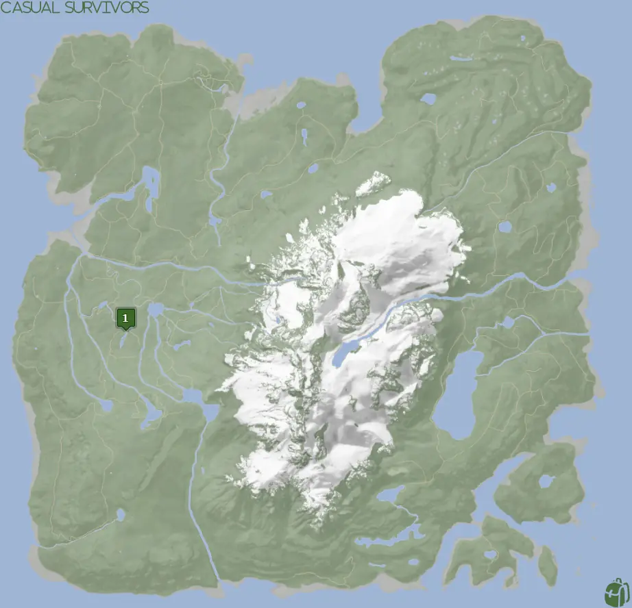
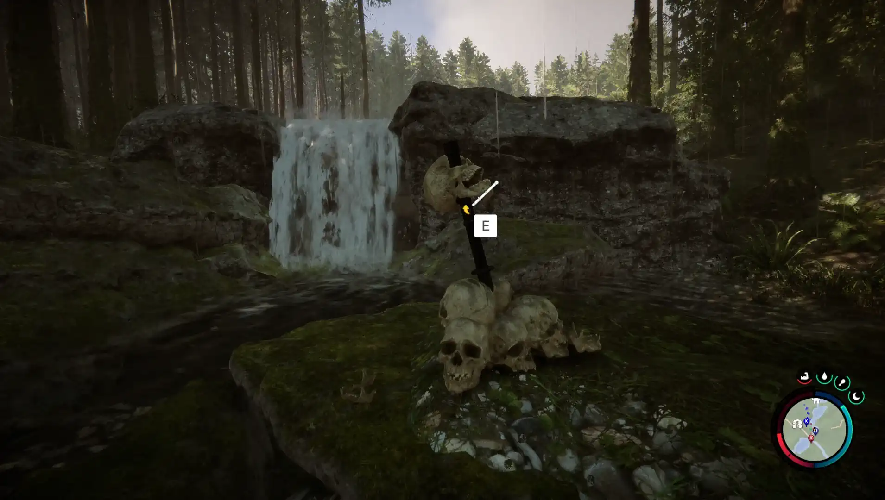


Where to find the Stun Baton and the requirements to obtain it in the Sons of the Forest.


## Stun Baton in Sons of the Forest
The Stun Baton is a blunt melee weapon that can be turned on to deal minor electrical damage and stun when attacking with it.
The weapon doesn't have any durability, so there is no concern about it breaking. However, it does run on batteries. Similar to
[the Flashlight](/sons-of-the-forest/guides/flashlight/), you will need to replace the batteries occasionally if you want to make use of the shock.

To check the battery levels of the Stun Baton, hover the mouse over it while in the inventory. The light blue bar under the item's icon is your indicator of how much power you have left (See the image below).

## Requirements for the Stun Baton
**None** - Some items require the player to solve a puzzle or use other collected items to obtain. For example, you may need to dig into the ground to find an item, so in situations like that, you will need a shovel. 

Thankfully the Stun Baton is not one of the items that require additional items or puzzles to obtain it. Just run on up to it and collect it! 

## Stun Baton Map
Below is a world map with all the known locations for the Stun Baton.

## The Stun Baton Location #1
The green marker on the map above is location 1. Head to that spot on the map and look for a small waterfall as seen below.
The stun baton will be in a pile of skulls. Don't mind the many skulls that the stun baton is in, you will be fine...

## Tips for Finding Stun Baton
There is a cave just a stone's throw away on the map. It would be ideal to head toward the cave marker on your map as that will show up for you.
Once at the cave entrance, you should be able to see the stream of water. Follow the stream away from the lake and towards the uphill direction.
It shouldn't be more than 4-5 seconds away from the cave entrance. 

## More Possible Locations
Currently, there is only 1 known location for the Stun Baton. More locations may come in future updates, but at this time players can only obtain it at the location above.
We will make sure to update our map with any new spots when Sons of the Forest gets any new updates for the Stun Baton.

## Obtain Once
The Stun Baton can only be obtained once. If the item had other spawn locations (Which may happen in the future), they would despawn preventing you from picking up multiple versions of the item. This is how Sons of the Forest enables the players to have multiple options when looting major items. 

## Conclusion
There are no requirements for the Stun Baton and there is only 1 known location to obtain it. So, if you want to collect all the items in Sons of the Forest, make sure you head to the marked spot and collect your Stun Baton!

Additionally; we would like to know if you enjoyed our guide. Let us know what you think and provide any feedback you may feel would improve the quality of the guide. To do so, join us on [Discord](https://discord.gg/ZXp93XsKnN) and let us know! We would love to hear from you! 
