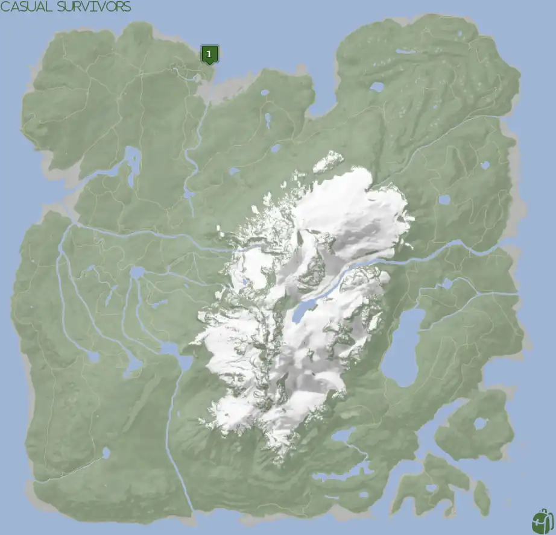
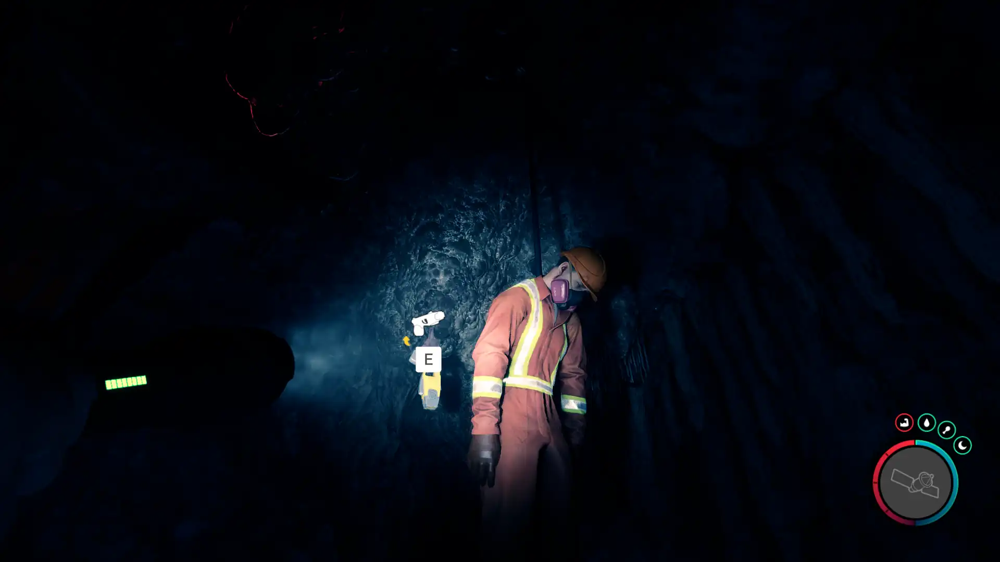
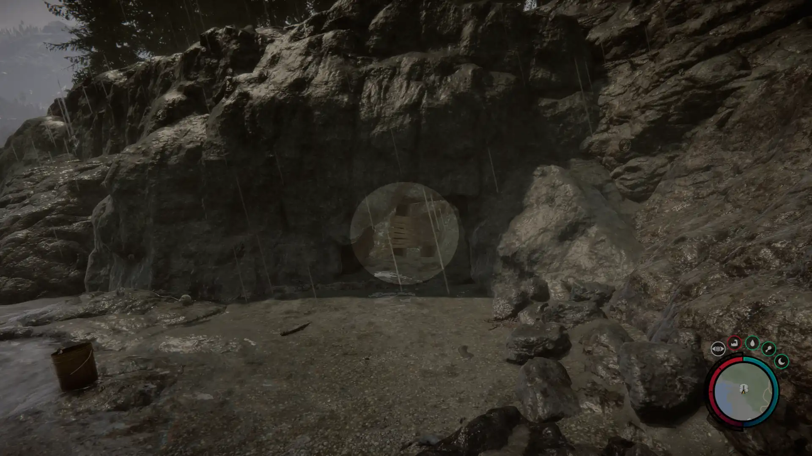


Where to find the Stun Gun and the requirements to obtain it in the Sons of the Forest.


## Stun Gun in Sons of the Forest
The Stun Gun is a single-shot ranged weapon that requires Stun Gun Ammo to fire. A successful hit with the Stun Gun will stun the target for a brief moment, so make sure you act fast after firing.
The weapon doesn't have any durability, so there is no concern about it breaking. It does not run on batteries as some might think.  So there is no concern about replacement batteries like [the Flashlight](/sons-of-the-forest/guides/flashlight/).

## Requirements for the Stun Gun
**Cave & Combat** - Some items require the player to solve a puzzle or use other collected items to obtain. For example, you may need to dig into the ground to find an item, so in situations like that, you will need a shovel. 

The Stun Gun requires you to explore a cave with cannibals to obtain it, so expect combat. 

## Stun Gun Map
Below is a world map with all the known locations for the Stun Gun.

## The Stun Gun Location #1
The green marker labeled 1 on the map is the location of the cave you need to enter to obtain the Stun Gun. Once inside, if you hug the right wall you will eventually reach your destination. If you see a dim red light, you are in the correct area. Just look for the dead maintenance body hanging from the roof.

### Tips for Finding Stun Gun
The cave is on the shoreline, so head toward the ocean and follow the water until you find the cave shown below. Additionally, the cave shows up on your map when you are close enough, so you can head toward that when you can see it. 

Once inside the cave, 4 cave lights will help brighten up your path. The 4th light is where the cave forks left or right. It's at that point you want to make sure you take the right path (which the light is shining towards, see image below) and you will eventually reach the Stun Gun. 

If you've entered a room with a cliff and 2 additional cave lights, you have taken a left at the fork and will need to head back. That's the room for the [Rebreather](/sons-of-the-forest/guides/rebreather/), however, if you attempt to collect that now you will not be able to turn back for the Leather Jacket.

## Other Nearby Items 
In the same room as the Stun Gun, the [Leather Jacket](/sons-of-the-forest/guides/leather-jacket/) can be found to the left while facing the body as you enter the room. Additionally, the [Rebreather](/sons-of-the-forest/guides/rebreather/) can be found by taking a left at the fork at the 4th light. 

## More Possible Locations
Currently, there is only 1 known location for the Stun Gun. More locations may come in future updates, but at this time players can only obtain it at the location above.
We will make sure to update our map with any new spots when Sons of the Forest gets any new updates for the Stun Gun.

## Obtain Once
The Stun Gun can only be obtained once. If the item had other spawn locations (Which may happen in the future), they would despawn preventing you from picking up multiple versions of the item. This is how Sons of the Forest enables the players to have multiple options when looting major items. 

## Conclusion
You have to explore a cave for the Stun Gun and there is only 1 known location to obtain it. So, if you want to collect all the items in Sons of the Forest, make sure you head to the marked spot and collect your Stun Gun!

Additionally; we would like to know if you enjoyed our guide. Let us know what you think and provide any feedback you may feel would improve the quality of the guide. To do so, join us on [Discord](https://discord.gg/ZXp93XsKnN) and let us know! We would love to hear from you! 
