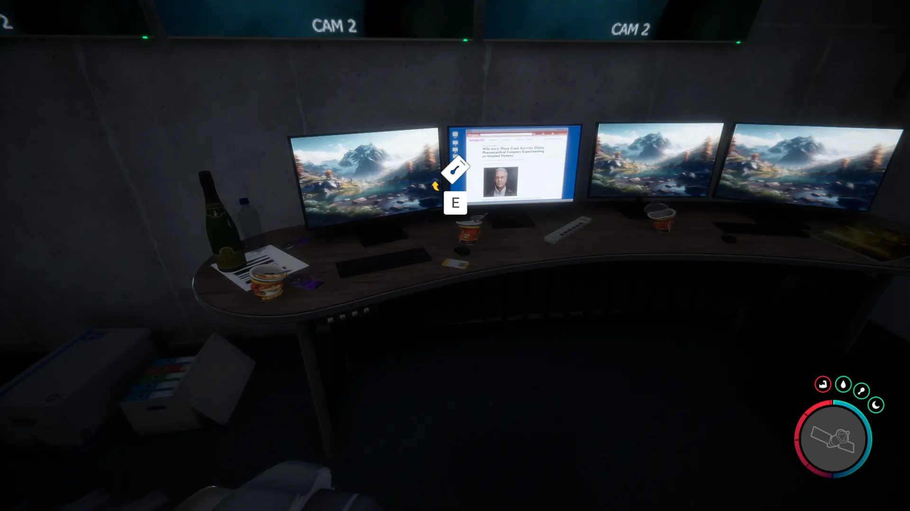


Where to find the VIP Keycard and the requirements to obtain it in the Sons of the Forest.


## VIP Keycard in Sons of the Forest
The VIP Keycard is a key item that gives you access to certain bunker doors around the game. 

The Maintenance Keycard has no durability, doesn't require additional items, and can't be crafted into something else, so this is the final form.

## Requirements to Obtain
**Cave, Bunker, Combat, Maintenance Keycard, Gun Rope, Rebreather, & Shovel** - Some items require the player to solve a puzzle or use other collected items to obtain. For example, you may need to dig into the ground to find an item, so in situations like that, you will need a shovel. 

The [Gun Rope](/sons-of-the-forest/guides/gun-rope/), [Rebreather](/sons-of-the-forest/guides/rebreather/), and [Shovel](/sons-of-the-forest/guides/shovel/) are all requirements to obtain the Maintenance Keycard. They are not required while inside the Cave/Bunker to access the VIP Keycard, however.

## VIP Keycard Map 
Below is a world map with all the known locations for the VIP Keycard.

## VIP Keycard Location 1
The green marker labeled 1 on the map is the location of the cave you need to enter to obtain the VIP Keycard. The location is naturally marked with a pulsing green circle on your map when you are close to the area. You can pinpoint the location by following that. You know you are close when you can spot 2 golf carts.

Once inside the cave, you will need to enter the bunker and progress past the maintenance keycard door and flooded areas to reach the security room with the VIP Keycard.

### Tips for Finding VIP Keycard
When progressing through the flooded area of the Bunker, there will be a fork in the hallway where you can turn left or continue forward. You will want to turn left and go up a few stairs to the security room where you will find the VIP Keycard. You know you are in the right room if you see 6 monitors/TVs mounted on the wall directly across from you where you enter.

### More Items Nearby
The [Dress](/sons-of-the-forest/guides/dress/) and [Crossbow](/sons-of-the-forest/guides/crossbow/) are also in this bunker. Make sure to check out those guides for more information about them.

## More Possible Locations
Currently, there is only 1 known location for the VIP Keycard. More locations may come in future updates, but at this time players can only obtain it at the location above.
We will make sure to update our map with any new spots when Sons of the Forest gets any new updates for the VIP Keycard.

### Main Story Required
While it may be possible for more locations of this item, it is highly unlikely as this item is one of the Main Story required items. As such, the developers will likely limit how the player comes across the VIP Keycard so they can control how the player progresses through the main story. 

## Obtain Once
The VIP Keycard can only be obtained once. If the item had other spawn locations (Which may happen in the future), they would despawn preventing you from picking up multiple versions of the item. This is how Sons of the Forest enables the players to have multiple options when looting major items. 

## Conclusion
There are no requirements for the VIP Keycard and there is only 1 known location to obtain it. So, if you want to collect all the items in Sons of the Forest, make sure you head to the marked spot and collect your VIP Keycard!

Additionally; we would like to know if you enjoyed our guide. Let us know what you think and provide any feedback you may feel would improve the quality of the guide. To do so, join us on [Discord](https://discord.gg/ZXp93XsKnN) and let us know! We would love to hear from you! 