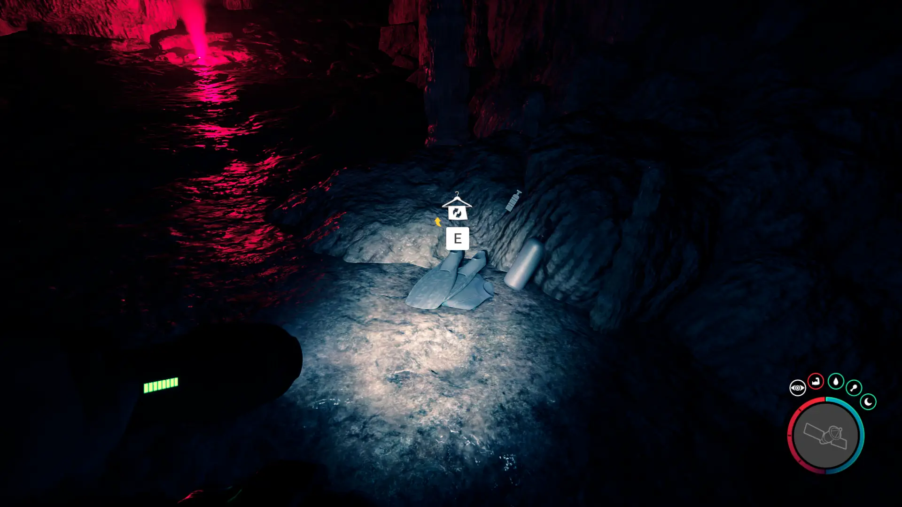
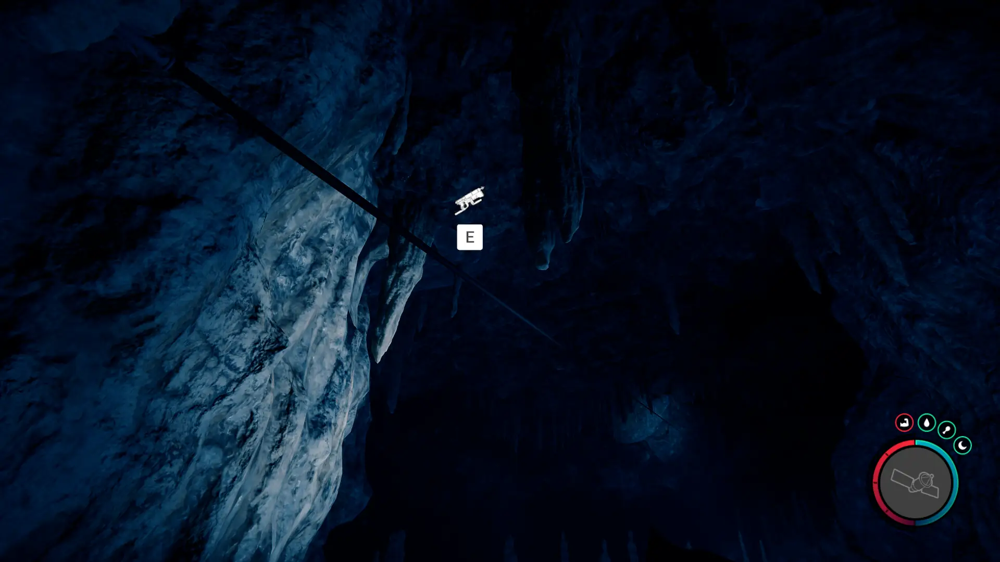
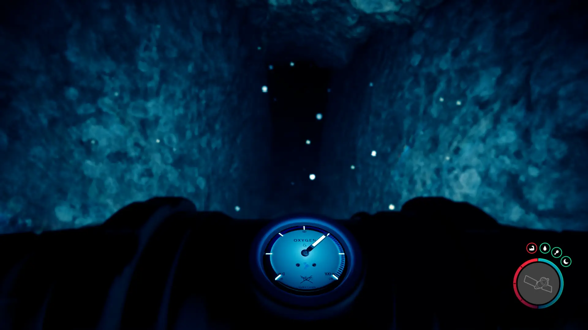


Where to find the Wet Suit and the requirements to obtain it in the Sons of the Forest.


## Wet Suit in Sons of the Forest
The Wet Suit is cloth gear that will protect fully protect you in rain/water and has less fire/comfort levels than your default clothing.

The Wet Suit has no durability, doesn't require additional items, and can't be crafted into something else, so this is the final form.

## Requirements to Obtain
**Cave, Gun Rope, & Rebreather** - Some items require the player to solve a puzzle or use other collected items to obtain. For example, you may need to dig into the ground to find an item, so in situations like that, you will need a Wet Suit. 

The Wet Suit requires [Gun Rope](/sons-of-the-forest/guides/rope-gun/) and the [Rebreather](/sons-of-the-forest/guides/rebreather/) to progress into the cave. Without these items, it will just lead to a dead end preventing further exploration of the cave. 

## Wet Suit Map
Below is a world map with all the known locations for the Wet Suit.

## Wet Suit Location #1
The green marker labeled 1 on the map is the location of the cave where you can find the Wet Suit. Once inside the cave and you use the Rebreather, you will come across the Wet Suit.

### Tips for Finding the Wet Suit
Head towards the location on the map and keep your eyes peeled for the cave icon to show up. Once it appears, head towards it to find the bodies just outside the cave. Head on inside.

Once inside, you will need to use the Rope Gun to cross the gap.

Then use your Rebreather to go underwater to the next section. If you need some oxygen, there is some underneath the zipline at the start of the cave. You can head back to pick it up and then use the Zip Line to cross back into the area.

## More Items Nearby
The [Flashlight Attachment](/sons-of-the-forest/guides/flashlight-attachment/), and [Shovel](/sons-of-the-forest/guides/shovel/) can be found further in this cave. Make sure to check out those guides for more information!

## More Possible Locations
Currently, there is only 1 known location for the Wet Suit. More locations may come in future updates, but at this time players can only obtain it at the location above.
We will make sure to update our map with any new spots when Sons of the Forest gets any new updates for the Stun Baton.

## Obtain Once
The Wet Suit can only be obtained once. If the item had other spawn locations (Which may happen in the future), they would despawn preventing you from picking up multiple versions of the item. This is how Sons of the Forest enables the players to have multiple options when looting major items. 

## Conclusion
There are no requirements for the Wet Suit and there is only 1 known location to obtain it. So, if you want to collect all the items in Sons of the Forest, make sure you head to the marked spot and collect your used Wet Suit!

Additionally; we would like to know if you enjoyed our guide. Let us know what you think and provide any feedback you may feel would improve the quality of the guide. To do so, join us on [Discord](https://discord.gg/ZXp93XsKnN) and let us know! We would love to hear from you! 
