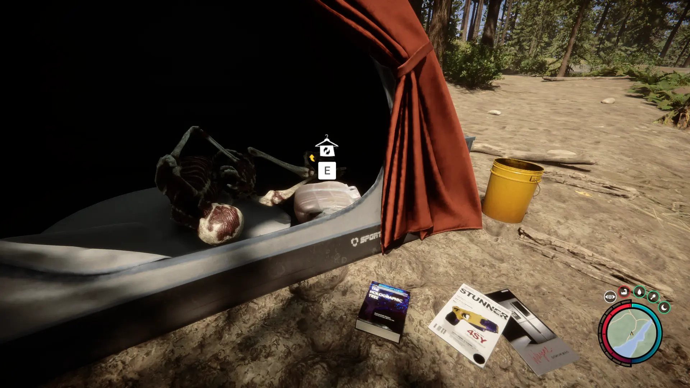


Where to find the Winter Jacket and the requirements to obtain it in the Sons of the Forest.


## Winter Jacket in Sons of the Forest
The Winter Jacket is cloth gear that is most effective against cold weather. Take a look at the stats below!

The Winter Jacket has no durability, doesn't require additional items, and can't be crafted into something else, so this is the final form.

## Requirements to Obtain
**None** - Some items require the player to solve a puzzle or use other collected items to obtain. For example, you may need to dig into the ground to find an item, so in situations like that, you will need a shovel.

You can obtain the Winter Jacket at any time, just walk up to it and loot it when you are ready for it!

## Winter Jacket Map
Below is a world map with all the known locations for the Winter Jacket.

## Winter Jacket Location 1
Head towards the location 1 marker on the map. You are looking for a small human camp with 2 orange tents along a water stream next to the waterfall.
The Winter Jacket can be found inside one of the two orange tents.

## More Possible Locations
Currently, there is only 1 known location for the Winter Jacket. More locations may come in future updates, but at this time players can only obtain it at the location above.
We will make sure to update our map with any new spots when Sons of the Forest gets any new updates for the Winter Jacket.

## Achievements 
The Dress is an item required for the FASHIONISTA achievement. To earn this achievement, you need to gather all the possible clothing items. Check this Article's Series for the other locations of the clothes. 

## Obtain Once
The Winter Jacket can only be obtained once. If the item had other spawn locations (Which may happen in the future), they would despawn preventing you from picking up multiple versions of the item. This is how Sons of the Forest enables the players to have multiple options when looting major items. 

## Conclusion
There are no requirements for the Winter Jacket and there is only 1 known location to obtain it. So, if you want to collect all the items in Sons of the Forest, make sure you head to the marked spot and collect your Winter Jacket!

Additionally; we would like to know if you enjoyed our guide. Let us know what you think and provide any feedback you may feel would improve the quality of the guide. To do so, join us on [Discord](https://discord.gg/ZXp93XsKnN) and let us know! We would love to hear from you! 